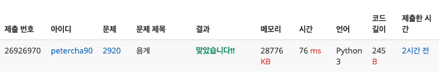
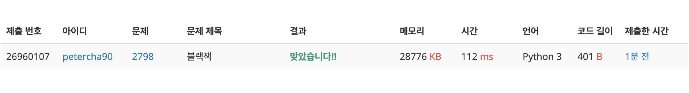
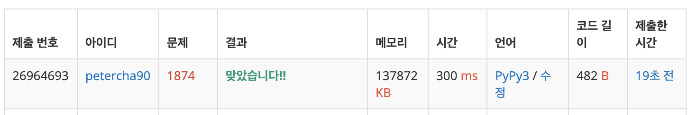
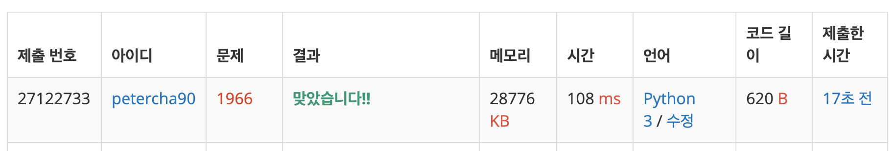

<!--page_number:true-->
<!-- $width: 1059-->
<!-- $height: 1500-->


# Baekjoon Online Judge

### 1. [음계](https://www.acmicpc.net/problem/2920)

* 문제
다장조는 c d e f g a b C, 총 8개 음으로 이루어져있다. 이 문제에서 8개 음은 다음과 같이 숫자로 바꾸어 표현한다. c는 1로, d는 2로, ..., C를 8로 바꾼다.

	1부터 8까지 차례대로 연주한다면 ascending, 8부터 1까지 차례대로 연주한다면 descending, 둘 다 아니라면 mixed 이다.

	연주한 순서가 주어졌을 때, 이것이 ascending인지, descending인지, 아니면 mixed인지 판별하는 프로그램을 작성하시오.

* 입력
	첫째 줄에 8개 숫자가 주어진다. 이 숫자는 문제 설명에서 설명한 음이며, 1부터 8까지 숫자가 한 번씩 등장한다.

* 출력
	첫째 줄에 ascending, descending, mixed 중 하나를 출력한다.

  예제 1 
  > 1 2 3 4 5 6 7 8 
  > ascending

  예제 2 
  > 8 7 6 5 4 3 2 1
  > descending

  예제 3 
  > 8 1 7 2 6 3 5 4
  mixed
  
---

* Code:

  ```python
  data = list(map(int,input().split()))

  count, temp = 0, 0
  for item in data:
      count = count + 1 if temp < item else count 
      temp = item

  if count == 8:
      print('ascending')
  elif count == 1:
      print('descending')
  else:
      print('mixed')
  ```
  
  
  
  <br><br><br><br><br><br><br><br><br><br><br><br><br>
  
---
### 2. [블랙잭](https://www.acmicpc.net/problem/2798)

* **문제**
카지노에서 제일 인기 있는 게임 블랙잭의 규칙은 상당히 쉽다. 카드의 합이 21을 넘지 않는 한도 내에서, 카드의 합을 최대한 크게 만드는 게임이다. 블랙잭은 카지노마다 다양한 규정이 있다.

	한국 최고의 블랙잭 고수 김정인은 새로운 블랙잭 규칙을 만들어 상근, 창영이와 게임하려고 한다.

	김정인 버전의 블랙잭에서 각 카드에는 양의 정수가 쓰여 있다. 그 다음, 딜러는 N장의 카드를 모두 숫자가 보이도록 바닥에 놓는다. 그런 후에 딜러는 숫자 M을 크게 외친다.

	이제 플레이어는 제한된 시간 안에 N장의 카드 중에서 3장의 카드를 골라야 한다. 블랙잭 변형 게임이기 때문에, 플레이어가 고른 카드의 합은 M을 넘지 않으면서 M과 최대한 가깝게 만들어야 한다.

	N장의 카드에 써져 있는 숫자가 주어졌을 때, M을 넘지 않으면서 M에 최대한 가까운 카드 3장의 합을 구해 출력하시오.

* **입력**
첫째 줄에 카드의 개수 N(3 ≤ N ≤ 100)과 M(10 ≤ M ≤ 300,000)이 주어진다. 둘째 줄에는 카드에 쓰여 있는 수가 주어지며, 이 값은 100,000을 넘지 않는 양의 정수이다.

	합이 M을 넘지 않는 카드 3장을 찾을 수 있는 경우만 입력으로 주어진다.

* **출력**
	첫째 줄에 M을 넘지 않고 M에 최대한 가까운 카드 3장의 합을 출력한다.

  예제 
  > 10 500
  > 93 181 245 214 315 36 185 138 216 295

  출력: 
  > 497
  > 
---

* Code:

  ```python
  a = list(map(int, input().split(' ')))
  cards = list(map(int, input().split(' ')))
  num_of_cards = a[0]
  maximum = a[1]

  total, result = 0, 0
  # C(n, 3)
  for i in range(0, num_of_cards):
      for j in range(i+1, num_of_cards):
          for k in range(j+1, num_of_cards):
              total = cards[i] + cards[j] + cards[k]
              if total > result and total <= maximum:
                  result = total
  print(result)
  ```
  

<br><br><br><br><br><br><br><br><br><br><br><br><br><br><br>

---

### 3. [스택 수열](https://www.acmicpc.net/problem/1874)

* **문제**
스택 (stack)은 기본적인 자료구조 중 하나로, 컴퓨터 프로그램을 작성할 때 자주 이용되는 개념이다. 스택은 자료를 넣는 (push) 입구와 자료를 뽑는 (pop) 입구가 같아 제일 나중에 들어간 자료가 제일 먼저 나오는 (LIFO, Last in First out) 특성을 가지고 있다.

	1부터 n까지의 수를 스택에 넣었다가 뽑아 늘어놓음으로써, 하나의 수열을 만들 수 있다. 이때, 스택에 push하는 순서는 반드시 오름차순을 지키도록 한다고 하자. 임의의 수열이 주어졌을 때 스택을 이용해 그 수열을 만들 수 있는지 없는지, 있다면 어떤 순서로 push와 pop 연산을 수행해야 하는지를 알아낼 수 있다. 이를 계산하는 프로그램을 작성하라.

* **입력**
첫 줄에 n (1 ≤ n ≤ 100,000)이 주어진다. 둘째 줄부터 n개의 줄에는 수열을 이루는 1이상 n이하의 정수가 하나씩 순서대로 주어진다. 물론 같은 정수가 두 번 나오는 일은 없다.

* **출력**
입력된 수열을 만들기 위해 필요한 연산을 한 줄에 한 개씩 출력한다. push연산은 +로, pop 연산은 -로 표현하도록 한다. 불가능한 경우 NO를 출력한다.


* **예제 1** - 아래가 세로로 숫자 하나에 한 줄씩 입력됐다고 하면
  ``` shell
  8 4 3 6 8 7 5 2 1
  ```
	 출력 - 얘도 세로로 출력
  ```shell
  + + + + - - + + - + + - - - - - 
  ```
* **예제 2** - 마찬가지
  ``` shell
  5 1 2 5 3 4
  ```
  출력 
  ```shell
  No
  ```
---

* Code:

  ```python
  n = int(input())

  count = 1 
  stack = []
  result = []

  for i in range(n):   # n번 입력을 받을 때 마다, 아래를 수행
      data = int(input())
      while count <= data:
          stack.append(count) # 실제로 숫자를 저장
          count += 1
          result.append('+')
      if stack[-1] == data:# 젤 큰 놈이다 -> 내림차순 pop 가능
          stack.pop()
          result.append('-')
      else:
          print('NO')
          exit(0)

  print('\n'.join(result))
	```
    

---

### 4. [프린터 큐](https://www.acmicpc.net/problem/1966)

* **문제**
여러분도 알다시피 여러분의 프린터 기기는 여러분이 인쇄하고자 하는 문서를 인쇄 명령을 받은 ‘순서대로’, 즉 먼저 요청된 것을 먼저 인쇄한다. 여러 개의 문서가 쌓인다면 Queue 자료구조에 쌓여서 FIFO - First In First Out - 에 따라 인쇄가 되게 된다. 하지만 상근이는 새로운 프린터기 내부 소프트웨어를 개발하였는데, 이 프린터기는 다음과 같은 조건에 따라 인쇄를 하게 된다.

	현재 Queue의 가장 앞에 있는 문서의 ‘중요도’를 확인한다.
나머지 문서들 중 현재 문서보다 중요도가 높은 문서가 하나라도 있다면, 이 문서를 인쇄하지 않고 Queue의 가장 뒤에 재배치 한다. 그렇지 않다면 바로 인쇄를 한다.
예를 들어 Queue에 4개의 문서(A B C D)가 있고, 중요도가 2 1 4 3 라면 C를 인쇄하고, 다음으로 D를 인쇄하고 A, B를 인쇄하게 된다.

	여러분이 할 일은, 현재 Queue에 있는 문서의 수와 중요도가 주어졌을 때, 어떤 한 문서가 몇 번째로 인쇄되는지 알아내는 것이다. 예를 들어 위의 예에서 C문서는 1번째로, A문서는 3번째로 인쇄되게 된다.

* **입력**
첫 줄에 테스트케이스의 수가 주어진다. 각 테스트케이스는 두 줄로 이루어져 있다.

	테스트케이스의 첫 번째 줄에는 문서의 개수 N(1 ≤ N ≤ 100)과, 몇 번째로 인쇄되었는지 궁금한 문서가 현재 Queue에서 몇 번째에 놓여 있는지를 나타내는 정수 M(0 ≤ M < N)이 주어진다. 이때 맨 왼쪽은 0번째라고 하자. 두 번째 줄에는 N개 문서의 중요도가 차례대로 주어진다. 중요도는 1 이상 9 이하의 정수이고, 중요도가 같은 문서가 여러 개 있을 수도 있다.

---

* **출력**
	각 테스트 케이스에 대해 문서가 몇 번째로 인쇄되는지 출력한다.

* 예제 입력  
  > 3
  1 0
  5
  4 2
  1 2 3 4
  6 0
  1 1 9 1 1 1

* 출력
	> 1
  2
  5

<br><br><br><br><br><br><br><br><br><br><br><br><br>

---
* Code:

  ```python
  num_case = int(input())

  for case in range(num_case):
      num_doc, idx = tuple(map(int, input().split(' ')))
      docs = list(map(int, input().split(' ')))
      oop = 0         # Order of print

      while docs:
          a = docs.pop(0)
          if docs:
              if any([x > a for x in docs]):
                  docs.append(a)
                  idx = len(docs) - 1 if idx == 0 else idx - 1
              elif:
                  idx == 0:
                  oop += 1
                  break
              else:
                  oop += 1
                  idx -= 1
          else:
              oop += 1
      print(oop)
  ```

	


---

### 5. [키로거](https://www.acmicpc.net/problem/5397)

* **문제**
창영이는 강산이의 비밀번호를 훔치기 위해서 강산이가 사용하는 컴퓨터에 키로거를 설치했다. 며칠을 기다린 끝에 창영이는 강산이가 비밀번호 창에 입력하는 글자를 얻어냈다.

	키로거는 사용자가 키보드를 누른 명령을 모두 기록한다. 따라서, 강산이가 비밀번호를 입력할 때, 화살표나 백스페이스를 입력해도 정확한 비밀번호를 알아낼 수 있다.

	강산이가 비밀번호 창에서 입력한 키가 주어졌을 때, 강산이의 비밀번호를 알아내는 프로그램을 작성하시오.

* **입력**
	첫째 줄에 테스트 케이스의 개수가 주어진다. 각 테스트 케이스는 한줄로 이루어져 있고, 강산이가 입력한 순서대로 길이가 L인 문자열이 주어진다. (1 ≤ L의 길이 ≤ 1,000,000) 강산이가 백스페이스를 입력했다면, '-'가 주어진다. 이때 커서의 바로 앞에 글자가 존재한다면, 그 글자를 지운다. 화살표의 입력은 '<'와 '>'로 주어진다. 이때는 커서의 위치를 움직일 수 있다면, 왼쪽 또는 오른쪽으로 1만큼 움직인다. 나머지 문자는 비밀번호의 일부이다. 물론, 나중에 백스페이스를 통해서 지울 수는 있다. 만약 커서의 위치가 줄의 마지막이 아니라면, 커서 및 커서 오른쪽에 있는 모든 문자는 오른쪽으로 한 칸 이동한다.

* **출력**
각 테스트 케이스에 대해서, 강산이의 비밀번호를 출력한다. 비밀번호의 길이는 항상 0보다 크다.

---
* **예제 입력**
  ```
  2
  <<BP<A>>Cd-
  ThIsIsS3Cr3t
  ```
  **예제 출력**
  ```
  BAPC
  ThIsIsS3Cr3t
  ```
<br>
  
* **Code**:

```python

```