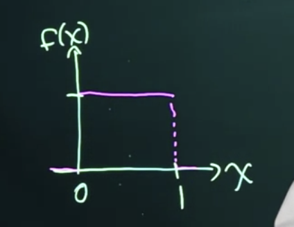

<!--page_number:true-->
<!-- $width: 1150-->
<!-- $height: 1500-->

## Bayesian Statistics:

# 3. Review of distributions

### Herbert Lee

### Univerrsity of California Santa Cruz

## 3.1. Bernoulli distribution

* 베르누이 분포는 동전을 튕기는 것과 같이 **두 가지 결과값**을 가지는 경우에 사용된다.

* 랜덤한 변수인 $X$가 베르누이 분포를 성공할 확률 $p$ 를 가지고 따르고 있다고 하면 아래와 같이 표현할 수 있다. 

$$X \thicksim B(p)$$

* $\thicksim$표시는 ~와 같이, ~의 분포를 따라 $X$가 분포되어 있다는 뜻이다. 
* 성공 = 1, 실패 = 0 라고 봤을 때, 아래와 같이 표현 할 수 있다. 

$$P(X=1) = p$$
$$P(X=0) = 1-p$$

* 우리는 이것은 가능한 모든 다른 결과값들에 대해서 함수로 다음과 같이 표현할 수 있다. 여기서 **$X$는 랜덤 변수**이고, **$x$는 $X$가 취할 수 있는 가능한 변수**를 뜻한다. $p$는 그 가능성에 대한 확률을 뜻한다.

$$f(X=x|p)$$

* 나중에 $p$를 알 수 없는 경우에 처한다면, 우리는 로마자 보다는 Greek 문자로 이 확률을 표현할 것이다.
---

* 우리는 $X$를 생략하고 다음과 같이 간략하게 표현할 수도 있다. 

$$f(X=x|p) = f(x|p)$$

### Indicator function

* Indicator function은 step function이라고도 하고, 때로는 heavy side function이라고도 하는데, Indicator function은 계산 순서에서 항상 우위를 점하기 때문에, 항상 이 Indicator 함수를 먼저 평가한 뒤에 나머지 수식을 계산하게 된다.  
* 그래서, 우리가 $log$나, $\sqrt{}$를 취할 때 음수 값을 취하는지 등을 피할 수 있도록, 사전에 먼저 점검하게 해주는 유용한 함수표현이다. 
* 베르누이 함수를 표현할 때는,아래와 같이 Indicator function을 사용해서 정리할 수 있다. 만약 변수가 True라면 $x$는 1을 가지고, False일 경우 $x$는 0을 가지기 때문에, 아래와 같이 표현할 수 있다. 

$$f(x|p) = p^x(1-p)^{1-x}I_{x\in\{0, 1\}}(x)$$

### PMF, PDF
* 이 식은 PMF(Probability mass function) - 확률질량함수, 이산 분포의 확률함수를 뜻한다. 하지만, 수학이나 통계에서 이론적인 레벨에 도달하게 되면, 결국에는 뭐든지 Density(밀도함수), 연속분포의 확률함수로 보게 된다. 
* 그래서 이 강의에서는 이론적인 관점에서 이 베르누이 분포도 PDF로 지칭한다.

 

### Expectation, Variance
* 베르누이 분포에서 기대값과 분산은 아래와 같다. 
$$E[X] = \sum_x xP(X=x)$$
$$Var(X) = p(1-p)$$

---
## 3.2. Binomial Distribution
* 우리가 **베르누이 분포에서 $N$번의 시도를 한다고 하면 binomial하게, 이항분포로 일반화** 할 수 있다. 
$$X \thicksim Bin(n, p)$$
$$P(X=x|p)=f(x|p) = {n \choose x}p^x(1-p)^{n-x}$$

* 여기서 ${n \choose x} = \frac{n!}{x!(n-x)!} \text{ for }x\in \{0, 1,...n\}$

 

### Expectation, Variance

* 이항분포에서 기대값과 분산은 아래와 같다.

$$E[X] = np$$
$$Var(X) = np(1-p)$$

           

---

## 3.3. Uniform Distribution

* 연속랜덤변수에 대해 계속해서 배울수록 수학적으로 약간 복잡해지기 시작하고 조금씩 미적분을 요구하게 됩니다. 
* 우리는 PDF, 즉 확률밀도함수라는 전제하에, 그 속에서 연속랜덤변수가 특정 값을 가진다고 정의합니다. 미분의 관점에서보면 이 연속랜덤변수가 무한정으로 가능한 변수들을 가질 수 있기 때문입니다. 
* 핵심 아이디어는 **우리가 PDF를 어떠한 범위 안에서 적분을 취한다고 했을 때, 그 랜덤변수가 그 범위 안에 존재할 확률을 줄 수 있다**는 점입니다. 
* 균등분포(Uniform distribution)로 예를 들어볼까요. 

$$X \thicksim U[0,1]$$

* 이 뜻은, 어떠한 값이든 0부터 1사이에 있다면, 그 값들은 **equally likely하다(같은 확률을 가진다)** 는 것입니다. 이 경우는 수식으로 아래와 같이 표현할 수 있습니다.

$$f(x) = \begin{cases} 1 \text{ if } x\in [0,1] \\ 0 \text{ otherwise}\end{cases}$$
$$=I_{\{0 \le x \le 1\}}(x)$$

* 그러면 이것을 plot으로 X대한 함수를 어떻게 그릴 것인지 생각해 볼 수 있습니다. 그렇다면 아래와 같이 되겠죠. 아주 간단합니다. 

  
---
### 연습문제
$$P(0 < x < \frac{1}{2})= \int_0^{\frac{1}{2}}f(x)dx = \int_0^{\frac{1}{2}}dx = \frac{1}{2}$$

$$P(0 \le x\le\frac{1}{2})= \int_0^{\frac{1}{2}}f(x)dx = \int_0^{\frac{1}{2}}dx = \frac{1}{2}$$
$$P(x = \frac{1}{2})= 0$$

### Key rules
* **PDF** - 연속밀도함수에 적용되는 핵심규칙은  **언제나, $\int_{-\infty}^\infty f(x)dx = 1$이라는 것**입니다.물론, 모든 가능한 변수 $X$에 대해서 확률은 음수일 수 없다는 점도요. ($f(x) \ge 0)$

 

### Expectation, Variance

* 균등 분포의 기대값은, 

$$E[X] = \int_{-\infty}^\infty xf(x)dx$$

* 일반적으로 함수 $g(x)$에 대해서 기대값은, 아래와 같이 쓸 수 있고, 
$$E[g(x)] = \int g(x)f(x)dx$$
* 특정 값에 대한 기대값은, 아래와 같이 상수를 앞으로 꺼내서 생각할 수 있습니다. 
$$E[cX]=cE[X]$$
---

* 비슷하게 생각해보면, 두 상수 값을 합친 것에 대한 기대값은, 아래처럼 나눠서 생각할 수 있고, 

$$E[X + Y] = E[X] + E[Y]$$

* 만약 $X$와 $Y$가 독립이라면($\perp$기호), 아래와 같이 표현 할 수도 있습니다.
$$\text{if }X \perp Y,\text{then }E[XY] = E[X]E[Y]$$

* $X \thicksim U[\theta_1, \theta_2]$인 경우는 다음과 같이 Density function(밀도함수)을 일반화 할 수 있습니다.

$$f(x|\theta_1, \theta_2) = \frac{1}{\theta_2 - \theta_1} I_{\{\theta_1 \le x \le \theta_2 \}}$$

  
### 연습문제 

* If $X \thicksim \text{Uniform}(0, 1)$, then the PDF of $X$ is $f(x) = I_{\{0 \le x \le 1\}}(x)$. Which of the following expressions could we use to calculate $E(X^2)$?

&nbsp;&nbsp;&nbsp;&nbsp;&nbsp;&nbsp;&nbsp;&nbsp;&nbsp;&nbsp;&nbsp;&nbsp;&nbsp;1. $\int_{-\infty}^\infty(I_{0 \le x \le 1}(x))^2dx$ &nbsp;&nbsp;&nbsp;&nbsp;&nbsp;&nbsp;&nbsp;&nbsp;&nbsp;&nbsp;&nbsp;&nbsp;&nbsp;&nbsp;&nbsp;&nbsp;&nbsp;&nbsp;&nbsp;&nbsp;&nbsp;&nbsp;&nbsp;&nbsp;&nbsp;&nbsp;&nbsp;&nbsp;&nbsp;&nbsp;&nbsp;&nbsp; 2. $\int_0^1x^2dx$

       
* 1번은 g(x)f(x)dx의 형태가 아니고 g(f(x))dx의 형태라서 오답이다.

---

## 3.4. Exponential Distribution

* 그 다음 배울 연속확률분포의 예시는 **지수분포**다. 지수분포는 아래와 같이 rate parameter $\lambda$로 표현한다. **특정한 비율($\lambda$)** 을 가지고 사건이 일어나는 경우, **지수분포는 사건과 사건 사이에 'Waiting time'을 의미**한다. 
$$X \thicksim Exp(\lambda)$$

### Expectation, Variance

* 지수분포의 밀도함수식, 기대값, 분산은 아래와 같다.
$$f(x|\lambda) = \lambda e^{-\lambda x} \text{ for } x \ge 0$$

$$E[X] = \frac{1}{\lambda},\text{  } Var(X) = \frac{1}{\lambda^2}$$

* 예를 들어 버스를 기다린다고 했을 때, 10분에 한 대씩 온다고 하면, 10분이 그 다음 버스가 올 것이라는 기대값이기 때문에,$\lambda$는 $\frac{1}{10}$이 된다. 

 

## 3.5. Normal Distribution
* 정규분포는 Gaussian 분포라고 부른다. 

$$X \thicksim N(\mu, \sigma^2)$$
* 으로 표현하고, 밀도함수는 

$$f(x|\mu, \sigma^2) = \frac{1}{\sqrt{2\pi\sigma^2}}exp\{-\frac{1}{2\sigma^2}(x-\mu)^2 \}$$

* 평균과 분산은 자명하다. 
$$E[X] = \mu, \text{ } Var(X) = \sigma^2$$

---

# Supplementary material for Lesson 3

## 1. Indicator Functions 

* Indicator function은 **Heaviside functions** or **Unit step functions** 라고도 불린다.
* $I_{\{A\}}(x)$, 때로는 $1_{\{A\}}(x)$라고도 쓰는데, **만약 문맥이 obvious할 경우에는 그냥 $I_{\{A\}}$라고만 쓸 수도** 있다. 

#### Example: 
* 지수함수의 밀도함수는 $f(x) = \lambda exp(-\lambda x)I_{\{x\ge 0\}}(x)$ 라고도 쓸 수 있다. 우리는 이것을 적분을 취함으로 진짜 이 밀도 함수가 1로 계산이 되는 것인지 확인하여 진정한 밀도함수인지 확인할 수 있다. 이 때, Unit step function이 어떤 역할을 하는지 관찰해보면 역할을 알 수 있다.

$$\int_{-\infty}^\infty \lambda exp(-\lambda x)I_{\{x \ge 0 \}}(x)dx = \int_{0}^\infty \lambda exp(-\lambda x)dx$$

$$-exp(-\lambda x)|_0^\infty = -(0 - 1) = 1$$

* 부분 적분을 공부한 뒤에, 지수 적분을 계산할 줄 알아야 위의 식이 100%로 이해 된다. 수학 공부하자. 

      

---

## 2. Expected Values
* 평균이라고 표현하는 기대값은, 랜덤한 변수 $X$에 대해 $E(X)$라고 표현된다. 
* Discrete-valued에서는 $\sum_x x\cdot P(X=x)$을 사용하고, PDF인 continuous random variable에 대해서는 $\int_{-\infty}^{\infty} x \cdot f(x)dx$를 사용해서 표현한다는 점이 다를 뿐이다. 

* ### For linear functions of random variables
  * 평균의 좋은 속성은 랜덤 변수들의 선형 회귀 함수를 계산하기 쉽다는 점이다. 랜덤 변수인 $X$와 $Y$에 대해서 $E(X) = \mu x$고 $E(Y) = \mu y$라고 하자.
  * 이 때, 우리가 새로운 랜덤 변수인 $Z = aX + bY =c \text{where a, b, and c are real constants}$에 관심이 있다고 하면, $Z$의 평균값을 찾기는 쉽다.($X$와 $Y$는 독립일 때,)
  * $$E(Z) = E(aX+bY + c) = aE(X) + bE(Y) + c $$
$$= a\mu x + b\mu y + c$$

* ### Expectations of functions of X
	*  $g(X) = 2/X$라고 하면,  $E(g(X)) = \int_{-\infty}^{\infty}g(x)f(x)dx = \int_{-\infty}^{\infty}\frac{2}{x} f(x)dx$로 생각할 수 있다. 
	*  하지만, 일반적으로 $E(g(X)) \neq g(E(X))$이라는 것은 주의할 것.

* ### 연습문제
	랜덤변수 $X$에 대한 PDF가 $f(x) = 3x^2 I_{\{0\le x\le1\}}(x)$이라면, $E(X^2)$은, 
$$E(X^2) = \int_{-\infty}^\infty x^2 \cdot 3x^2 I_{\{0\le x \le 1\}}(x)dx$$

$$\int_0^1 x^2 \cdot 3x^2dx = \int_0^1 3x^4dx = \frac{3}{5}x^5|_{x=0}^{x=1} = \frac{3}{5}(1-0) = \frac{3}{5}$$

---
## 3. Variance

* 랜덤 변수의 분산이란, 얼마나 변수들이 퍼져있는지를 측정하는 것이다. 평균으로 부터 얼마나 멀어져 있느냐. $E(X) = \mu$라면, 분산은 $E[(X-\mu)^2]$가 된다.

* 평균과 마찬가지로 이산변수라면 $\sum$을 사용한 식으로, 연속변수라면 $\int$를 사용한 식으로 표현할 뿐이다. 

* **이산이든 연속이든 상관없이 사용할 수 있는 편한 식**은 아래와 같다. 

$$Var(X) = E[X^2] - (E[X])^2$$

* 여기에 square root만 씌우면 standard deviation. 표준 편차가 된다. 

* ### Linear property 
	* 분산의 선형회귀식과의 관계는 평균과 비슷하다. 제곱만 주의 하면 된다. 아까와 같은 $Z$를 $Var(X) = \sigma^2_X$와 $Var(Y) = \sigma^2_Y$가 있을 때 구한다고 하면, 아래와 같다. $c$는 상수이기 때문에 분산은 0이다.  

$$Var(Z) = Var(aX + bY =c)$$

$$a^2Var(X) + b^2Var(Y) + 0 = a^2\sigma^2_X + b^2\sigma^2_Y$$

* ### 연습문제
	평균값에 대한 연습문제에서 PDFF $f(x) = 3x^2 I_{\{0 \le x \le 1\}}(x)$에 대한 $E(X^2)$값은 $\frac{3}{5}$로 이미 알고 있다. 비슷하게 $E(X)$를 구해보면, 3/4가 나오고, 식에 대입하면 분산을 쉽게 구할 수 있다. 
    
    $$Var(X) = E[X^2] - (E(X))^2 = 3/5 - (3/4)^2 = 3/80$$

---

## 4. Additional Discrete Distributions

### 4.1. Geometric

* **기하분포**란, **첫 번째로 성공하기 까지의 시도 횟수**를 말한다. 베르누이 이벤트에서 첫 번째 성공이 관찰될 때까지의 확률분포를 말한다. 
* 첫 번째 성공을 위해서는 무조건 최소 첫 시도를 해야하기 때문에, 양수인 1부터 value는 시작한다. 

$$X \thicksim Geo(p)$$
$$P(X =x|p) = p(1-p)^{x-1} \text{ for x = 1,2,...}$$
$$E[X] = \frac{1}{p}$$
* 만약 성공할 확률이 $p$라면 첫 성공까지의 기대되는 시도횟수는 $1/p$가 된다. 

	### 연습문제
    공평한 동전 하나를 4번 던져서 한 번도 앞면을 보지 못할 확률은? 이 문제는 $X \thicksim Geo(\frac{1}{2})$일 때, $P(X>4)$인 경우를 말하는 것이다. 
    $$P(X>4)$$
    $$= 1-P(X=1) -P(X=2) -P(X=3)-P(X=4) $$
    $$= 1- (1/2)-(1/2)(1/2)-(1/2)(1/2)^2-(1/2)(1/2)^3 $$
    $$= 1/16$$
---

### 4.2. Multinomial

* 베르누이와 이항분포의 또 다른 일반화는 **다항 분포**이다. 이항분포는 두가지 경우의 수에 대해서 $n$번의 trial을 하지만, 다항분포는 경우의 수가 $p_1, ..., p_k$까지, $k$
개의 가능한 서로 다은 결과 값이 생길 가능성이 있는 분포이다. 
* 아주 직관적인 예로는 주사위를 굴린다고 해보자. 그러면 일단은 6가지 경우의 수가 생기는데, 그러면 일단 $k$는 6이 되는거고, 이걸 $n$번이나 졸라 던져. 우리는 1부터 6까지 각각 해당 숫자가 나타나기까지 시도해야했던 횟수를 $x_1,... , x_6$로 표기한다고 하자. 그러면 아래 식을 뜻하는 상황이 됨.
$$\sum_{i=1}^6 x_i =n \text{ and } \sum_{i=1}^6 p_i = 1$$
* 함수식은 아래와 같다. 

$$f(x_i, ..., x_k| p_1,...,p_k) = \frac{n!}{x_1!\cdots x_k!}p_1^{x_1 }\cdots p_k^{x_k}$$
* **category $i$에 대한 기대값** - category $i$가 나오기까지 시도해야하는 횟수 - 은 
	### "$np_i$"
    
      

---
### 4.3. Poisson

* 포아송 분포는 **계수(count)하기 위해서 사용된다.** 그리고 다양한 상황들에서 일어난다. 매개변수인 $\lambda > 0$는, 우리가 **횟수를 세고 있는 사건이 관찰되기로 기대하는 비율**을 뜻한다.

$$X \thicksim \text{Pois}(\lambda)$$
$$P(X=x|\lambda) = \frac{\lambda^x\text{exp}(-\lambda)}{x!} \text{ for }x = 0,1,2,...$$
$$E[X]= \lambda, \text{ } Var[X] = \lambda$$

* 포아송 과정(Poisson process)은 **평균적으로 $\lambda$의 비율로 사건이 일어나는 과정**이고, 사건은 **한 번에 하나씩만 일어난다**. 그리고 **이벤트들은 서로 독립**이다. 

	### 연습문제 
    미국 서부에는 주요한 지진이 포아송 과정에 따라 일주일에 두번이라는 비율로 나타난다. 그렇다면 다음 2주 안에, 지진이 최소 3번 이상 나타날 확률은?

	**여기서 $\lambda$를 정하는 방법은, 2주라는 시간 안에 rate는 $2\times2$로, 4가 되기 때문에, $X \thicksim \text{Pois}(4)$라고 생각해야한다는 것**이다.($\lambda = 4$).
    그 뒤에 문제를 푸는 방식은 at least 3라고 했기 때문에, 구하고자 하는 가능성은 $P(X \ge 3) = 1-P(X \le 2)$. 즉,
    $$1- P(X=0) - P(X=1) - P(X =2)$$
    $$1 - e^{-4}- 4e^{-4}-\frac{4^2e^{-4}}{2}= 1- 13e^{-4} = 0.762$$
---

## 5. Continuous Distributions

### 5.1. Exponential
* 지수분포는 랜덤한 이벤트들 사이의 **대기시간을 modeling**하는 것에 많이 사용된다.
* 실제로, 만약 $\text{Exp}(\lambda)$ 분포로부터(지수분포로부터) 연속적인 이벤트들 사이의 **대기시간(waiting times)들이 독립이라면**, 모든 길이가 $t$인 고정 시간 window에 대해서 그 윈도 안에서 일어나는 이벤트들의 횟수는 **평균이 $t\lambda$인 Poisson 분포를 따르게 된다**. 

* 지수분포의 밀도함수식, 기대값, 분산은 아래와 같다.

$$X \thicksim \text{Exp}(\lambda)$$
$$f(x|\lambda) = \lambda e^{-\lambda x} \text{ for } x \ge 0$$

$$E[X] = \frac{1}{\lambda},\text{  } Var(X) = \frac{1}{\lambda^2}$$

* 포아송 분포와 비슷하게, 매게 변수 $\lambda$는 이벤트가 일어나는 비율로 해석된다. 
(지수분포에서 $\lambda$는 대기시간에 대한 확률
&nbsp; 포아송 분포에서 $\lambda$는 사건이 $\lambda$번 일어날 것으로 기대되는 비율.)

        

---
### 5.2. Gamma
* 만약에 $X_1, X_2, \cdots X_n$들이 독립이고, $\text{Exp}(\lambda)$로 균일하게(identically)분포하고 있는 연속적인 이벤트들 사이의 **대기시간**들이라고 한다면. (조건 엄청 복잡하네;;)
* 그렇다면 **모든 $n$개의 이벤트가 일어날 총 대기시간** $Y= \sum_{i=1}^n X_i$는, **shape parameter가 $\alpha=n$이고, rate parameter가 $\beta=\lambda$** 인 감마분포를 따른다. 
$$Y \thicksim \text{Gamma}(\alpha, \beta)$$
$$f(y|\alpha, \beta) = \frac{\beta^\alpha}{\Gamma(\alpha)}y^{\alpha-1}e^{-\beta y}I_{\{y \ge0\}}(y)$$
$$E[Y] = \frac{\alpha}{\beta} ,  \text{ } Var[Y]=\frac{\alpha}{\beta^2}$$ 
* $\alpha$와 $\beta$는 둘 다 $>0$이어야 한다.
* $\Gamma(\cdot)$은 정수가 아닌 요소도 받을 수 있는 factorial 함수의 일반화이다. 만약 $n$이 양수인 정수라면, $\Gamma(n) = (n-1)!$다.
* **지수함수는 $\alpha=1$인 특수한 감마 분포인 케이스**다. 감마분포는 통계적인 문제에서 흔하게 나타난다. 
* **감마분포는 양수값이고, 우측편향된 연속분포에 사용**된다. 
* $\alpha$가 커질수록, 감마분포는 점점 더 정규분포와 닮아진다. 

   

---

### 5.3. Uniform

* **균일분포**는 구간 내에 모든 랜덤한 변수들이 모두 같은 확률을 가질 때 사용된다. 

$$X \thicksim \text{Uniform}(a, b)$$
$$f(x|a, b) = \frac{1}{b-a}I_{\{a \le x \le b\}}(x)$$
$$E[X] = \frac{a+b}{2}, \text{ } Var[X] = \frac{(b-a)^2}{12}$$
* 표준 균일 분포는 $a=0$ and $b =1$이다. 

 

### 5.4. Beta
* 베타분포는 **랜덤 변수가 0에서 1사이에서 결정될 때 사용**된다. 
* 이런 이유로, 혹은 또 다른 수업에서 살펴볼 이유로, **베타 분포는 확률을 모델링할 때 보통 사용된다**. 

$$X \thicksim Beta(\alpha, \beta)$$

$$f(x|\alpha, \beta) = \frac{\Gamma(\alpha + \beta)}{\Gamma(\alpha)\Gamma(\beta)}x^{\alpha-1}(1-x)^{\beta-1}I_{\{0<x<1\}}(x)$$
$$E[X] = \frac{\alpha}{\alpha + \beta}, \text{ } Var[X] = \frac{\alpha\beta}{(\alpha + \beta)^2(\alpha + \beta +1)}$$

* $\alpha >0$ and $\beta > 0$이다. 
* Standard $Uniform(0, 1)$분포는 $\alpha = \beta = 1$인 베타분포의 특별한 케이스다. 

---

### 5.5 Normal

* 정규분포. 가우시안 분포는 통계에서 가장 중요한 분포 중 하나다. 
* 정규분포는 **랜덤한 변수들의 합과 평균 분포들을 한계지을 때 사용**된다. 이것은 **중심극한정리** 때문인데, Section 6에서 소개될 것이다. 이 성질 덕분에 정규분포는 **에러값, 혹은 회귀모델에서 설명되지 않는 각각의 관찰값들의 변형들을 모델링하는 용도로 자주 쓰인다.** 
* 정규분포의 기준은 

$$Z \thicksim N(0, 1)$$

$$f(z) = \frac{1}{\sqrt{2\pi}}\text{exp}\Big(-\frac{z^2}{2}\Big)$$
$$E[Z] =0, \text{ } Var[Z]=1$$

* 자, 그럼 $X = \sigma Z+ \mu \text{ where } \sigma > 0$ 그리고, $\mu$은 어떤 실수인 상수라고 하면, $E(X) = E(\sigma Z + \mu) = \sigma E(Z) + \mu = \sigma \cdot 0 + \mu = \mu$이고,
$Var(X) = Var(\sigma Z + \mu) = \sigma^2 Var(z) + 0 = \sigma^2 \cdot 1 = \sigma^2$가 된다.
그러니까, X는 평균 $\mu$와 분산 $\sigma^2$를 따르는, 

   $$X \thicksim N(\mu, \sigma^2)$$
   $$f(x|\mu, \sigma^2) = \frac{1}{\sqrt{2\pi \sigma^2}}\text{exp}\Big(-\frac{(x-\mu)^2}{2\sigma^2}\Big)$$
   이 된다는 말씀!
* $\mu$를 기준으로 대칭을 이루는 종모양 곡선을 정규분포는 가지고 있다.
* $X$가 어떠한 실수가 되든, 그게 양수든 음수든 99% 이상의 확률들은 3가지 평균 표준 편차 안에 모여있다.

---
### 정규분포 성질
* 정규분포는 여러가지 바람직한(?) 성질들을 가지고 있다. 그 중에 하나는, 만약,

	$X_1 \thicksim N(\mu_1, \sigma_1^2)$이고, $X_2 \thicksim N(\mu_2, \sigma_2^2)$일 때 **독립이라면**,
    $X_1 + X_2 \thicksim N(\mu_1 + \mu_2, \sigma_1^2 + \sigma_2^2)$가 말이된다. 

* 결론적으로, 우리는 $n$개의 **독립적이면서 동일하게 분포되어 있는( iid - independent and identically distributed)** 정규 랜덤 변수들의 평균을 아래와 같이 취할 수 있다.

	$$\bar X = \frac{1}{n}\sum_{i=1}^n X_i$$

	$\text{where }X_i \thicksim^{iid} N(\mu, \sigma^2) \text{ for } i = 1,2,\cdots, n$, then

$$\bar X \thicksim N\Big ( \mu, \frac{\sigma^2}{n}\Big) $$

---

### 5.6 t
* 만약 우리가 정규화된 데이터를 가지고 있다고 하면, 우리는 위에서 봤던, $\bar X \thicksim N\Big(\mu, \frac{\sigma^2}{n}\Big)$를 사용해서 평균값인 $\mu$를 가늠해볼 수 있다. 정규분포에서 봤던 변환식을 역으로 계산해보면 우리는 아래와 같은 식을 구할 수 있다.

$$\frac{\bar X - \mu}{\sigma/\sqrt n} \thicksim N(0,1)$$

* 근데 우리는 아직 $\sigma$ 값을 모른다. 만약 우리가 이 값을 데이터에서 구한다면 우리는 이 값을 **표본 표준 편차인 $S = \sqrt{\sum_i(X_i - \bar X)^2 / (n -1)}$로 대체**할 수 있다. 
* 이렇게 해버리면 더이상 표준 정규 분포가 아니게 된다. 다만, **자유도(degrees of freedom) $\nu = n-1$를 따르는 표준 $t$ 분포가 된 것**이다. 

$$Y \thicksim t_\nu$$
$$f(y) = \frac{\Gamma(\frac{\nu +1}{2})}{\Gamma(\frac{\nu}{2})\sqrt{\nu \pi}}\Big(1 + \frac{y^2}{\nu}\Big)^{-(\frac{\nu+1}{2})}$$

$$E[Y] = 0\text{ if } \nu >1$$
$$Var[Y] = \frac{\nu}{\nu - 2} \text{ if } \nu > 2$$

* $t$ 분포는 대칭이고 정규분포와 닮았지만 **꼬리가 좀 더 두껍다**.  **자유도가 올라갈수록 $t$ 분포는 정규분포와 닮아진다.**

* 왜 n-1로 나누지? 표본 표준 편차인 S를 구할때 말이야. Answer: 

---

## 6. Central Limit Theorem

* 중심극한정리는 통계에서 가장 중요한 결과물 중에 하나다. 핵심은, **표본의 사이즈가 충분하게 크다면, 그 표본의 평균은 대략적으로 정규분포를 따라가게 돼있다!!** 는 것이다. 
* 이것자체로 정규분포의 중요성을 강조하는 것이고, 흔히 사용되는 대부분의 방법들이 데이터가 정규화되어 분포되어있다고 가정을 하게 되는 이유다. 

### 설명해줄게
* 먼저 '표본 평균이 분포를 가진다'는 말이 무슨 말인지 생각해보자. 당신이 가장 좋아하는 초콜릿칩 쿠키가 담겨진 가방을 사러 가게로 갔다고 하자. 그 가방 안에 24개의 쿠기가 있다. 그럼 그 쿠키들 하나하나에 박힌 초코칩의 갯수가 모두 똑같을까?
* 반죽에 초코칩을 넣고 잘 섞어서 쿠키 한 판을 만든다고 하고, 정확히 같은 양의 반죽을 베이킹 시트에 하나하나 올린다고 할 때, 쿠키 하나에 들어있는 초코칩의 갯수는 근사적으로 Poisson 분포를 따른다. (초코칩의 무게가 0이라고 제한한다면 완전한 Poisson Process다.)
* 그러므로 울리는 쿠키당 들어있는 초코칩의 갯수는 정말 다양해질 수 밖에 없다고 생각할 수 있다. 우리는 포아송 분포를 가지고 쿠키마다의 초코칩갯수를 모델링 할 수 있다는 말이다. 
* 또한 우리는 쿠키마다 가지고 있는 초코칩 갯수에 대한 평균값을 계산할 수 있다. 그럼 그 가방에 대해서는 특정한 숫자를 가질 수 있겠지. 하지만 그 가게에 쿠키가방이 그거뿐인가. 모든 가방이 같은 평균 초코칩 갯수를 가질 수 있을까?
* 만약 그 가게 안에 모든 초코칩쿠키가 같은 오븐 판에서 나왔다면, 각각의 쿠키는 각각 포아송 갯수의 칩을 가지게 될 것이다. 그러니까 결국은 한 가방이 가지고 있는 평균 초코칩갯수는 다른 가방이 가지고 있는 평균값과 또 다를 것이라는 말이지.
* 이 상황까지 오면 우리는 이 가게 안에 가방들의 아니면 이 세상에 있는 모든 쿠키 백들의 평균수치에 대한 분포가 뭐가 될지 생각해 볼 수 있다. 이 평균들의 분포는 중심극한정리가 정규분포로 근사한다고 말할 수 있게 하는 것이다.  이 분포는 각각의 쿠키들이 가지는 분포와 같은 평균수치를 가지고, 각 평균 값들의 표본갯수에 루트를 씌운 값으로 나눈 표준편차를 가질 뿐이다. 
---

* 수학적인 표현으로 중심극한정리를 말하면 아래와 같다.

  $\text{Let } X_i, \cdots , X_n$ be iid with 

	$E[X_i]=\mu$ and $Var(X_i) = \sigma^2, 0< \sigma^2 < \infty.$ Then,
    
    $$\frac{\sqrt{n}(\bar X - \mu)}{\sigma} \to N(0, 1)$$

 

## 7. Bayes Theorem for continuous distributions

* 연속 랜덤 변수인 $\theta$를 다룰 때, 우리는 $y$에 대한 $\theta$의 조건부 확률을 다음과 같이 쓸 수 있다.

$$f(\theta|y) = \frac{f(y|\theta)f(\theta)}{\int f(y|\theta)f(\theta)d\theta}$$

* 이 수식은 Bayes' theorem과 똑같은 것을 하는 것이다. 왜냐하면 $\theta$가 연속적이기 때문에 우리는 모든 가능한 $\theta$에 대해 단순 합보다 적분을 취한 것이다. 이 연속형 베이즈 이론은 Lesson 5에서 중요한 역할을 한다.

        