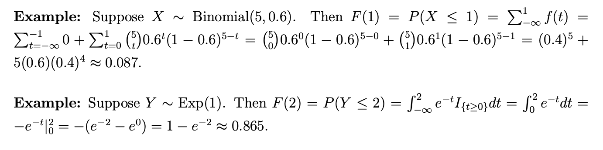
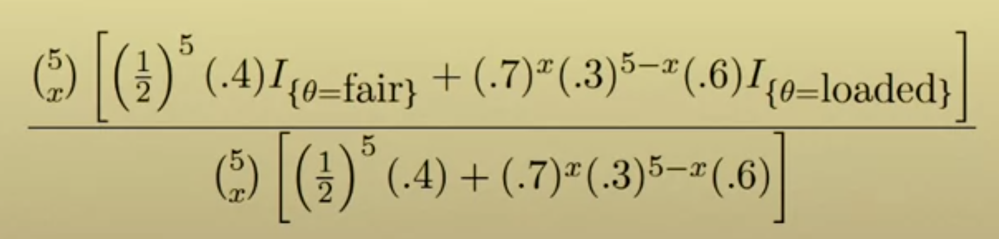

<!--page_number:true-->
<!-- $width: 1150-->
<!-- $height: 1500-->

## Bayesian Statistics:

# 5. Bayesian inference

### Herbert Lee

### Univerrsity of California Santa Cruz

 

 
## Background for Lesson 5

### 용어정리 
* **CDF** - Cumulative distribution function. **누적분포함수**. 연속분포든 이산분포든 상관 없이 모든 분포가 가질 수 있음. 이 누적분포함수는 PMF, PDF로 나눠서 표현될 수 있다. 
* **PMF** - Probability Mass Function: **확률질량함수**
	* $f(x)$가 질량함수일 경우 $\sum _{t=-\infty}^xf(x)$로 표현 되는 PMF.

* **PDF** - Probatility Density Function: **확률밀도함수**. 
	* $f(x)$가 밀도함수라면 $\int_{t=-\infty}^xf(t)dt$가 된다. 

 

* CDF는 아래와 같이 범위(intervals) 안의 확률을 구할때 유용하게 사용된다. 

---

### Quantile(분위수) Function
 * CDF는 랜덤 변수를 취해서 확률을 return한다. 0에서 1사이에 있는 $p$값을 정해서, 
<**$P(X \le x)= p$인 $x$** >를 구하고 싶다고 하자. 그 때, **이 식을 만족하는 $x$를 우리는 $X$ 분포의 $p$ quantile(혹은 100p percentile - 백분위수)** 이라고 한다. 

#### Example: 
* 규격테스트에서 시험참여자들의 97번째 percentile 점수가 23점 이다. 그 말은 만약 모든 시험참여자 97%이상의 점수를 받고 싶다면, 23점을 받아야 한다는 말이다. 
* 이 때 우리는 $q= 23$을 테스트 점수 분포의 .97 quantile이라고 부른다. 

 

## 5.1. Inference example: frequentist

* 만약 당신의 동생이 공평하지 않은 코인, 70% 확률로 앞면이 나올 가능성이 있는 코인으로 자신은 앞면이 나오는 쪽을 선택하고, 5번 던져서 많이 나오는 사람이 이기는 내기를 제안했다고 하자. 
* 그렇다면 먼저 그 코인이 정상일 경우와 아닌 경우에 해당하는 확률, $\theta$. 내기의 조건에 해당하는 $X \thicksim Bin(5, ?)$은 아래와 같이 표현할 수 있다. 

$$f(x|\theta) = \begin{cases} {5 \choose x}\Big(\frac{1}{2}\Big)^5 \text{ if }\theta = \text{fair} \\ {5 \choose x}(.7)^x(.3)^{5-x} \text{ if }\theta = \text{loaded} \end{cases}$$

* 자, 그럼 이 상황에서 $X=2$인 경우, likelihood는 어떻게 되는가? 위식을 보고 계산해보면 아래와 같이 된다. 

$$f(\theta(X=2)) = \begin{cases}{0.3125} \text{ if }\theta = \text{fair} \\ {0.1323} \text{ if }\theta=\text{loaded} \end{cases}$$ 
* 따라서 MLE($\theta$)는 0.3125의 공평한 주사위인 경우다고 말할 수 있다. 이 것이 frequentist들의 MLE다. 그럼 여기서 추가 질문. **그걸 얼마나 확신할 수 있는데?**

---

* 이 질문은 Frequentist의 패러다임으로는 쉽게 대답을 할 수가 없다. 또 하나 질문할 수 있는 것은, $X=2$이라는 전제 하에, 코인이 공평할 경우의 확률이 얼마나 되냐는가이다. 

$$P(\theta=\text{fair} | X=2)$$

* Frequentist들의 입장에서는 코인은 하나의 물리적인 물체다. 고정된, 정해진 코인 하나다. 그래서 앞면이 나올 수 있는 정해진 확률이 있다. 그 코인이 공평하든 공평하지 않든 말이다. 
* 그렇기에, $P(\theta=\text{fair} | X=2)$ 는, $P(\theta = \text{fair})$와 같은 말이나 다름없고, 그 확률 또한 공평하나 안하냐 $P(X)\in \{0, 1\}$라고 밖에 말할 수 없다. 이런 대답은 딱히 만족스런 대답일 수가 없다. 
* 그럼, 여기서 Bayesian Inference에서는 어떤 대답을 얻을 수 있는지 살펴보자. 

              

---

## 5.2. Inference example: Bayesian

* **Bayesian 접근법의 장점은, 이것은 당신이 쉽게 prior - 사전확률 정보를 취합**할 수 있게 해준다.  Posterior - 사후확률에 대한 정보를 알기 위해, 울리가 이미 알고 있는 Prior를 사용한다. 동전이 공평하지 않을 확율이 60%라는 것을 우리가 안다고 하면,

$$\text{Prior: } P(\text{loaded)} = .6$$

$$f(\theta|x) = \frac{f(x|\theta)f(\theta)}{\sum_\theta f(x|\theta) f(\theta)}$$

* 베이즈 정리의분모에 해당하는 경우는  $\theta$가 fair or loaded 두가지다. 

 

* 우리가 **다섯 번 던져서 두 번 앞면**이 나왔다는 데이터를 가지고 있을 때, 이 정보를 사용해서 식을 계속해서 정리하면, 다음과 같이 식을 구성할 수 있다. 

$$f(\theta| X=2) = \frac{0.0125 I_{\{\theta=\text{fair}\}} + 0.0079I_{\{\theta = loaded\}}}{0.0125 + 0.0079} $$
$$= 0.612I_{\{\theta=\text{fair}\}} + 0.388 I_{\{\theta = loaded\}}$$

* 이렇게 되면, 5번 중에 2번의 앞면이 나왔을 때, 그 동전이 공평하지 않을 확률이 무엇이냐고 물어보면 $P(\theta = \text{loaded} | X=2) =0.388$라고 말할 수 있게 된 것이다. 이것이 Frequentist들의 대답보다 더 만족스러운 Bayesian의 설명이다.

   

---
### Bayesian Inference의 장점
* 우리는 이처럼, Prior - 사전확률을 무엇으로 가질 것이냐에 따라, 똑같은 계산을 한다면, 우리의 믿음(belief)에 기반해서, 코인이 공평할 확률과 아닐 확률에 대해서 수치로 말할 수 있게 된다.
* 이 동전 내기를 제안한 사람이 내가 아주 잘 알고 있는 동생이라고 할 때, 나한테 사기칠 확률이 90%라는 전제를 한다면 Prior는 $P(\theta = \text{loaded}) =.9$가 되고, 이 사전확률을 가지고 똑같은 계산을 하면,

	$$P(\theta = \text{loaded}) =.9 \to P(\theta=\text{loaded}|X=2) = . 792$$
	라는 확률을 말할 수 있게 된다.
        

* 반대로 보통의 경우 공평할 확률이 50%라고 하면,
	$$P(\theta = \text{loaded}) =.5 \to P(\theta=\text{loaded}|X=2) = .297$$
    이라는 확률로 동전이 공평하지 않을 가능성에 대해 수치적으로 표현할 수 있다.
* 이렇게 수식으로 자신의 전제(Prior, Belief)를 수식적으로 표현할 수 있다는 것이, 앞서 말했던 베이지안 접근법의, **주관적(subjective), 일관적(consistent), 논리적(coherent)인 특징**이다. 

       

---

## 5.3. Continuous version of Bayes' theorem

* 앞서 배운 개념을 정리하면, 베이즈 정리에 의해

	$$f(\theta|y) = \frac{f(y|\theta)f(\theta)}{f(y)} = \frac{f(y|\theta)f(\theta)}{\int(y|\theta)f(\theta)d\theta} = \frac{\text{likelihood} \times \text{prior}}{\text{normalizing constant}}$$
	가 되는데, normalizing constant부분이 아무래도 계산하기에 좀 괴롭기 때문에 실용적으로는, 
    
    $$\frac{\text{likelihood} \times \text{prior}}{\text{normalizing constant}} \propto \text{likelihood} \times \text{prior} $$
    를 사용한다. $\text{likelihood} \times \text{prior}$ 가 어떻게 생겨먹었는지를 먼저 확인한 후에, 맨 마지막에 적절한 normalizing constant를 적용해주면 되기 때문에, 당장 $\int$를 모두 계산할 필요가 없다. 

 

#### Example
* 동전을 던져서 앞면이 나올 확률을 모른다고 하자. 그러면 우리는 그 확률를 모르겠다는 의미를 균등분포, 다 똑같은 확률을 가지겠지뭐~ 라는 의미로, Uniform distribution으로 표현할 수 있다.

$$f(x) \thicksim U[0, 1] \text{, } f(\theta)= I_{\{0\le\theta\le 1\}}$$
* 자, 이때 우리가 한 번 동전을 던져서 앞면이 한 번나왔다고 하면, 아래와 같다.

	$$f(\theta|Y=1) = \frac{\theta^1(1-\theta)^0I_{\{0\le\theta\le1\}}}{\int_{-\infty}^{\infty}\theta^1(1-\theta)^0d\theta}$$
    $$=\frac{ \theta I_{\{0\le\theta\le1\}}}{\int_0^1 \theta d \theta} = 2\theta I_{\{0\le\theta\le1\}}$$
    
    
---

* 같은 결과를 우리는 비례식(proportional)을 써서 다음과 같이 할 수도 있다. 
	$$f(\theta|y) \propto f(y|\theta)f(\theta) \propto \theta I_{\{0\le\theta\le1\}}$$
    그렇게 먼저, $\text{likelihood} \times \text{prior}$를 확인하고, 맨 마지막에 분모가 되는 친구를 나눠줘도 똑같은 결과에 이를 수 있기 때문에, $\propto$로 계산하고 뒤에 생각해보는 식의 접근법이 훨씬 편해서, 자주 이런식으로 한다. 
    
                    

---

## 5.4. Posteriror intervals

* 5.3.에서 살펴본 동전 예시를 이어서 Prior Density function과 Posterior Density function을 그려보면 다음과 같다. 

#### Prior Interval Estimates - 사전확률 구간 추정 

* Uniform Distribution이기 때문에 아래의 구간에 대해
  $$P(0.025 < \theta < 0.975) = .95 , \text{ } P(\theta > 0.05) = .95$$
	와 같이 쉽게 계산해볼 수 있다. 

#### Posterior Interval Estimates - 사후확률 구간 추정 

* 사후확률 그래프는 위에서 보이는 바와 같이 증가함수로, 계산을 해보면, 

	$$P(.025 < \theta < .925) = \int_{.025}^{.975}2\theta d\theta = .975^2 - .25^2 = 0.95$$
    로, 사전확률구간추정과 같은 확률이 나온다. 
    
* 하지만, $P(\theta > .05)$ 구간에 대해서는,

	$$P(\theta > .05) = 1-.05^2 = .9975$$
    라는, 확실히 다른 수치가 나온다.
    
* Prior Interval estimates와 Posterior interval estimates의 차이가 의미하는 것은, **우리가 $P(Y=1)$라는 실제 데이터를 관찰 함으로, Prior에서 Posterior로의 큰 변화를 볼 수 있다는 것**이다.

---

#### 특정한 수치 확률 범위 구하기.
* 우리는 다른 경우, 우리는 **사후확률의 관심구간 - Posteriror interval of interest이 어떻게 되는지**, 예를들어 "95%의 사후확률을 포함하는 구간은 어떻게 되지?"하고, 질문할 수 있다.
* 이 질문은 아마 Frequent disconfidence interval과 개념상 같은 말일 수도 있다. 우리는 다양한 방식으로 이 질문에 대답할 수 있는데, **Bayesian Posterior Intervals인, 신용구간(Credible Intervals)를 구하는 방법**으로 **Equal-tailed intervals**와 **Highest posterior density intervals**가 있다.

#### Equal-tailed intervals(ETI)

* 말 그대로 95% 구간을 구한다고 했을 때, 양 끝 꼬리에는 각각 0.025씩 구간을 설정하는 방식이다. 이것이 가능하게 하기 위해서는, 우리는 Quantiles(분위수)가 무엇인지 알아야한다. 
* 우리가 알고 싶어하는 범위가 $P(\theta < q |Y=1)$이고 이것을 계산하면, $\int_0^q 2\theta d\theta = q^2$다. 그래서 우리가 원하는 구간을 ETI개념에 입각해서 구하면 $P(.025 < \theta < .975)$가 아니라 $P(\sqrt{.025}<\theta < \sqrt{.975}$가 된다.(제곱해야 실범위가 나오는 표현식이 돼야하니까) 
* 마저 계산하면 정답은 $P(.158 < \theta < .987)$이 된다. 이 말인 즉슨, **Posterior의 확률그래프에서, $\theta$가 이 구간 안에 있을 가능성이 95%라는 말**이다.

#### Highest posterior density intervals(HPD)

* 또 다른 방식은 **최대 사후확률 밀도 구간** - Highest Posterior Density Intervals다. 
* 같은 전체 확률의 95%를 포함하는 구간을 구할 것이지만 밀도가 가장 높은 구간을 구하게 된다. 그 말인 즉슨, 가장 짧은 구간에 95%에 해당하는 양을 가지고 있으면 밀도가 가장 높다는 말이고, 그 가장 짧지만 밀도가 높은 구간을 구하게 되는 방식이다. 
* 우리는 95%의 확률를 포함하는 가장짧은 구간을 구하고 싶다. 이 때도 역시 Quantiles를 확인해봐야하는데, 역시나 같은 공식을 적용해서 $P(\theta > \sqrt{.05}|Y=1)$을 구하게 되고, 이는 $=P(\theta > .224|Y=1) =.95$
라는 말이 된다. 

---
### Posterior Distribution이 의미하는 것?
* 사후확률분포(Posterior Distribution)가 설명하는 것은 **우리의 믿음(Belief)과 가지고 있는 Data를 조합한, 우리의 불확실성에 대한 이해**다. 
* 확률밀도함수(**PD**F - Probability Density Function)로, 우리는 특정 구간 안에서 데이터가 존재할 확률에 대해 말할 수 있게 된다. 이 것은 Frequentist들이 신뢰구간(Confidence Intervals)으로 설명하는 방식보다 더 만족스러운 대답을 해준다. 
* 위의 예시에서 확인할 수 있었듯이, 합법적으로(legitimately) 특정 범위 안에 알 수 없는 $\theta$가 존재할 확률에 대해서 말할 수 있었다. Posterior Distribution을 그리고, 그 안에서 범위를 구하며, 그렇게 불확실성에 대한 확률을 이야기 할 수 있었다. 
* 이것은 무수한 가정을 전제로 해야하는 frequentist들이 할 수 없는 것이다. 
* The point is, 
	## **Bayesian들은 불확실성을 확률로 표현 할 수 있다!!** 

              

---

## Supplementary material for Lesson 5

### 1. Normalizing Constants and Proportionality - 한정상수와 비례성

* $f(\theta|x) \propto f(x|\theta)f(\theta)$, likelihood 곱하기 prior로 표현 되는 것은, 우리는 부분적으로 그것이 해당 Posterior를 표현할 수 있다고 말할 수 있기 때문이다. 

* $\propto$ 라는 표현 자체가, 만약 $f(\theta) = 5\theta$라고 하면, 우리는 $f(\theta) \propto \theta$라고 말할 수 있다. 여기서 한정상수(Normalizing Constant)는 5다.

* 주의할 점은 우리는 이 비례성(proportionality)이 오직 **전체 $f(\theta)$를 곱했을 때만 성립할 수 있다는 점**이다. 

	* 예를 들어, $f(\theta)$는 $\theta + 1$과 비례하지 않는다.  $\theta +1$이 비례하는 식은, $5(\theta +1)$와 같이, 전체 식이 함께 곱해져 있어야 한다.

	* 분모가 되는 $\int_{-\infty}^{\infty}f(x|\theta)f(\theta)d\theta$는 전체적인 덧셈의 합인 상수, $\theta$로 부터 자유롭기 때문에 우리가 $f(\theta|x) \propto f(x|\theta)f(\theta)$라고 쓸 수 있다. 그저 한정상수일 뿐이다. 우리는 $\theta$를 포함하지 않는 어떠한 곱셈들을 무시할 수 있다. 

### Example

* If $\theta \thicksim N(m, s^2)$, then
	$$f(\theta) = \frac{1}{\sqrt{2\pi s^2}}\text{exp}\Big[-\frac{1}{2s^2}(\theta - m)^2\Big]$$
    $$\propto \text{exp}\Big[-\frac{1}{2s^2}(\theta - m)^2\Big]$$
    
        