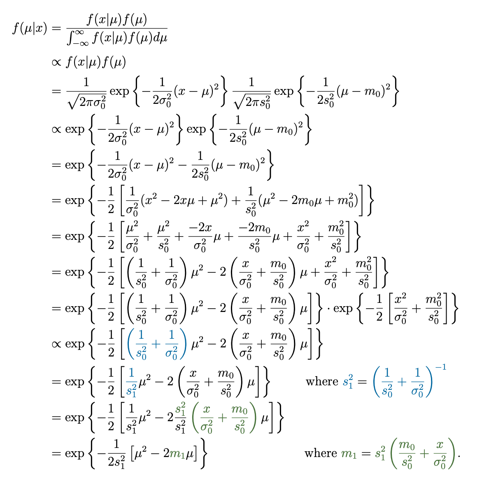
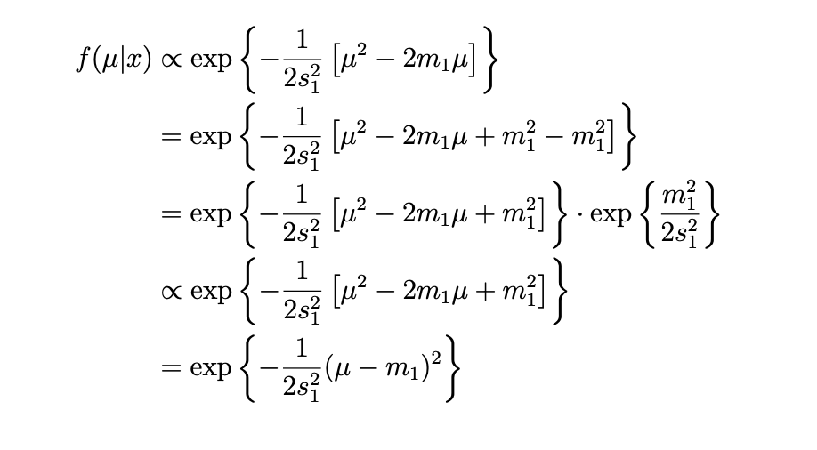
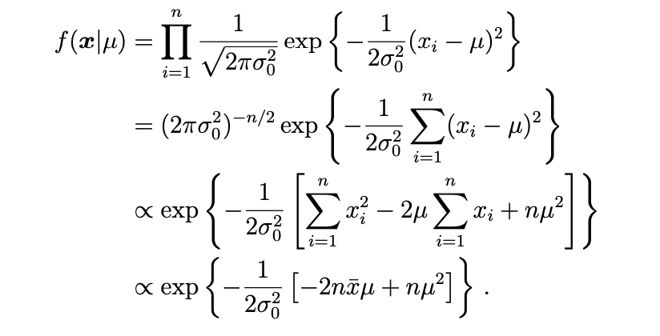
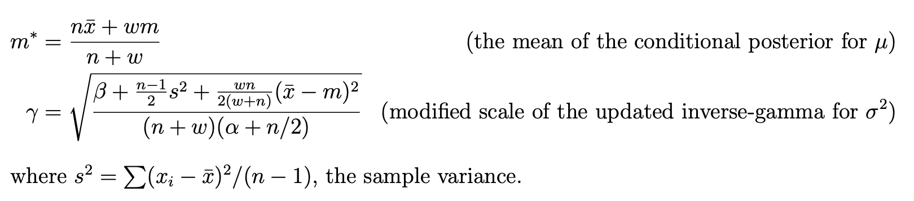

<!--page_number:true-->
<!-- $width: 1150-->
<!-- $height: 1500-->

## Bayesian Statistics:

# 10. Normal data
### Herbert Lee

### Univerrsity of California Santa Cruz

 

* 마지막으로 살펴볼 분포는 Gaussian 분포라고도 불리는 정규분포다. 정규분포는 사람들의 키, 공장의 생산 프로세스, 그리고 중심극한정리의 결과로 많은 분야에서 나타날 수 있다. 

## 10.1. Normal likelihood with variance known

* 분산은 알고 있다고 할 때, 평균을 알고 싶다고 하자. 이런 경우는 생산 산업체 생산 프로세스를 모니터를 하는 경우 자주 관찰될 수 있다. 

$$X_i \thicksim N(\mu, \sigma_o^2)$$

* 이런 경우, $\mu$의 Prior는 어떻게 선택할 수 있는가? Conjugate prior를 사용하면 편리하겠지만, 정규분포의 Conjugate는 자신의 평균에 해당하는 Parameter 그 자신이다.  

	$$\text{Prior  } \mu \thicksim N(m_0, s_0^2)$$

	$m_0$, $s_0$가 뜻하는 것은, parameter가 아니라, 특정한 값이라는 뜻이다. 

* Posterior를 구하기 위해 비례식 $f(\mu|x) \propto f(x|\mu)f(\mu)$을 계산하면 그 결과로 아주 복잡한. 아래와 같은 식을 얻을 수 있다. 식의 전개과정은 Supplementary Material에서 확인할 수 있다. 

	$$\mu|x \thicksim N\Bigg(\frac{\frac{n \bar x}{\sigma_o^2} + \frac{m_o}{s_0^2}}{\frac{n}{\sigma_o^2}+\frac{1}{s_0^2}}, \frac{1}{\frac{n}{\sigma^2}+\frac{1}{s_o^2}}\Bigg) $$

---
### Posterior Mean
* Posterior 식에서 평균부분에 더 집중해서 살펴보면, 아래와 같이 분리할 수 있다.
  	$$\frac{\frac{n \bar x}{\sigma_o^2} + \frac{m_o}{s_0^2}}{\frac{n}{\sigma_o^2}+\frac{1}{s_0^2}} = \frac{\frac{n}{\sigma_o^2}}{\frac{n}{\sigma_o^2}+\frac{1}{s_o^2}}\bar x + \frac{\frac{1}{s_0^2}}{\frac{n}{\sigma^2}+\frac{1}{s_0^2}}m$$ 
    $$=\frac{n}{n + \frac{\sigma_0^2}{s_0^2}}\bar x + \frac{\frac{\sigma_o^2}{s_0^2}}{n + \frac{\sigma_0^2}{s_0^2}}m$$
    
    이렇게 보면, Posterior Mean은 또 Prior mean의 weighted average와, Data mean의 weighted average의 합인 것을 알 수 있고, **Effective sample size또한, n에 대응되는 $\frac{\sigma_0^2}{s_0^2}$- 데이터의 분산과 Prior의 분산의 비(ratio)가 되는 것**도 확인할 수 있다.  
* 이 식은 Prior의 분산이 클수록, 들어있는 실제 정보의 양이 작을 것이고, Prior의 분산이 작을수록, 더 많은 정보들을 가지고 있다고 해석할 수 있게 해준다. 

           

---
## 10.2. Normal likelihood with variance unknown

* 그렇다면, $\mu$와 $\sigma^2$를 둘 다 모를 때는 어떻게 해야할까? $\mu$와 $\sigma^2$를 둘 다 모를 때도 우리는 Conjugate Prior를 계층적(Hierarchical)인 차원에서 정의할 수 있다. $X_i$가 iid라고 하면, 

	1) 	$$X_i | \mu, \sigma^2 \thicksim N(\mu, \sigma^2)$$
    이고, 여기의 $\mu$의 분포를 아래와 같이 정의한다. 
	2) $$\mu|\sigma^2 \thicksim N\Big(m, \frac{\sigma^2}{w}\Big)$$
    $\sigma^2$에 대한 식이 된다. 여기서 $w$는 분산과, <u>정규분포의 또다른 분산</u>(?)인 $\sigma_\mu$의 비율, Ratio다. $w=\Big(\frac{\sigma^2}{\sigma_\mu}\Big)$ 이 **$w$가 Prior의 Effective sample size**다. 이유는 아래에서 이따가 설명.  

	마지막으로, Prior를  $\sigma^2$에 대해서 전개하면 된다. **이때, Conjuate Prior는 감마분포의 역함수**다. 그래서 우리는 parameter로 $\alpha$와 $\beta$를 설정한다. 
    
    3) $$\sigma^2 \thicksim \Gamma^{-1}(\alpha, \beta)$$

### Posterior
* 그러면, 나중에 살펴 볼 엄청난 양의 계산이 끝나면, 우리는 아래와 같은
 $\sigma^2$  Posterior를 구할 수 있다.
    $$\sigma^2|x \thicksim \Gamma^{-1}\Big(\alpha + \frac{n}{2}, \beta + \frac{1}{2}\sum_{i=1}^n(x_i - \bar X)^2 + \frac{nw}{2(n+2)}(\bar X - m)^2\Big) $$
     $\mu$의 Posterior(given $\sigma^2$)는 아래와 같다. 명시적으로 $\sigma^2$에 대한 식이다. 
    $$\mu|\sigma^2, x \thicksim N\Big(\frac{n\bar x + wm}{n + w}, \frac{\sigma^2}{n+w} \Big)$$
    
    
---

* $$\mu|\sigma^2, x \thicksim N\Big(\frac{n\bar x + wm}{n + w}, \frac{\sigma^2}{n+w} \Big)$$
	Posterior Mean인,$\Big(\frac{n\bar x + wm}{n + w}\Big)$에 주목해보면, 아래와 같이, Prior mean과 Data mean으로 나누어서 다시 표현될 수 있고,
    $$\frac{n\bar x+wm}{n+w} = \frac{w}{n+w}m + \frac{n}{n+w}\bar x$$
    우리는 $w$가 effective sample size가 된다는 것을 알 수 있다. 
    
    
* 우리는 결국엔 $\mu$에만 집중하고 싶고 $\mu$만 추론하고 싶을 수 있다. 위에서 전개해 온 Posterior에 대한 식들이 $\sigma^2$과 상관없게 만들고 싶을 수 있다. 
* $\sigma^2$를 다 처리해버려서 합쳐버리게 되면, $t$ 분포를 따르게 된다. 
	$$\mu| x \thicksim t$$
    마찬가지로 Posterior Predictive Distribution 또한 t분포를 따르게 된다. 
    
             
    
    
* 전체적으로 설명이 부족하다. 왜 감마함수의 역함수가 정규분포 분산의 Conjuate Prior가 되는 건지. 등등 설명이 전체적으로 부족하다.  

---
## Supplementary material

### 1. Conjugate Posterior for the Normal Mean

* 10.1에서 생략한 어마어마 한 식에 대한 설명이다. 우리가 알고싶어하는 Posterior가
$x_1, x_2, ... x_n \thicksim N(\mu, \sigma^2$)라는 데이터와 
$\mu \thicksim N(m_0, s_0^2)$라는 likelihood에 대한 식이라고 보고, 
	$$f(\mu|x)= \frac{f(x|\mu)f(\mu)}{\int_{-\infty}^{\infty}f(x|\mu)f(\mu) d\mu} \propto f(x|\mu)f(\mu)$$
    라는 식을 전개해 나가는 설명인데, 우선은 한 개 $x$라는 데이터에 대해서 전개하면 전체 식은 아래와 같다. 저 파란 $s_1^2$부분과 녹색 $m_1$치환하는 부분은 이해가 안간다. 
    
    

    
---
    
* 약간의 트릭을 써서 식을 정리하면, 
	

	
	로 마저 정리할 수 있다. $m_1$과 $s_1^2$를 평균과 분산으로 가지는 정규분포가 된다. 

* 그렇다면, 이 것을 $n$개의 독립적인 데이터에 대해 확장을 하면 되는데, 이 때, likelihood는 아래와 같다.
	

	그렇게 다시 식을 계산해도 되겠지만, 우리는 이 식이 오직 Sample의 평균인 $\bar x$에 대한 식에만 우리의 data가 기여하고 있다는 것을 발견 할 수 있다. **이것은 $\bar x$가 $\mu$에 대해 '충분한 통계'가 되어준다는 것을 의미**한다. 
---

* 그렇다면, 우리는 binomial likelihood를 베르누이 분포의 연속식 대신에 쓸 수 있었던 것 처럼, $\bar x$의 식을 likelihood로 사용할 수 있다. likelihood를 그래서, 정규분포의 성질을 사용해서, 아래와 같이 쓸 수 있다. 

	$$\bar x | \mu \thicksim N\Big(\mu, \frac{\sigma^2}{n}\Big), \text{ } \mu \thicksim N(m_0, s_0^2)$$ 
	그래서 $x$ 대신에 $\bar x$를, $\sigma^2$대신 $\sigma^2/n$을 대입하여 식을 업데이트하면, 10.1에서 쓴 결과를 얻을 수 있다. (잘 이해한게 맞으려나..)
    
    
     

### 2. Marginal Distribution of Normal Mean in Conjuagte Model

* 주변확률분포인 Marginal Distribution은 두 가지 변수로 표현되는 결합확률, Joint Probability Distribution, $f(x, y)$를 두 변수가 독립이라는 가정 하에, 하나의 변수($x$ 혹은 $y$)에 대한 식으로만 표현할 수 있게 해주는 역할을 한다. 
* 그래서 위의 Posterior를 Data $x$에 대한 Marginal distribution으로 풀어 쓰면 
	$$\int_{-\infty}^{\infty}f(x|\mu)f(\mu) d\mu$$
	로, $\mu$에 대한 적분을 취해서 표현할 수 있다. 그렇게 이 식은 새로운 데이터가될 $x^*$에 대한 Prior Predictive distribution이 된다. 

* 이 식을 좀 더 편리한 방법으로 다시 써볼까 한다. 
	$$ x = \mu + \epsilon \text{ where } \epsilon \thicksim N(0, \sigma^2)$$
	$$\mu = m_0 + \eta \text{ where } \eta \thicksim N(0, s_0^2)$$
	라고 하자, $\epsilon$과 $\eta$는 서로 독립이다. 
    
    
---

* $\mu$를 첫번째 식에 치환해서 쓰면, $x = m_0 + \eta + \epsilon$라는 식을 얻을 수 있다.
	두 개의 정규 랜덤 변수들을 더한 값의 결과는 또 다른 정규 랜덤 변수가 된다는 것을 생각해보면, 

	$$E(x)= E(m_0 + \eta+ \epsilon) = m_0 + E(\eta) + E(\epsilon)$$
	$$ = m_0 + 0 + 0$$
	가 되고, 
    $$Var(x) = Var(m_0 + \eta + \epsilon) $$
	$$= Var(m_0) + Var(\eta) + Var(\epsilon) = 0 + s_0^2 + \sigma_0^2$$
	가 된다. 

* 그래서 결론적으로 $x$의 marginal distribution을 좀 더 쉽게, 평균 $m_0$과 분산 $s_0^2 + \sigma_0^2$에 대한 식으로 쓸 수 있다.
* Posterior predictive distribution도 똑같은 방식인데, $m_0$과 $s_0^2$가 10.1에서 보듯이, Posterior update가 되면서 바뀐다는 것만 주의하면 된다. 

 

### 3. Inverse-Gamma Distribution

* **Inverse-gamma 분포는 평균이 알려진 정규분포 likelihood의 $\sigma^2$의 Conjugate prior**다. 또한 10.2에서 나오는 모델의, **$\sigma^2$의 Marginal prior/posterior** 이기도 하다.

* 이름에서 유추할 수 있듯이 감마분포와 관련이 있는데, 

	$$X \thicksim \Gamma(\alpha, \beta)$$
    $$Y = 1/X \thicksim \Gamma^{-1}(\alpha, \beta)$$ 
	가 된다. 
    
---

* Inverse-Gamma($\alpha$, $\beta$)의 함수식은 아래와 같다. 

$$f(y) = \frac{\beta^\alpha}{\Gamma(\alpha)}y^{-(\alpha+1)}\text{exp}\Big(-\frac{\beta}{y}\Big) I_{\{y \gt0\}}$$
$$E(Y) = \frac{\beta}{\alpha -1} \text{for }\alpha \gt 1$$

### 4. Margianl Posterior Distribution for the Normal Mean when the Variance is Unknown.

* 만약 우리가 알지도 못하는 $\sigma^2$에 대해서 관심이 없다면, **우리는 joint posterior로 적분을 때려서 없애**버릴 수 있다. 10.2 마지막에 말한것 처럼. 이렇게 하면 **marginal t-분포 posterior**가 된다. 

* **이 t-분포는 $\nu = 2\alpha + n$의 자유도**를 가진고, 아래와 같은 두가지 추가 매개변수, scale $\gamma$와, location $m^*$를 가진다. 각각에 따른 추산 식은 아래와 같다.(지랄맞네..) 

	

* **이 t-분포는 $\mu$에 대한 신용구간을 구하는 데 사용**될 수 있다. scale $\gamma$와 location $m^*$에 해당하는 분위수를 곱하면 말이다. 

#### Example:

* 평균도 분산도 모르는 정규분포 데이터를 가지고 있다고 하자. 우리는 그래서 아래와 같은 10.2의 모델을 쓰고, $m=10$, $w = 0.1$, $\alpha = 3/2$, $\beta = 1$, $n = 20$개의 독립된 데이터를 $\bar x = 1.2, s^2=0.7$라는 형태로 가지고 있다. 

	$$\sigma^2|x \thicksim \Gamma^{-1}\Big(\alpha + \frac{n}{2}, \beta + \frac{1}{2}\sum_{i=1}^n(x_i - \bar X)^2 + \frac{nw}{2(n+2)}(\bar X - m)^2\Big) $$

---

* 그러면, 이 문제는 주어진 힌트들을 각각의 식에 대입하고 복잡한 식의 결과를 얻으면, 아래와 같이 풀릴 수 있다. 

$$\sigma^2 | x \thicksim \Gamma^{-1}(11.5, 7.72)$$
$$ \mu|\sigma^2, x \thicksim N\Big(1.19, \frac{\sigma^2}{20.1}\Big)$$
$$m^* = 1.19, \text{ } \gamma = 0.183$$

* $\mu|x$ 는 23의 자유도를 가진 t-분포이며, location 1.19와, scale 0.183을 가진다. 
	* location은 평균값이라는 의미로 정규분포의 정 중앙의 위치(location)을 의미한다.  
* $\mu$에 대한 95%의 equal-tailed 신용구간을 구하기 위해서는, 먼저 0.025와 0.975 분위수에 해당하는, 자유도 23의 정규 t 분포 수치가 필요하다. 표를 찾아보면, 0.025는 -2.07, 0.975는 2.0이다. 
* 그렇다면, 95% 신용구간은 $m^* \pm \gamma(2.07) = 1.19 \pm 0.38$이 된다. 

          