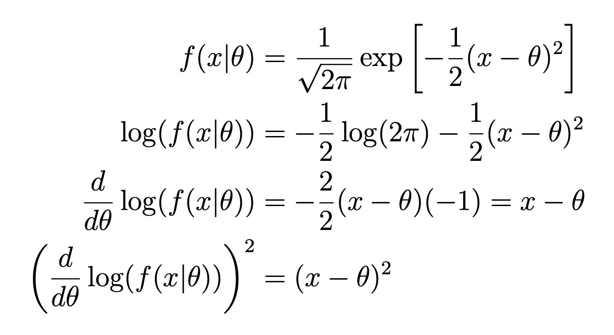

<!--page_number:true-->
<!-- $width: 1150-->
<!-- $height: 1500-->

## Bayesian Statistics:

# 11. Alternative priors

### Herbert Lee

### Univerrsity of California Santa Cruz

## 11.1. Non-informative priors

* 여태까지는 많은 정보를 가지고 있는 Prior를 선태하는 방법에 대해서 알아보았다. 그리고 확신하기 힘든 경우, Prior에 많은 정보를 넣지 않고 모호한 상태로 두는 법에 대해서도 보았다. 
* 또 다른 접근법은 **objective Bayesian statistics 혹은 objective bayesian inference**라고 불리는 방식이다. 우리는 명시적으로 Prior에 들어갈 정보의 양을 최소화 하려 할 것이다. 

* 이것은 Posterior에 대한 Data 자체의 영향력을 최대화 하는 것이다. 그렇기에 이런 방식을 나아가서는 **Non-informative priors**라고 부른다.

### 첫 번째 Non-informative priors 예시: 또 다시 동전
* 동전 던지기 예시로 돌아가보자. 앞 면이 나올 확률을 모른다고 하고 베르누이 분포를 따른다고 가정한다. 

	$$Y_i \thicksim B(\theta)$$
	어떻게 하면 $\theta$에 대한 우리 Prior를 최소화 할 수 있을까? 한 가지 직관적인 방법은 모든 $\theta$의 값들이 같은 확률을 가진다고 해버리는 것이다. 그래서 그냥 Uniform 분포를 따른 다고하면 된다. 
    
    $$\theta \thicksim U[0, 1]$$

---

### Effective sample size
* 여기서 $U[0, 1]$는 $\text{Beta}(1, 1)$과 같다는 것을 떠올릴 수 있다. 그렇다면 Beta Prior의 Effetive sample size는 두 변수의 합이다. 그러면, 이 경우는 2가 된다. 
* 이 말은 이미 동전이 가지고 있는 한 면은 앞면, 한 면은 뒷 면이라는 Data와 같은 말이다. 그러니까 아직 얘는 완전히 non informative prior라고 할 수 없다. 

* 그렇다면 Effective sample size작게 하기 위해서 $\text{Beta}(\frac{1}{2}, \frac{1}{2})$를 취한다거나, $\text{Beta}(0.001, 0.001)$과 같이 할 수도 있을 것이다. 그럼 이런식으로 가면 거의 0에 가까워지다가 극한그로 가서, $\text{Beta}(0, 0)$을 Prior로 설정하면 어떻게 될까? 
* 그렇다면 밀도함수는 아래와 같은 형태를 띄게 된다. 

	$$f(\theta) \propto \theta^{-1}(1-\theta)^{-1}$$
	그렇다면 이 식에 $\int$를 취하면 1이 아니라 무한대로 발산한다. 그래서 이런 경우를 우리는 **Improper prior**라고 한다. 
    
* 그러면, 상식적으로 이런 Improper prior는 우리는 못쓴다고 생각할 수 있다. 하지만, 실제로 데이터를 수집할 때는 그냥 써본다. 데이터를 수집하면 우리가 Prior를 뭘 가지고 있든 간에 최소 1개의 앞면과 1개의 뒷면은 나올 수 있는 한, 그냥 가보는 거다. 
* 그러면 Posterior의 밀도함수는 
	$$f(\theta|y) \propto \theta^{y-1}(1-\theta)^{n-y-1}$$
	가 되고, 이는 $\text{Beta(y, n-y)}$의 형태가 된다. 그러면 여기서, Posterior Mean은
	$$\frac{y}{n} = \hat \theta$$
	가 된다. 가만 보면 이 **결과는 Frequentist들의 MLE 결과와 같다!**
* 하지만, **큰 차이점은 전체 Posterior에 대해서, 구간을 설정하고, 그 구간에 $\theta$가 들어갈 확률을 알고 싶다고 하면, 이것은 Frequentist들은 할 수 없는 것**이라는 것이다. 

    
---

### Summary

* 그래서 이렇게까지 Improper prior를 사용하는 것을 보여주면서 하고싶은 말은, 

*	#### 첫 번째: 
	**Posterior가 Proper하다면, Improperr priors를 사용해도 괜찮다**는 것이다. 그래서 Posterior가 Proper한지, 수학적으로 체크되어야 할 부분이 있을 수도 있고, 어느정도 데이터에 대해 연구가 필요할 수도 있다. 
	* 이번 예시의 경우는 proper posterior를 얻기 위해서 최소 한 번의 앞면과 한 번의 뒷면이 나올것이라고 관찰하고 난 뒤에 진행하였다.

* **두 번째:**
Prior에는 많은 문제들이 존재하는데, 특히 Improper prior가 그렇다. Improper prior는 Frequentist들의 패러다임과 같은 결과를 도출한다. 

	* 아주 비슷한 결과지만, 베이지안의 접근법에서 거의 전적으로 데이터에 의존하는 결과를 가져온다는 것이 다른 점이다.
	* 또한 Posterior 구간추정을 할 수 있고Parameter의 Posterior 확률에 대해서도 이야기 할 수 있다. 

### 두 번째 Non-informative priors 예시: 정규분포

#### 1. $\sigma^2$ 알고 있을 때:
* iid이고, $\sigma^2$를 알고있다고 가정한 정규분포가 있다고 하자. 

	$$Y_i \thicksim N(\mu, \sigma^2)$$
    
    우리는 여기서 평균인 $\mu$에만 집중할 것이다. 

* 우리는 **vague prior**의 관점에서 아래와 같이 가정할 수 있다. 
	$$\mu \thicksim N(0, 1000000^2)$$
	이 말은 현실적으로 가지고 있는 아이템을 흩뿌리는 것을 의미한다. 당신은 엄청나게 많은, 다양한 가능한 변수들 중에서 하나를 고를 수 있다는 말이다. 
    
---

* 위와 같은 가정을 하면, 수많은 가능성들에 걸쳐서 공평하게 non informative하다고 할 수도 있겠다. 그렇다면 이제 우리는 극한을 취해서 생각해 볼 수 있다. 
* 분산을 그럼 훨씬 더 크게 해서 무한대로 보내버리면 어떻게 될까? 기본적으로 현실적인 선상에 이 분산을 퍼뜨려 놓은 것이다. 그러면 우리는 아래와 같이 비례하게는 밀도함수가 1이라고도 말할 수 있다.
	$$f(\mu) \propto 1$$ 
    여기서 1이라는 것은 그냥 현실선상에서의 어떠한 상수(constant)를 말한다. 

* 확실히 이 것은 improper prior다. 이 밀도함수를 적분을 취했다가는 당연히 무한대라는 답을 얻을 것이기 때문에 그렇다. 
* 하지만 이 Prior를 Posterior를 찾는데 그냥 대입을 해버리면 아래와 같이 된다.
	$$f(\mu|y) \propto f(y|\mu) f(\mu)$$
    $$\propto \text{exp}\Big(-\frac{1}{2\sigma^2}\sum(y_i -\mu)^2\Big)(1)$$
	$$\propto\exp\Big(-\frac{1}{2{\frac{\sigma^2}{n}}}(\mu - \bar y)^2\Big) $$
    
    $$\mu|y \thicksim N(\bar y, \frac{\sigma^2}{n})$$
    
    
* 이 결과는 또 MLE와 같다.

 
#### 2. $\sigma^2$도 모를 때:

* 분산도 모를 때는, Prior의 밀도 함수 식은 $f(\sigma^2) \propto \frac{1}{\sigma^2}$와 같다. (왜???) 그러면 이 말은 또 prior가 $\Gamma^{-1}(0, 0)$이라는 말이다. (왜???2) 
* 이것은 improper prior이고 $\sigma^2$의 log scale에서는 정규분포(uniform distribution)이 된다. (아니 그러니까 왜.....) 

---
* 그리고 Posterior for $\sigma^2$는
	$$\sigma^2|y \thicksim \Gamma^{-1}\Big(\frac{n-1}{2}, \frac{1}{2}\sum(y_i - \bar y)^2\Big)$$
    가 되어서, 또 frequentist의 sample standard deviation 같은 결과가 된다.
	
    (이 교수님 말 진짜 너무 막하는데...이렇게 불친절할 수가...)
    
                     

---
## 11.2. Jeffreys prior

* 균일분포 Prior를 고르는 것은 특별한 파라미터표시에 달려있다. 예를 들어, 정규분포를 살펴보면, 

	$$Y_i \thicksim N(\mu, \sigma^2)$$
    내가 $\sigma^2$의 로그 스케일의 균일 분포인 prior를 사용한다고 가정해보면, 
	$$f(\sigma^2) \propto \frac{1}{\sigma^2}$$
    라는 말이 된다. 그리고 또 다른 어떤 사람이 로그 스케일이 아니고 $\sigma^2$자체를 prior를 쓰고 싶다고 하면, 
    $$f(\sigma^2) \propto 1$$
    이 된다. 그래서, 이 두가지 Prior들은 특정 스케일이나 파라미터표시 방법에 따라는 둘 다 균일분포이지만, 분명히 둘은 다른 prior이고,서로 다른 posterior를 결과로 가져오게 돼있다. 

* 그래서 **핵심은 Uniform Prior는 변환과정에서는 변할 수 있다는 점**이다. Uniform Prior를 사용하면, 당신이 어떻게 문제를  파라미터화 시키는지에 따라 다른 답을 얻게 된다. 이 문제에 관한 하나의 시도가 **Jeffreys priors**다.  

### Jeffreys Prior

* 제프리 사전확률은 다음과 같다. 

	$$f(\theta) \propto \sqrt{I(\theta)}$$
    무슨 말인가 ~ 하면, 지금 내가 보고 있는 이 Prior가, Fisher information이라고 부르는, $\sqrt{I(\theta)}$에 $\propto$하게 성립하는지를 알아보는 방법이다.

* 대부분의 경우에 이 식은 다 improper prior로 귀결된다. 

---
#### 정규분포 데이터 예시
* 정규분포 데이터를 예시로 들어보자. 
	$$Y_i \thicksim N(\mu, \sigma^2)$$
	이 때, **우리가 prior로 아래와 같이 균일분포지만 $\mu$에 대해 설정하거나, $\sigma^2$에 대해서 설정해서 서로 다른 파라미터화를 하더라도, Jeffreys priors에 넣으면 같은 information을 제공**하게 돼있다. 
    
    $$f(\mu) \propto 1, \text{and }f(\sigma^2) \propto \frac{1}{\sigma^2} (\text{on the log scale)}$$

#### 베르누이 or 이항분포 예시
* Bernoulli나 Binomial의 예시에서는, Jeffreys priors는 아래와 같이 표현된다. 
	$$Y_i \thicksim B(\theta)$$
    $$f(\theta) \propto \theta^{-1/2}(1-\theta)^{-1/2} \thicksim Beta\Big(\frac{1}{2} , \frac{1}{2}\Big)$$
	이 경우는 Jeffreys prior가proper prior로 결론이 나는, 특별한 경우에 해당된다. 왜냐면 보다시피, $Beta\Big(\frac{1}{2} , \frac{1}{2}\Big)$라는 부분에서 effective sample size로 1이라는 정보를 가지고 내포하고 있는 Prior이기 때문이다.  
* **하!지!만! 우리가 $\theta$가 아닌, 확률을 parameter로 사용했다 하더라도, 예를 들어 로지스틱 스케일에서 prior계산을 한다고 하더라도, 수식은 다 달라지지만, Jefferys prior를 통과하면 우리는 같은 1이라는 정보를 얻을 수 있다.**

* Objective Bayesian inference의 다른 가능한 접근법으로는, **Reference priors와 maximum entropy priors**가 있다. 

---

### 교수님의 충고 
* 마지막으로, 베이지안 분석의 실경험적인 측면에서, 관련이 있는 개념에 대해 이야기 해보고자 한다.

* 경험적인 차원에서는 당신은 당신의 prior를 돕기 위해 데이터라는 것을 사용한다. 예를 들어 Prior 분포의 평균을 정하기 위해서 데이터의 평균을 사용하는 것처럼 말이다. 이런 접근법은 Posterior에 대해  합리적인 점추정으로 자주 이끌어 준다.

* 하지만, 이런 방법은 일종의 컨닝이다. 왜냐하면 당신은 데이터를 두 번 사용하는 것이기 때문이다.(?) 그래서 결론적으로 이런 방식은 어쩌면 부적절 불확실 추정에 이르게 할 수도 있다. 

	(그래서, 데이터에 의존해서 prior를 정하기 보다는, Non-informative priors 같은, Objective bayesian inference를 사용해서 Posterior를 구하라는 뜻인가봄)
    
    
 

## Supplementary material

### 1. Fisher Information 

$$I(\theta) = E\Big[ \Big(\frac{d}{d\theta}\text{log}(f(X|\theta))\Big)^2\Big]$$

* Fisher information은 낮은 분산을 가지고 있는 것처럼, 좋은 성질을 가지고 있는 경우에 $\theta$에 대해 추정하는데 유용하게 사용할 수 있다. 
* Jeffreys prior의 근간이다.

---

### Example:
* 다음과 같이 X가 정규분포를 따르고 있을 때, 
	$$X | \theta \thicksim N(\theta, 1)$$
	우리는, 아래와 같이 Fisher Information 공식에 따라 식을 변형할 수 있다. 
    
    

* 따라서, $\theta$에 대한 Fisher information $I(\theta)$는, 아래와 같다.
	$$I(\theta) = E[(X - \theta)^2] = Var(X) = 1$$