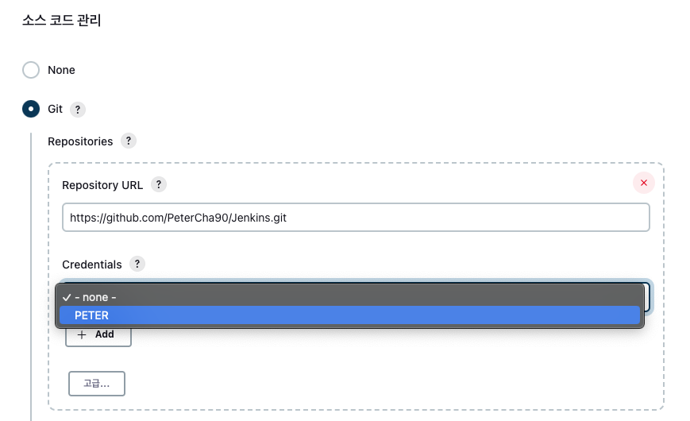

# Connect Github

**Updated at 2023.03.07**

### 1. SSH 만들고 Github에 등록

---

- SSH 인증 설정 - 이건 해도되고 안해도 되는데, 보안을 위해서 나는 괜히 해봤다.
  mac의 경우 `/Users/peter/.jenkins` 위치에 젠킨스가 설치된다. 그래서 나같은 경
  우는, 저 폴더 아래에 `.ssh` 폴더를 만든다.
- `.ssh` 폴더 안에서 아래 명령어를 실행해서 ssh 비대칭키 생성. 나오는 질문에는
  그냥 엔터만 쳐도 됨.
  ```bash
  $ ssh-keygen -t rsa -f ./[my_ssh_key_name]
  ```
  그러면 아래와 같이 확인할 수 있다. 나는 test라는 이름으로 생성했다.
  ```bash
  $ ssh-keygen -t rsa -f ./test
  Generating public/private rsa key pair.
  Enter passphrase (empty for no passphrase):
  Enter same passphrase again:
  Your identification has been saved in ./test
  Your public key has been saved in ./test.pub
  The key fingerprint is:
  SHA256:5TMbrBvt58uyuH+VCLSZyY72h8GysPu6q+49f2OlLDk peter@Peterui-MacBookAir.local
  The key's randomart image is:
  +---[RSA 3072]----+
  |                 |
  |          .      |
  |         o.=     |
  |         +B      |
  |        S+*. . . |
  |      . +o+=o o  |
  |       +o*o= .   |
  |     .o E=X.+    |
  |   o+.*O*B+O+.   |
  +----[SHA256]-----+
  $ ls
  test     test.pub
  ```
- Jenkins를 연동하고자 하는 Repository의 Settings 클릭하고, 좌측 목록의
  Security - Deploy keys를 누른 뒤, Add Deploy Key를 클릭하고 생성된 공개키. 즉.
  test.pub의 내용을 넣어줘도 되지만, 나는 그냥 SSH 키 자체를 내 계정에 등록했다.
- 아래처럼 우측 상단 프로필을 눌렀을 때 나오는 Settings 클릭.
    


1. 그러고 SSH and GPG keys 클릭하고 New SSH key를 눌러서, `$ less test.pub` 를
사용해 나온 공개키 내용을 jenkins라는 이름으로 등록해줬다.


### 2. Github **Repository Webhooks 설정!**

---

- 그 다음으로 등록해준 공개키를 가지고, 실제 어떤 주소의 jenkins에게, Github
  repository에 변경이 생겼을 때 Webhook으로 알려줘야하는지 알려주자.
- 젠킨스를 연동하고 싶은 리포지토리를 클릭하고 상단 Settings → Webhooks를 클릭.

    

- 그 다음 Add webhook을 누르면

    

- 아래와 같이 세팅. Payload URL은 **ngrok으로 설정한 주소 + `/github-webhook/`
  을 꼭 붙여주자**.

    

- 설정이 잘 됐다면 아래처럼 체크표시가 뜬다!! 

### 3. Jenkins Credential 만들기

---

- Credential을 만들기 위해 Jenkins 홈에서 좌측 메뉴에 보이는 `Jenkins 관리` 클릭
  . 

- Security 영역의 `Manage Credentials` 클릭

    

- 아래처럼 Domains의 (global)을 마우스 hover하면 뜨는 Dropdown을 내려서
  `Add credentials` 클릭하거나 그냥 클릭해서 나오는 Global credentials 페이지 우
  상단에 `+ Add Credentials`를 클릭!
    
- 아래처럼 Kind 클릭해서 SSH Username with private key 누르고, ID는 마음대로 정
  하고,
    
- Private Key 부분에 아까 1번에서 생성한 SSH 비밀키(`.pub` 안붙은거) 내용을 less
  나 cat 명령어로 출력해서 복붙해주면 끝!
    
- 짜잔
    

### 4. 후. 드디어 연결!

- 좌측에 보이는 새로운 Item 클릭해주고.
    
- 이름 맘대로 정해주고, 젤 위에 Freestyle project 클릭해주자.

    

- GitHub project 체크하고 Repository URL 작성
    
- Github Repo 주소 복사해와서 아래 보이는 GitHub project 클릭하고 Project url에
  넣어주고,
    
- 소스 코드 관리 부분에도 넣어주면 된다. Credentials 클릭하면 아까 만들어논 키가
  보일거고 그걸 선택.
    
- 주의해야할 부분은 Branches to build 부분이다.. 저게 기본적으로 `*/master`로 되
  어 있는데, 이게 겁나 함정이다. `*/main` 으로 바꿔줘야 한다!
    
- 마지막으로 빌드 유발 부분은 GitHub hook trigger for GITScm polling으로 선택해
  주고 가장 아래 저장을 눌러주면 끝!
    

### 5. Results!

---

- 홈에 가보면 내가 설정한 프로젝트가 보인다. 클릭해보자.
    
- 지금 빌드를 한 번 클릭해주고(안해줘도 되려나), 작업공간을 클릭해서 확인해보면
    
- 실제 Github 내용이 그대로 보인다! 새로운 파일을 추가하고 삭제했을 때, 그 때 그
  때 이 목록도 바뀌고 변화가 생겼다는 걸 알 수 있다.

  - 추가했을 때. 
  - 추가한 걸 지웠을 때. 아주 잘 반영이 된다. 

- 구체적인 로그는 GitHub Hook Log를 클릭해보면 알 수 있다.
  
