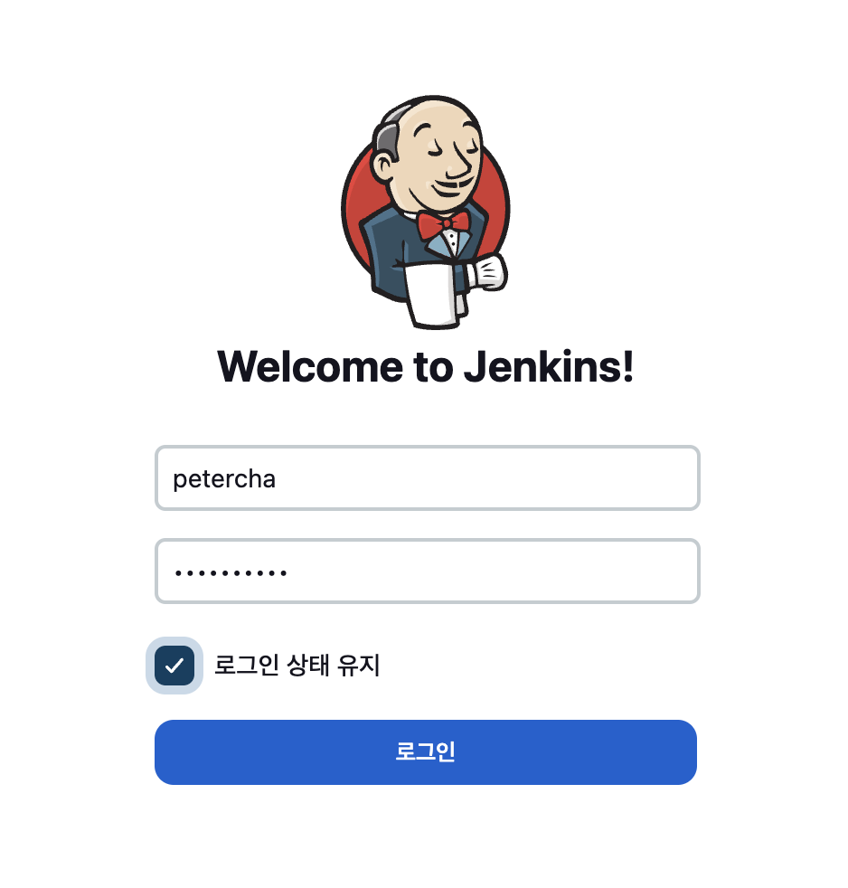
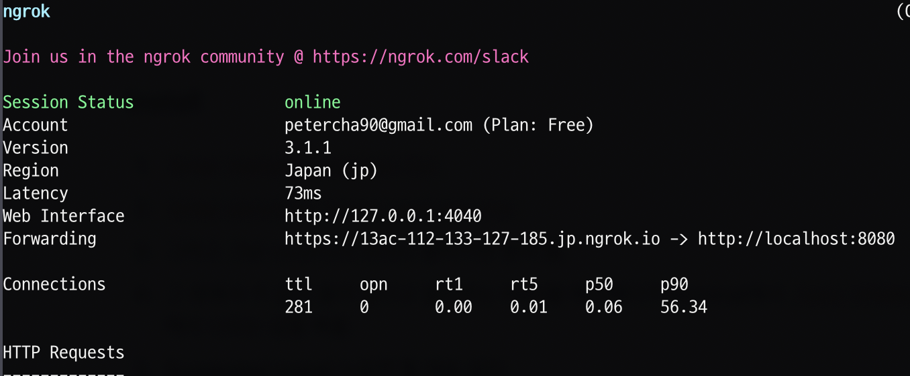

### Install

---

1. `brew install jenkins-lts`
2. `brew services start jenkins-lts`
3. 그러고 그냥 [localhost:8080](http://localhost:8080) 들어가면 창이 뜸.
4. 그 창에서 키 값이 들어 있다고 알려주는 Path를 복사해다가 terminal에서
   `less {YOUR_PATH}` 해서 나오는 값을 복붙.
5. Suggested Install 누르면 뭘 계속 설치.
6. 그럼 설치는 완료다!

- 하지만, 보다시피 Jenkins는 로컬에 설치가 됐다. 이 로컬에 깃헙이 있는 외부에서
  Webhook이란 개념으로 변경이 생기면 변경사항을 받을 수 있어야 하는데, 그러려면
  어떻게 외부에서 내 로컬 젠킨스에 연결이 되게 한단 말인가. ~~답답쓰~~
- 그래서 착한 분들이 ngrok이라는 무료서비스를 만들어 놨다.

### ngrok

---

- [공식 홈피](https://ngrok.com/download)를 참고해서 설치해도 되고, 맥은
  `$ brew install --cask ngrok` 으로 설치 쌉가능.
- `$ ngrok http 8080` 해주면! 짜잔. 저기 보이는
  https://13ac-112-133-127-185.jp.ngrok.io/로 접속하면 내 젠키스가 보인다! 젠킨
  스를 설치할 때 등록한 ID/PW가 아니면 로그인 안되니까 안심하고 사용!
  

- 다만 내 PC와 ngrok 서버 간 통신은 https가 아니기 때문에 보안에 완전하지 못하다
  . 그냥 테스트 용으로 쓰고, 제대로 서비스를 해야하면 https가 되는 프로버전을 쓰
  면 될거 같다. 
