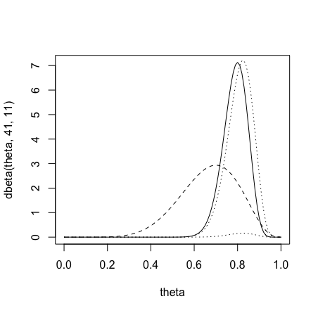

<!--page_number:true-->
<!-- $width: 1150-->
<!-- $height: 1500-->


## Bayesian Statistics:

# 7. Bernoulli/binomial data

### Herbert Lee

### Univerrsity of California Santa Cruz

<hr>
<br>

## 7.1. Bernoulli/binomial likelihood with uniform prior


* 6과에서 살펴보았듯이 **$\Gamma$함수와, Beta 분포 식을 사용하면**, **베르누이 Likelihood를 위해 Uniform Prior를 사용할 때는, Beta Posterior를 얻게 된다**. 이 표현을 수식적으로 증명하면 아래와 같다. 

$$f(y|\theta) = \theta^{\sum y_i}(1-\theta)^{n-\sum y_i}, f(\theta) = I_{\{0\le \theta \le 1\}}$$

$$f(\theta|y) = \frac{f(y|\theta)f(\theta)}{\int f(y|\theta)f(\theta)d\theta} = \frac{\theta^{\sum y_i}(1-\theta)^{n-\sum y_i}I_{\{0 le \theta \le 1\}}}{\int_0^1 \theta^{\sum y_i}(1-\theta)^{n- \sum y_i}I_{\{0 le \theta \le 1\}}d\theta}$$

$$= \frac{\theta^{\sum y_i}(1-\theta)^{n- \sum y_i}I_{\{0 le \theta \le 1\}}}{\frac{\Gamma(\sum y_i +1)\Gamma(n-\sum y_i +1)}{\Gamma(n+2)}\int_0^1\frac{\Gamma(n+2)}{\Gamma(\sum y_i +1)\Gamma(n-\sum y_i +1)} \theta^{\sum y_i}(1-\theta)^{n- \sum y_i}d\theta}$$

$$= \frac{\Gamma(n+2)}{\Gamma(\sum y_i +1)\Gamma(n-\sum y_i +1)}\theta^{\sum y_i}(1-\theta)^{n-\sum y_i}I_{\{0 \le \theta \le 1\}}$$

<br>

$$\theta|y \thicksim Beta(\sum y_i +1, n-\sum y_i +1)$$


---

## 7.2. Conjugate Priors

* 사실상, 균일분포, **Uniform Distribution은 Beta(1,1)** 다. 그리고 **모든 Beta 분포들은 베르누이 분포의 활용형태(Conjugate)** 다. 그 말인 즉슨, 7.1.에서 사용한 Uniform Prior도 사실상 beta prior라는 말이다. 그래서 **모든 Beta Prior는, Beta Posterior를 주게 돼있다**. 그동안 공부한 내용을 잘 따라왔다면 아래의 식을 이해할 수 있다. 

	* 먼저 아래와 같이 Beta Prior가 있다고 하고,
	$$f(\theta) = \frac{\Gamma(\alpha + \beta)}{\Gamma(\alpha)\Gamma(\beta)}\theta^{\alpha -1}(1-\theta)^{\beta-1}I_{\{0\le\theta\le 1\}}$$
 
	* Posterior에 대한 식을 한정 상수를 무시할 수 있는 비례식으로 전개해 나가면,

		$f(\theta|y) \propto f(y|\theta)f(\theta)$
        
		$=\theta^{\sum y_i}(1-\theta)^{n-\sum y_i}\frac{\Gamma(\alpha + \beta)}{\Gamma(\alpha)\Gamma(\beta)}\theta^{\alpha-1}(1-\theta)^{\beta-1}I_{\{0\le\theta\le 1\}}$

		$\propto \theta^{\alpha+\sum y_i -1}(1-\theta)^{\beta + n- \sum y_i -1}I_{\{0\le\theta\le 1\}}$

	* 아래와 같은 결론에 이른다. 
		$$\theta|y \thicksim Beta(\alpha+ \sum y_i , \beta + n-\sum y_i)$$
        이 식에 $\alpha$, $\beta$에 각각, 1을 대입하면 우리가 이미 봤던 것과 같은 결과값을 준다.
        
* Likelihood와 함께 일하는 특별한 형태의 Prior를 고르는 이러한 전체 프로세스를 '**`Conjugate family`** 를 사용한다.'라고 표현한다. 
*  **분포가족(Family of distributions)은 켤레**를 뜻한다. 무슨 말이냐, 당신이 만약 **분포가족 멤버들 중에서 Prior를 골랐다면, 당신은 그 가족 멤버 중 또 다른 하나를 Posterior로 가지게 된다**는 말이다. 
	* 위에서 살펴보았듯이, Beta 분포는 베르누이 분포의 Conjugate다. 앞에 $nCx$계수만 likelihood에 없다 뿐이지 Binomial 분포도 마찬가지다. 

---
### Conjugate Prior를 쓰는 이유 
* 우리는 Conjugate Priors를 자주 쓴다. 왜냐면 삶을 더욱 간편하게 만들어주기 때문이다. 만약 전개 과정 중에 Likelihood를 잘 알아볼 수 없다면, 분모가 될 $\int$도 계산하기 힘들어진다. 
* 그렇기에 Conjuagte family Solution은 우리에게 Closed Form Solution(해석이 가능한 형태의 풀이)을 제공해준다. 만약 특정 분포가족이 충분히 유연하다면, 당신의 믿음을 충분히 가깝게 표현할 수 있는 멤버를 찾을 수 있을 것이다. 
* 우리는 이번 예시의 모델을 Hierarchy - 계층적으로 표현할 수 있다. 관찰된 데이터 $Y_1, ... ,Y_m$이 베르누이 likelihood를 따른다. 

	$$Y_i,...Y_n \thicksim B(\theta) \text{ likelihood}$$
    라고 하고, $\alpha$, $\beta$에 영향을 받는 주요 매개변수인 $\theta$는 베타분포 Prior를 가진다.
    $$\theta| \alpha, \beta \thicksim Beta(\alpha, \beta) \text{ Prior}$$
    $\alpha$, $\beta$에게 특정한 값을 줄 수 있을 것이고, 그 특정한 값인 $\alpha$, $\beta$를 $\alpha_o$, $\beta_o$라고 할 때, 우리는 이 $\alpha_o$, $\beta_o$를 **Hyper parameters**라고 부른다.
    $$\alpha , \beta = \alpha_o, \beta_o \text{ Hyperparameters}$$
    
	* 이처럼 $B(\theta)$를 $\to$ $\theta$에 관해서, 또 $\theta$를 $\to$ $\alpha$와 $\beta$에 관련하게 계층적으로 풀어낼 수 있다.

<br><br><br><br><br>

---

## 7.3. Posterior mean and effective sample size

* 7.2.에서 우리는 Conjugate Prior로 인해, Beta Prior를 가지고, Beta Posterior인 $\text{Beta}(\alpha + \sum y_i, \beta + n - \sum y_i)$를 얻을 수 있다는 것을 말했다.이를 통해, Prior와 실관측 데이터가 Posterior에 어떻게 관여하는지 분명하게 확인할 수 있었다.

### Effective sample size

* **우리가 **Prior** $Beta(\alpha, \beta)$를 가지고 있다고 하면, $(\alpha + \beta)$만큼의 *추가 관찰 데이터*를 가지고 있는 것과 같다.** 이것을 우리는 ***"Prior의 effective sample size"*** 라고 부른다. 

* Beta 분포의 평균값이 $\frac{\alpha}{\alpha + \beta}$였다는 것을 생각해보면, $\text{Beta}(\alpha + \sum y_i, \beta + n - \sum y_i)$의 평균값은,
	$$\frac{\alpha + \sum y_i}{\alpha + \sum y_i + \beta + n - \sum y_i} = \frac{\alpha + \sum y_i}{\alpha + \beta + n}$$
    라고 쉽게 계산 할 수 있다. 여기서 좀 더 분해할 수 있는데, 
    
    $$= \frac{\alpha + \beta}{\alpha + \beta + n}\cdot \frac{\alpha}{\alpha+\beta} + \frac{n}{\alpha + \beta + n}\cdot \frac{\sum y_i}{n}$$
	으로 만들 수 있다. 
    
* 여기서 재밌는 것은, 제일 마지막 식을 잘 살펴보면, 곧,

	$\text{Posterior mean} =$
    $$\text{Prior weight } \times \text{Prior mean} + \text{Data weight} \times \text{Data mean}$$
    라는 공식이 성립한다는 점이다. 
* Prior weight과 Data weight는 합쳐서 1이 되기 때문에 Weights라고 할 수 있고, **Posterior 평균값은 Prior 평균과 데이터 평균값의 Weighted Mean**이라고 할 수 있다. 

---
$$= \frac{\alpha + \beta}{\alpha + \beta + n}\cdot \frac{\alpha}{\alpha+\beta} + \frac{n}{\alpha + \beta + n}\cdot \frac{\sum y_i}{n}$$

* $\Big(\frac{n}{\alpha + \beta + n}\Big)$에서, $n$은 Sample Size를 뜻하는데, 그와 상응하는(Corresponding term) 것이 Prior weight부분$\Big(\frac{\alpha + \beta}{\alpha + \beta + n}\Big)$의 $\alpha + \beta$다. 그래서 우리는 이 $\alpha + \beta$를 **Prior의 Effective Sample Size**라고 부르는 것이다. 
* 이 Effective Sample Size가 줄 수 있는 중요한 포인트는, **Prior가(막연한 믿음) 당신의 Posterior에 너무 큰 영향을 주지 않기 위해서 필요한 데이터의 양이 어느정도 인지를 알려준다**는 것이다.
	* 만약 $\alpha + \beta$가 $n$보다 작은 경우, Posterior는 주로 데이터에 의해서 결정되어진다고 해석할 수 있다. 
	* 반대로, $\alpha + \beta$가 $n$보다 상대적으로 크다면, 당신의 Posterior는 상당부분 당신의 Prior(믿음)에 좌우되는 것이다. 

<br>

### Credible Intervals

* Frequentist들의 95% 신뢰구간은 알다시피, 아래와 같다. Frequentist들의 신뢰구간으로는 $\theta$가 실제로 그 구간에 들어있을 확률이 얼마나 되는지 말할 수 없다. 
	$$\hat\theta \pm1.96\sqrt{\frac{\hat\theta(1-\hat\theta)}{n}}$$

* Bayesian으로서,우리는 $\theta$ Posterior 분포를 사용해 95% 신용구간(credible interval)을 만들 수 있다. 
* R과 같은 컴퓨터 패키지를 사용해서, 95%구간에 해당하는 수치들을 찾을 수 있다. 제일 아래에 있는 문제를 풀어보면 알게 되겠지만, R언어로 구해보면, $\text{qbeta}(n, \alpha, \beta)$와 같은 함수를 사용해서, Quantile에 해당하는 Upper, Lower 구간을 정할 수 있다. 실제 $\theta$값을 포함할 확률이 95%인 구간을 찾을 수 있다. 이것이 진짜 확률이다. 


---
### Sequencial Update 
* Prior $f(\theta)$와, $n$개의 관측 데이터가 있다고 하면, Posterior는 아래와 같다. 

	$$f(\theta), \text{ observe }y_i,...,y_n$$
    $$\text{Posterior }\theta|y_i,...,y_n$$
    
* 자, 그러면 당신은 다음날 와서 좀 더 많은 데이터를 관찰했다고 가정해보자. 
	$$\text{more data,  } y_{n+1},...,y_{n+m}$$
 	그러면, 이런데 더 관찰한 데이터를 가지고, Posterior를 Update할 수 있는가? 할 수 있다면 어떻게 하면 되는가.
    
* 방법은 **어제의 Posterior를 오늘의 prior로 사용**하면 된다. 

	$$\text{Posterior }\theta|y_i,...,Y_{n+m}$$
    
* 그렇기 때문에, **새로운 데이터가 관찰될 때마다, 연속적으로 Posterior를 Update**할 수 있다. <u>이렇게 조금씩 Posterior를 Update를 하는 것과, 최종으로 모든 데이터를 모아서 한번의 Batch로 Posterior를 계산하는 것. 둘 다 수식적으로 같은 결과값</u>을 가진다. 
* 주로 자주 작은 양의 Sample Size들이 반영되어야 하지만, 최소한의 updates는 실행되어야 하는 의료기기테스트산업군에서 이런 베이지안의 Sequential Updates라는 특징이 유용하고 실용적으로 사용된다. 

<br><br><br><br><br>

---

## Data Analysis Example in R

* 그 동안 공부한 내용을 실무적으로 적용해 볼 수 있게 아래 문제를 풀어보자. 
* Suppose we are giving **two students a multiple-choice exam with 40 questions**,  where each **question has four choices**. We don't know how much the students have studied for this exam, but **we think that they will do better than just guessing randomly**. 

	#### 1)  What are the parameters of interest(Posterior)$?

	#### 2) What is our likelihood?

	#### 3) What prior should we use?

	#### 4) 
	What is the prior probability P(theta>.25)? P(theta>.5)? P(theta>.8)?

	#### 5) 
	Suppose the first student gets 33 questions right. What is the posterior distribution for theta1? P(theta1>.25)? P(theta1>.5)? P(theta1>.8)? What is a 95% posterior credible interval for theta1?


	#### 6) 
	Suppose the second student gets 24 questions right. What is the posterior distribution for theta2? P(theta2>.25)? P(theta2>.5)? P(theta2>.8)? What is a 95% posterior credible interval for theta2?
	#### 7) 
	What is the posterior probability that theta1>theta2, i.e., that the first student has a better chance of getting a question right than the second student?

<br><br>

---

* ## Solutions:

	**1)** Parameters of interest are theta1=true probability the first student will answer a question correctly, and theta2=true probability the second student will answer a question correctly.

	**2)** **Likelihood is Binomial(40, theta)**, if we assume that each question is independent and that the probability a student gets each question right is the same for all questions for that student.

	**3)** The conjugate prior is a beta prior. Plot the density with dbeta.

    ```R
    > theta=seq(from=0,to=1,by=.01)
    > plot(theta,dbeta(theta,1,1),type="l")
    > plot(theta,dbeta(theta,4,2),type="l")
    > plot(theta,dbeta(theta,8,4),type="l")
    ```

	**4)** Find probabilities using the pbeta function.
    ```R
    > 1-pbeta(.25,8,4)
    > 1-pbeta(.5,8,4)
    > 1-pbeta(.8,8,4)
    ```

	**5)** 
    **Posterior 분포는 Beta(8+33,4+40-33) = 			Beta(41,11)**
    ```R
	> lines(theta,dbeta(theta,41,11))
	```
    **Posterior mean**: 41/(41+11)  
    **MLE**: 33/40 - 베르누이 분포의 MLE는 $p$이기 때문에.- MLE를 구해보는 건 그냥 비교를 해보기 위함. 
	
	
	한 이미지에 결과값을 안짤리게 넣기 위해 새로 Posterior 분포 먼저 다시 그려보자. 
	```R
  > plot(theta,dbeta(theta,41,11),type="l") # Posterior
  > lines(theta,dbeta(theta,8,4),lty=2) # Prior
	> lines(theta,dbinom(33,size=40,p=theta),lty=3) # likelihood
	```

---
* Plot scaled likelihood (44는 likelihood가 너무 작게 나와서 적당히 보기 좋게사이즈를 키워주려하다보니,  그냥 이정도가 적당한 숫자라서 쓴거)
	
	```
    > lines(theta,44*dbinom(33,size=40,p=theta),lty=3)
	```
    다 그리면 아래와 같은 그림이 되는데, 이 그림에서 **점선은 likelihood고, 실선은 Prior, 연속선이 Posterior**다. 
    이 그림을 보면, Posterior가 Likelihood와 Prior 사이에 있다는 것을 알 수 있는데, Likelihood와 더 가까이 있다. 이것은 **Effective Sample Size인 8 + 4 = 12가 40이라는 실제 데이터 사이즈와 비교했을 때** 훨신 작은 수이기 때문에, Posterior는 Prior보다는 likelihood(실제 관측된 데이터)에 더욱 영향을 많이 받는다고 해석할 수 있다. 
<center></center>


---

* 
	**Posterior probabilities**
  ```R
  > 1-pbeta(.25,41,11)
  > 1-pbeta(.5,41,11)
  > 1-pbeta(.8,41,11)
  ```
	**Equal-tailed 95% credible interval**
  ```
  > qbeta(.025,41,11)
  > qbeta(.975,41,11)
  ```

<br>

*	**6)** Posterior is Beta(8+24,4+40-24) = Beta(32,20)
		32/(32+20)  # posterior mean
	24/40       # MLE
	```R
    > plot(theta,dbeta(theta,32,20),type="l") # Posterior
    > lines(theta,dbeta(theta,8,4),lty=2) # Prior
    > lines(theta,44*dbinom(24,size=40,p=theta),lty=3) # likelihood
	>
    > 1-pbeta(.25,32,20) # 25% 이상 Posterior분포가 실제로 포함 될 확률
    > 1-pbeta(.5,32,20) # 50% 이상
    > 1-pbeta(.8,32,20) # 80% 이상
    >
    > qbeta(.025,32,20) # Lower Posterior Credible Interval
    > qbeta(.975,32,20) # Upper Posterior Credible Interval
    ```
  
<br>

* 	**7)** Estimate by simulation: draw 1,000 samples from each and see how often we observe theta1>theta2

    ```R
    > theta1=rbeta(1000,41,11)
    > theta2=rbeta(1000,32,20)
    > mean(theta1>theta2)
    ```
<br>


* 	### Note for other distributions:
    > dgamma, pgamma, qgamma, rgamma
    > dnorm, pnorm, qnorm, rnorm