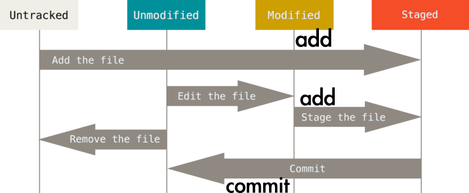
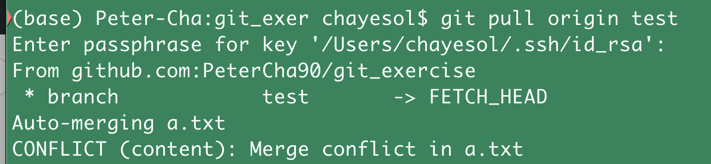
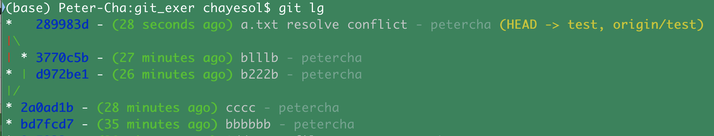
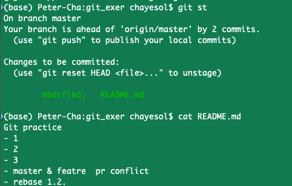

# git

Sources from
[Country](https://github.com/HwangNara/git-class/blob/master/beginner/README.md)

- **🥚 Git 설치하고 이쁘게 세팅하기**

  - **git 설치** [Downloads](https://git-scm.com/downloads)
  - **alias 명령어로 축약어 설정 및 로그 이쁘게 볼 수 있게 설정**

    ```bash
    git config --global alias.sw switch
    git config --global alias.br branch
    git config --global alias.ci commit
    git config --global alias.st status
    git config --global alias.lg "log --graph --abbrev-commit --decorate --format=format:'%C(bold blue)%h%C(reset) - %C(bold green)(%ar)%C(reset) %C(white)%s%C(reset) %C(dim white)- %an%C(reset)%C(bold yellow)%d%C(reset)' --all"

    # 설정 다했으면, 확인
    git config --list
    ```

- 🐤 **기본**

  - **git lifecycle** 

  - **`add`**
    - `git add filename` : 수정이 끝난 파일 Staged로 만들기.
    - `git add -A` : 작업 디렉토리 내 모든 변경 사항을 몽땅 스테이징으로 올리기
    - `git add .` : 현재 위치한 디렉토리 내에서만의 변경 내용을 스테이징으로 넘
      김
    - `git add -p` : 각 변경 사항을 터미널에서 하나씩 확인하면서 스테이징으로 넘
      길지 말지 정할 수 있다.
  - **`commit`**
    - `git -am` : git add -m 합친거. 최초 생성된 파일은 add를 먼저 해줘야 하기때
      문에 바로 이 명령어를 쓸 수 는 없음. 사용 시에는, Untracked File이라는경고
      문을 확인 할 수 있음.
    - `git --ammend` : 바로 직전에 커밋한 거 수정하기 - Stage 상태 파일들과 커밋
      을 같이 한다. Stage에 파일 없으면 그냥 메세지만 수정
  - **`clone`**
    - `git clone repository_url` : 걍 클론
    - `git remote -v`: remote 저장소 확인
    - `git remote set-url origin repository_url`: 원격 저장소 다시 세팅
  - **`branch`**
    - `git branch` : 현재 브랜치 확인!
    - `git branch name` : branch 생성
    - `git **switch** name`: name branch로 이동
    - `git **switch** -c name`: name branch를 생성하고 이동!
    - `git branch -D name` : branch 삭제
    - `git branch ${hashcode}`: 해당 시점으로 이동**(시간여행!)**!
    - Local branch를 생성했지만, 해당 브랜치에서 Commit을 실행하지 않으면 실제
      Github상에는 해당 브랜치가 생기지 않는다.
    - `git push origin --delete {branch명}` : 리모트의 브랜치도 삭제!
    - `git fetch -p` : 삭제된 리모트 브랜치를 로컬에도 반영! -p는 Prune.
  - **`push`**
    - Push를 하려면 기본적으로 권한이 있어야 한다.
    - 기본적으로 같은 Branch에서 여러 명이 작업하고 있다고 하면, 먼저 Push한 사
      람이 최신 버전 Branch가 되기 때문에, 그 뒤로 Push를 하려면 먼저 Merge나
      Rebase를 하고 난 뒤에 Push를 할 수 있다.
    - `git push [origin] [master]`: clone이나 pull을 받았으면 보통 원격저장소는
      origin으로 설정 되어 있다. **[ ] 안에 있다는 의미는 생략해도 된다는 뜻.**
      그니까 걍 `git push` 를 하면 알아서 잘 Commit이 이루어 진다.
    - `git push --force` : git push -f 로 사용하기도 한다. 내 로컬 브랜치로 원격
      브랜치를 덮어 씌워버린다. 강제로 진행하는 부분이기 때문에, 내가 혼자 작업
      하는 feature 브랜치에서만 사용하는 것이 좋다.
  - `**restore**`
    - **restore는 복구를 하는 명령어.** 총 3가지 기능을 할 수 있다.
    1. 특정 파일 **HEAD Commit으로 복구하기**
    ```bash
    $ git restore [filename]
    ```
    1. 특정 파일, **특정 Commit으로 복구하기**
    ```bash
    $ git restore --source [commit hash] [filename]
    ```
    1. **Staged에 올라간거 unstaging 시키기**
    ```bash
    $ git restore --staged [filename]
    ```
  - **`pull & fetch`**
    - `pull` 은 Clone한 서버에서 데이터를 가져오고, 그 데이터를 자동으로 현재 작
      업하는 코드와 Merge.
      ```bash
      $ git pull origin
      ```
    - `fetch` 는 서버에서 데이터만 가져오고, 자동으로 코드를 합치지는 않는다.
  - **`diff`** Source:
    [byeol4001](https://velog.io/@byeol4001/git-diff-%EC%82%AC%EC%9A%A9%ED%95%98%EA%B8%B0)
    - `git diff` : commit된 파일상태와 현재 수정중인 상태 비교
    - `git diff --staged` : commit된 파일상태와 add된 파일 상태 비교
    - `git diff [비교할commit해쉬1] [비교할commit해쉬2]` : commit간의 상태 비교
      하기 - commit hash 이용 ex ) git diff 048171 0c747d
    - `git diff HEAD HEAD^` : commit간의 상태 비교하기 - HEAD 이용. 가장 최근의
      커밋과 그 전의 커밋을 비교한다
    - `git diff [비교할branch1] [비교할branch2]` : branch간의 상태 비교하기 -
      HEAD 이용 ex ) git diff feature/test origin/masterlocal의 feature/test브런
      치와 remote의 master branch 비교 **Branch 전략 - Git Flow (수정필요)**
  - Master, Hotfixes, Release, Develop, Feature 다섯 가지로 이루어진 전략
  - master에서 Tag를 따는 방법은? 

- 🐔 **협업**

  - **Conflict 해결하기 ✨**

    - 다른 사람이 먼저 수정해서 커밋을 한 동일한 파일을 나도 수정을 한 상황이라
      고 할 때. Push를 하거나 Pull을 하려고 하면 Conflict가 난다.

        
        
        - <<<<<<<  HEAD 가 로컬의 자신의 상황,
        >>>>>>> 3770c5b 가 원격저장소(remote origin) 상황
        - `git log` 를 통해 살펴보면 더 확실히 알 수 있다.
        
        

    - 이 상황에서 `git status`를 치면 나오는 추천하는 두 가지 해결책:
      
      1. `git merge --abort` Pull 하기 전 그대로 돌려놓는다. (회피하기)
      2. **[Conflict를 일으키는 파일](https://www.notion.so/330d697f21cd4e4d894553ac5076619d)을
         협의를 통해 최종 수정을 다시 하고**, **다시 Commit, Push를 진행**한다.
         그 결과는 아래처럼, 서로 다른 브랜치로 수정 사항이 달라 나누어 졌던 브
         랜치를 다시 Merge를 잘 한 것을 확인 할 수 있다.
         

  - `**stash**`

    - stash는 작업하던 내용을 임시 저장
    - **브랜치에서 작업을 하다가 다른 브랜치로 변경을 해야하는 경우, 그렇다고 커
      밋은 하고 싶지 않을 때, 임시 저장**!
    - stack 처럼 작동! `git stash`: 현재 상태 저장! - 그러면 현재 status가 저장
      이 되고, 변경사항이사라진다. `git stash list`: stash한 내용을 확인할 때 사
      용 `git stash pop`: 저장한 내용을 복구 할 때 사용
    - `git stash` 를 여러번 사용 후에, `git stash pop` 을 2번 사용하면, 먼저 pop
      한 상황을 커밋을 하라고 나오는데, 커밋을 하게 되면 잠시 분기가 되었다가,
      두 번째 pop을 하고 다시 커밋을 하게 되면 합쳐진다 `git stash apply` :
      stack에 쌓여있는 것 중에 골라서 pop을 하는 기능 `git stash drop` : 현재
      list에 저장된 것들을 날려버리는 명령어.

  - `**merge**`
    - 협업의 핵심! 다른 브랜치와 현재 브랜치를 합쳐서 코드를 합침.
    - 방식
      - `fast-forward` : 내 브랜치에는 변경이 없고, 합치려는 대상 브랜치의 커밋
        만 증가 했을 경우 단순히 HEAD만 옮겨짐
      - `3-way Merge` : 두 갈래로 나온 변경들을 합쳐서 새로운 커밋을 만듬
        conflict
      - `squash` : 대상 브랜치의 커밋들을 하나의 커밋으로 합쳐서 merge.
  - `**rebase`\*\*

    ### 1. 다른 브랜치와 병합

    - 기능은 merge와 같다. (코드를 합침)
    - **장점 1)** 내 브랜치의 커밋을 대상 브랜치의 위(다음)으로 생성함 👉🏻 깔끔한
      로그를 유지할 수 있음 (?) **(fast forward)**

      - git log를 해보면, 다른 브랜치랑 작업이 다를 경우 브랜치가 분기가 되는데,
        rebase를 쓰면 fast-forward를 한 것처럼 다른 브랜치와 분기가 되는 형태를
        만드는 것이 아니라, 그 위에 새로운 하나의 커밋으로 생성해서 깔끔하게 유
        지 시킨다는 말.
      - 만약 마스터에서만 수정이 생겼고, feature/c 브랜치에서는 수정이 없었다고
        하면, 아래 예시처럼 `git rebase master` 를 실행하면, 지금 rebase를 실행
        한 브랜치에서 rebase 다음으로 적은 해당 브랜치(예시에서는 master)로 딱그
        냥 바로 옮겨버린다. Merge와 같다.

        

    - **장점 2)** 두 브랜치 모두 커밋이 있지만 충돌이 나지 않음 **(auto
      merging)**
      - master와 feature/c 두 브랜치가 같은 파일에서 서로 다른 부분에 수정이 있
        었다고 하면, 분기가 된다. 그러나, merge를 하면 merge가 된 부분이 갈라졌
        다가 합쳐지는 형태로 보이지만, rebase를 쓰면 그냥 **두 브랜치의 수정부분
        을 모두 반영한 하나의 '새로운 커밋'을 생성**해서 auto merge로 처리해 준
        다.
    - **장점 3)** 두 브랜치 모두 커밋이 있고 충돌이 남 (**conflict**)
      - 이때는 3가지 옵션이 있다.
      - `--abort` : rebase를 중단. 원래 상태로 돌아감
      - `--continue` : conflict이 난 파일을 보면 충돌이 난 부분을 보여주는데, 그
        부분을 지우고 최종적으로 어떤 모습이어야하는지 수정해준 다음에 이 옵션으
        로 git rebase --continue해주면, 수정한 모습으로 rebase해준다.
        - 이때 주의해야할 점은 수정이 끝난 뒤, git -am으로 add와 commit을 한번에
          하면 안되고 add만! 해주고 그 뒤에 git rebase --continue를 실행해야 됨.
      - `--skip` : 을 사용하는 경우는 그냥 현재브랜치 내용으로 적용해버리겠다는
        뜻.

    ### 2. 커밋 수정하기.

    - rebase를 사용해서 커밋을 수정할 수도 있는데, 주의해야할 점은 꼭!. push를해
      서 누군가 사용하고 있는 commit을 내가 rebase로 수정을 해버리고 있는 것은아
      닌지 체크해야한다는 것이다. 그 때는 절대로 rebase를 하면 안된다(→ Hell
      Gate)
      - 해당 커밋을 기반으로 작업하고 있는 사람이 있는데 그 커밋을 수정해버리면,
        그 사람을 그 세계에 가둬버리는 것이다.
    - 아무튼 사용방법은 아래와 같다. 아래 명령어는 최근 3개의 commit을 합치는 작
      업을 하기 위한 첫 뻔째 명령어다.

      ```bash
      $ git rebase -i @~3
      ```

      - @는 HEAD와 같다. 3은 Head를 포함해서 최근 3개를 뜻한다.
      - -i는 대화형으로 화면을 보여준다. 엔터를 치면 → 아래처럼 최근 3개의 커밋
        을 제일 오래된것 부터 보여주는 화면이 나오는데, 아래처럼 제일 앞에 pick
        이라고 적힌 것은 하나만 남겨두고(어떤 커밋을 기준으로 합칠 건인지 pick),
        

      - 아래 사진처럼 fixup을 뜻하는 f로 바꾸고 저장하면, 첫 번째 commit을 기준
        으로 나머지 2개는 합쳐진다. p, r, e, s, f, x 총 6가지 옵션이 있는데
        p(ick)과, f만 사용해본 예시다. 

  - `**reset**`

    - 상태를 이전의 커밋 상태로 돌아가게 해줌
    - 옵션에 따라서 몇 커밋 이전으로 혹은 어느 단계 (Staged, Modified,
      Unmodified)로 까지 Reset을 할 것인지 결정할 수 있음
    - `show` 를 사용하면 커밋 정보를 보여주는데 이 명령어로 커밋의 과거 및 현재
      를 지칭하는 표현들을 알아보자.

      - `HEAD` == `@` 같은 명령어고 `~` == `^` 랑 같은 명령어다. ex) HEAD~,
        HEAD^, @~, @^ 네 가지 방법 모두 '한 커밋 이전'이라는 뜻이다. @~2: 두 커
        밋 이전
      - 예시 `$ git show @` : 현재 HEAD 커밋 정보 

            `$ git show @~` : 한 단계 이전 커밋 정보

            

            `$ git show @~2` : 두 단계 이전 커밋 정보. `@^2`는 `@~2`와 같은게 아니다. 같지도 않고 그런 명령어는 없다. 안쓴다.

            

    - 옵션
      - `--soft`
        - commit 명령만 되돌린다. (Staged 상태가 된다.)
        - HEAD만 해당 커밋으로 돌린다. 
        - 결과 
      - `--mixed` (기본)
        - commit 명령도 되돌리고, add 명령까지 되돌림 (Modified 상태가 됨)
          
        - 결과 
      - `--hard`
        - commit 명령도 되돌리고, add 명령도 되돌리고, 워킹 디렉토리까지 되돌림
          (Unmodified 상태가 됨)
        - IntelliJ같은 로컬 히스토리 기능이 있지 않는 한은, 워킹 디렉토리까지 되
          돌려 버리기 때문에 복구가 불가능 
        - 결과  

  - **`cherry-pick`**
    - 다른 Branch의 커밋을 가져온다.
    - 브랜치를 따서 작업을 한 커밋의 수가 적다면, 이 Cherry-pick을 이용해서 잠깐
      생긴 수정사항을 간단히 다른 Branch에 반영시킬 수 있다. 예를 들어, 한참 작
      업을 해놓은 브랜치가 있는데, 그 결과를 다른 브랜치에 적용을 해야하는 경우.
      cherry-pick을 사용하면 된다.
    ```bash
    $ git cherry-pick {{hash}}
    ```
    - merge나 rebase보다 간결하고 깔끔한 트리를 유지할 수 있음

- **🤖 그 외 다양한 에러들**
  - `unrelated histories`
    - The **“fatal: refusing to merge unrelated histories”** Git error occurs
      when two unrelated projects are merged (i.e., projects that are not aware
      of each other’s existence and have mismatching commit histories).
    - **Solution** after a `git pull` or `git merge`,
    ```bash
    $ git pull origin master --allow-unrelated-histories
    ```
  - `fatal: in unpopulated submodule` Source:
    [jytrack](https://velog.io/@jytrack/Git-Error-fatal-in-unpopulated-submodule-...-%ED%95%B4%EA%B2%B0%ED%95%98%EA%B8%B0)
    - Local에 clone한 저장소 안에 또 다른 git init이 적용된 디렉토리를 넣고 커밋
      을 시도한 경우 생기는 에러. **Solution**
    ```bash
    $ rm -r .git
    or
    $ git rm --cached . -rf
    ```
