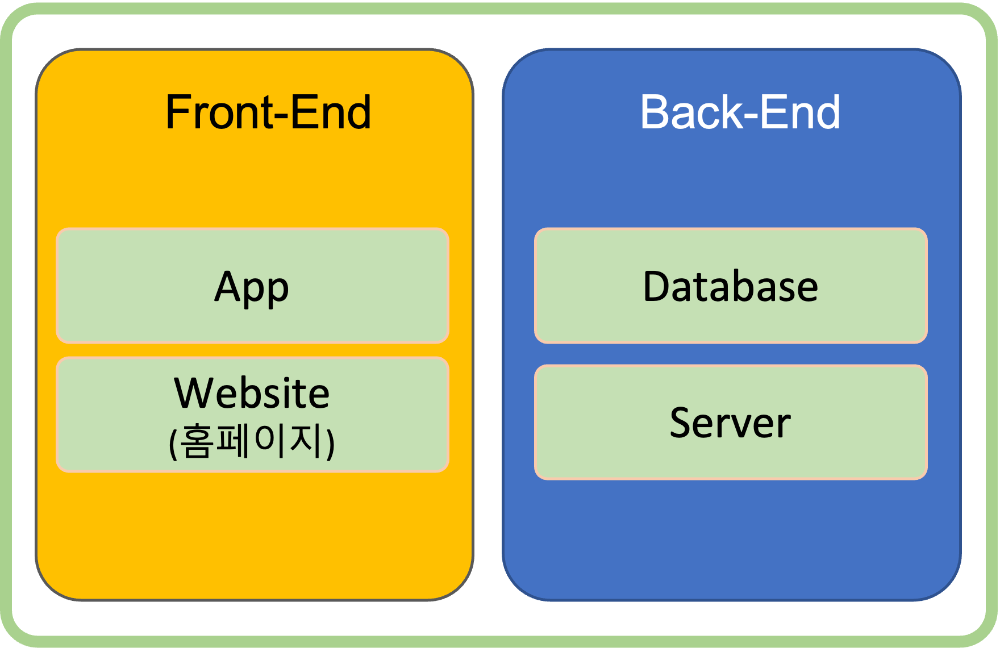
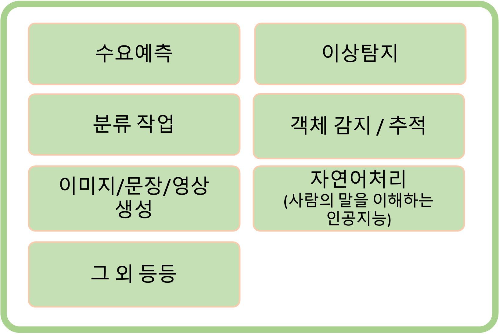
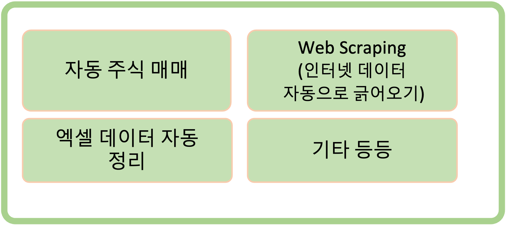
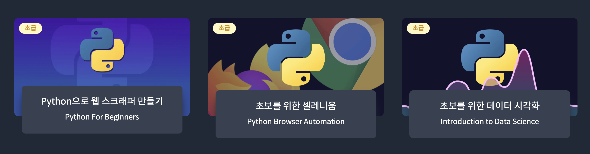
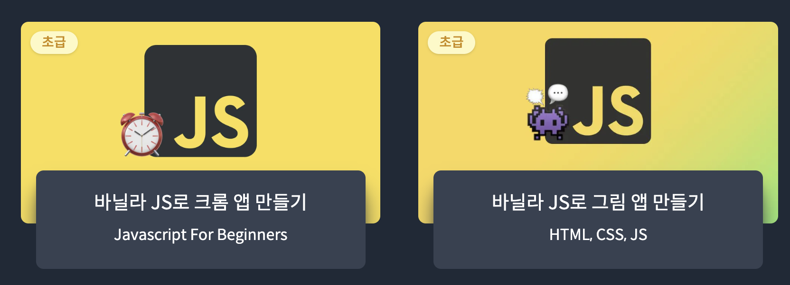
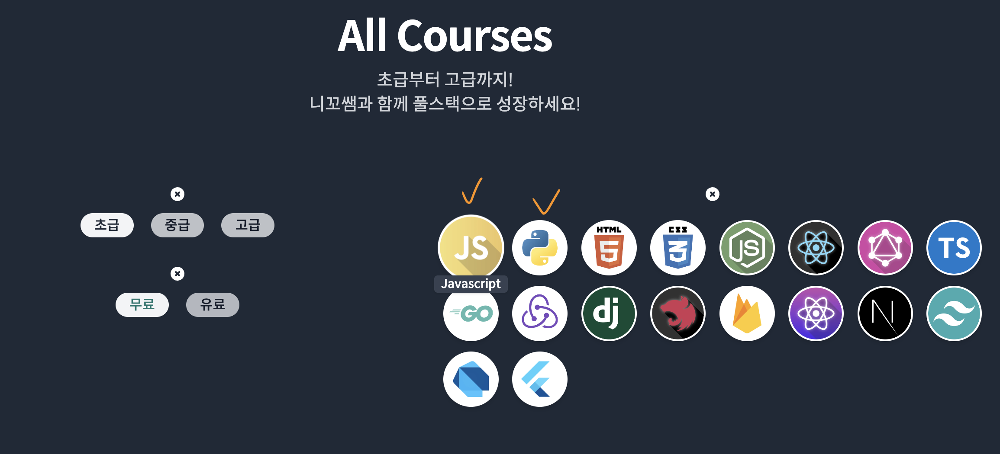

# 개발 입문 가이드

- 쉬운 설명을 위해 작성자 개인의 주관 100%
- 2023년 3월 기준. 요즘 실무에서 활발히 사용하는 내용으로만 설명. 디테일한 것은
  질문 ㄱㄱ

### 🧙‍♂️ 입문 추천 사이트

- **[Nomad Coder](https://nomadcoders.co/)**
  - [Youtube](https://www.youtube.com/@nomadcoders)도 운영을 하고 있어서, 이 유
    튜브 내용만 잘 봐도 트렌드를 읽거나 개발 꿀팁을 가지는 데 엄청난 도움을 얻을
    수 있음.
  - API, Git과 같은 개발자 용어들을 아주 쉽게 잘 설명해주기 때문에 모르는 단어는
    이 유투브 안에서 먼저 검색해서 영상을 먼저 보고 공부를 시작하는 것도 아주 좋
    은 습관.
  - 공부를 시작하는 사람들이 막막하거나 잘 모르는 개념에 대해서 아주 잘 설명해놨
    기 때문에 유투브 영상 목록만 쭈르륵 읽어봐도, 오 이거 봐야겠다 하는 경우가
    많음. 핵강추.

### 👨‍🏫 코딩으로 할 수 있는 것들.

---

- 개발 영역은 아래 그림과 같이 설명할 수 있음.

1. **Service 개발 (App, Website 만들기)**

   

   - 가장 많은 활용도. 무슨 프로그램을 만들든 크게 이 개념에서 출발하지 않는 것
     은 없음.
   - 아래 인공지능 및 데이터분석 모델이든 뭘 만들어도 실제 서비스로 제공되기 위
     해서는 꼭 이 개념이 필요.
   - **Front-End**는 문자 그대로 Front. 즉, 가장 앞 단인 스크린에서 유저를 만나
     는 것과 관련된 기술. 아이폰, 안드로이드 앱 개발과 홈페이지같은 웹페이지를
     만드는 기술.
   - **Back-End**는 Front-End와 반대로, 눈에 보이지는 않지만 Front-End에서 요청
     이 오면 데이터를 저장(ex:회원가입)하거나, 요청 받은 정보에 해당하는 데이터
     를 돌려주는(ex: 로그인 성공했을 때 보여줄 데이터) 부분.
     - Database(DB)는 데이터가 쌓이는 곳
     - Server는 DB에 저장된 데이터를 달라고 요청을 수신하고, DB에서 실제로 꺼내
       와서 Front에게 돌려주는 역할.

2. **데이터분석 & 인공지능**

   

   - 최근 5년 사이 가장 주목 받고 있는 분야인건 확실.
   - 그러나 ChatGPT와 같은 서비스를 만들수 있을 정도가 아니라면, 인공지능으로 어
     떤 것들을 할 수 있고 그 것은 어떻게 동작하는지에 대한 이해를 할 수 있을 정
     도로만 스터디 & 경험하고 이것으로 어떤 서비스를 만드는 것이 좋을까 고민하는
     것이 수익으로 연결되기 더 좋다는 생각.

3. **실무자동화 및 개인용도 프로그램**

   

   - 위 두 분야가 아니더라도, Python이나 JavaScript를 공부하면 실무에 활용하는
     개인적인 용도의 프로그램 개발이 가능.
   - 이런거 잘 만들어서 유료로 파는 사람들도 있음. 크몽에 가보면 웹크롤링 해준다
     , 뭐다 뭐다 해서 용돈벌이하고 있는 개발자들을 많이 볼 수 있음.

### 🧑🏻‍💻 개발 추천 언어 별 특징 설명

---

- **PYTHON**
  - Python은 가장 배우기 쉬운 언어 중 하나로 항상 손 꼽힘.
  - 인공지능, 머신러닝, 데이터 분석에서 독보적인 점유율을 자랑하는 언어.
    - 만든 인공지능을 디테일한 실무(로봇, 모바일 등)에 접목시켜서 제대로 된 서비
      스로 만들기 위해서는 C/C++/C#, Java와 같은 프로그램을 더 공부해야 함.
  - 인공지능 분야가 아니더라도, 간단한 UI/UX 설치형 Front 프로그램을 만들 수도
    있고, 활용이 쉬워서 웹스크래핑을 하거나 주식 자동 투자 같은 프로그램을 만들
    어서 쓸 수도 있는 간편하고 좋은 언어.
  - Python을 가지고도 Web 개발의 Back-end 개발에 해당하는 Server를 만드는 쪽은
    상당히 발달되어 있음.
- **JavaScript**
  - 줄여서 JS라고도 표현을 많이 함.
  - Web 개발, 어플 개발, 서버개발에 아주아주아주아주 많이 사용되고 있음 JS만 잘
    해도, Front-End, Back-End를 다 할 수 있는 사람을 칭하는 **Full-Stack 개발
    자**가 될 수 있음.
  - JS를 사용해서 하나의 코드로 아이폰과 안드로이드 용 어플 및 화면을 동시에 다
    개발이 가능한 기술들이 나오면서 점점 더 각광 받고 있음.

### 🪧 Study 방향 가이드

---

- 개발자 기본소양인 HTML, CSS, Git 공부를 먼저 하고 원하는 개발 언어에 대해 공부
  를 시작하는 단계만 설명한다. A나 B 루트 중 선택해서 공부.
- A, B 루트 중 하나에 대한 공부를 다 하고 나면 그 다음 뭘할지는 공부한 내용 베이
  스로 다시 보이게 되는데, 그건 그 때가서 또 정해나가면 될 듯.

### **A. 코코아톡 클론코딩(2주완성반, 비용 10.8만원)**

- 노마드코더 상단 `Courses` → 초급
  - 을 누르면 나오는 `코코아톡 클론코딩` 을 수강하면 JavaScript를 공부하든
    Python을 공부하든, 기본 소양으로 알아야하는 HTML, CSS, Git(hub)이라는 개념에
    대해서 아주 빠르고 확실하게 배울 수 있음.
- **그 뒤에,**
  - Python을 공부하고 싶다면, 아래 3가지 중 본인이 원하는 방향에 따라 공부하면
    됨.
    - 첫 번째 영상은 일단 공부를 그냥 닥치고 들어야하고, 그 뒤에 Web 자동화에 관
      심이 있으면 두 번째, 데이터 분석쪽으로 빠지고 싶으면 세 번째 영상을 보면
      됨.
      

  - JS를 공부하고 싶다면, 아래 두 개 강의를 들으면 됨!
      

### **B. 다양한 무료 소스 활용하기**

1. **HEROPY Tech 블로그 + Git 개념잡기**
   1. HEROPY Tech의 [이 글](https://heropy.blog/2019/04/24/html-css-starter/)을
      공부하고,
   2. 노마드코더 유튜브의
      [이 영상](https://www.youtube.com/watch?v=YFNQwo7iTNc)을 시청한 뒤
   3. 얄팍한 코딩사전 [영상](https://www.youtube.com/watch?v=1I3hMwQU6GU) - 요걸
      따라해보면 된다.
2. **그 뒤에,**
   - JS는 A코스의 강의들을 똑같이 무료로 들을 수 있어서 그대로 하면 되는데,
     Python은 A코스의 3가지 강의 중 첫 번째 영상만 무료로 들을 수 있긴한데 개인
     적으로 첫 번째 영상만 보면 된다고 생각해서 괜찮을 것 같다!

### 👀 그 외 참고할 것들

---

- 노마드 코더 홈페이지 상단 `Courses`를 누르면 나오는 페이지 오른쪽에 아이콘들도
  클릭하면 그 언어나 기술에 맞는 강의만 필터링해서 보여주니까 참고.
    

### 📄 Editor는 무조건 VS Code를 사용

---

- 코딩을 할때 메모장으로 해도 되지만, 그렇게 하면 내가 잘 못 썼을 때 에러를 일으
  키는지, 뭘 잘못했는지 알 수도 없고 그냥 대환장 파티가 될 가능성이 큼.
- 그래서 코딩을 할 때는 코딩용 에디터를 사용하는데, 정말 다양한 에디터들이 있지
  만, 거의 국률처럼 요즘은 [VS Code](https://code.visualstudio.com/)라는 프로그
  램을 사용함. 노마드코더에 나오는 코딩실습 화면에서 니콜라스가 쓰는 에디터가
  `VS Code`라는 에디터.
- 이걸 사용하면 여러모로 편리한 기능을 많이 제공하는데, 일단 사용을 시작하고 공
  부를 하면 할 수록 왜 VSCode를 사용해라고 했는지 이해가 될 것 같음.

### ✍️ Notion 추천

---

- 공부한 내용을 정리하고 기억이 안날 때마다 찾아서 볼 수 있는 나만의 정리된 노트
  를 만드는 걸 추천하는데, 그런 의미로 사용할 수 있는
  [Notion](https://www.notion.so/desktop) 활용을 추천. (이 페이지도 노션으로 만
  듬)
- 아이폰 안드로이드 웹 싹다 연동되기 때문에 좋고, 특히 개인에게는 평생 무료라 엄
  청 유용함
- 기본적인 사용법은 그냥 검색하면 엄청 잘 나와서 찾아서 공부하면 금방 익힐 수 있
  음!
