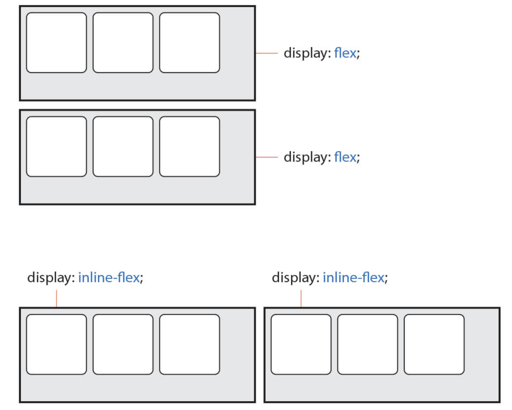
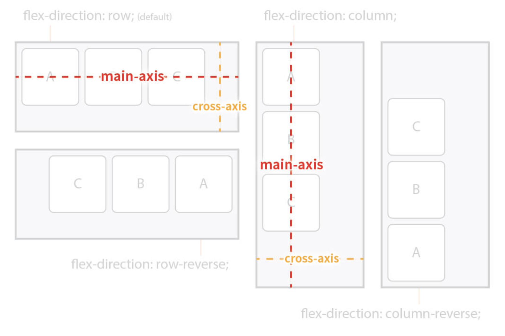
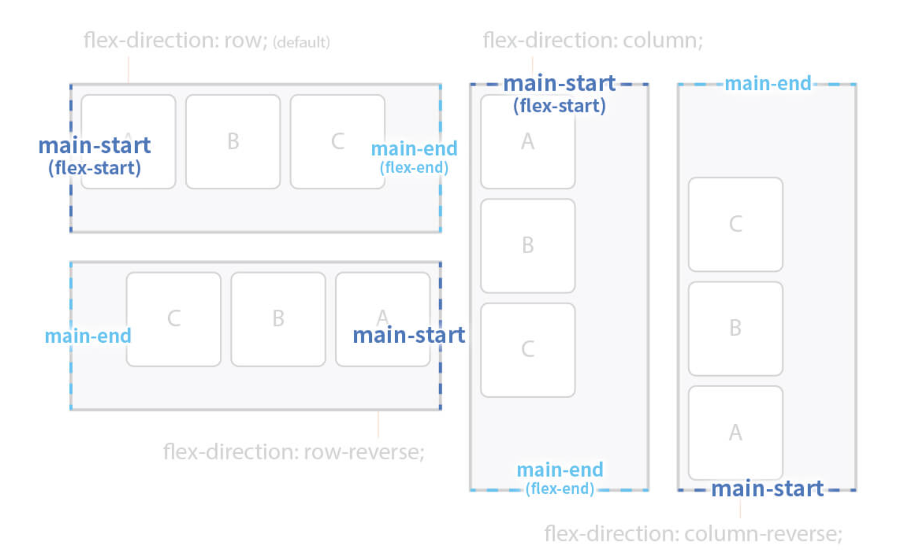
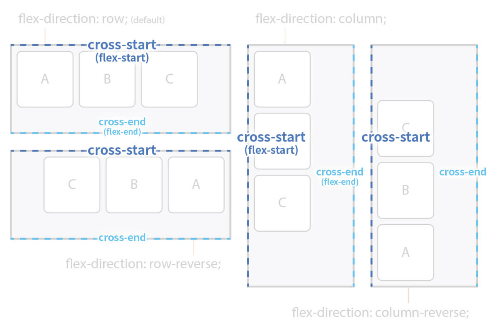
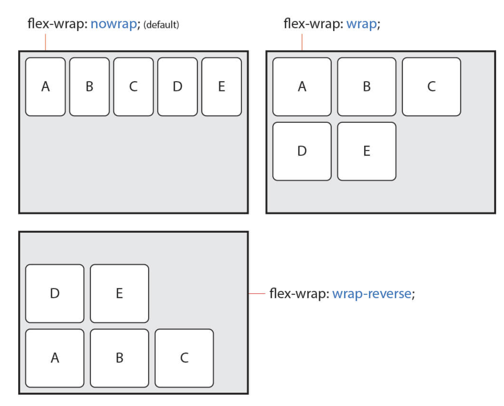
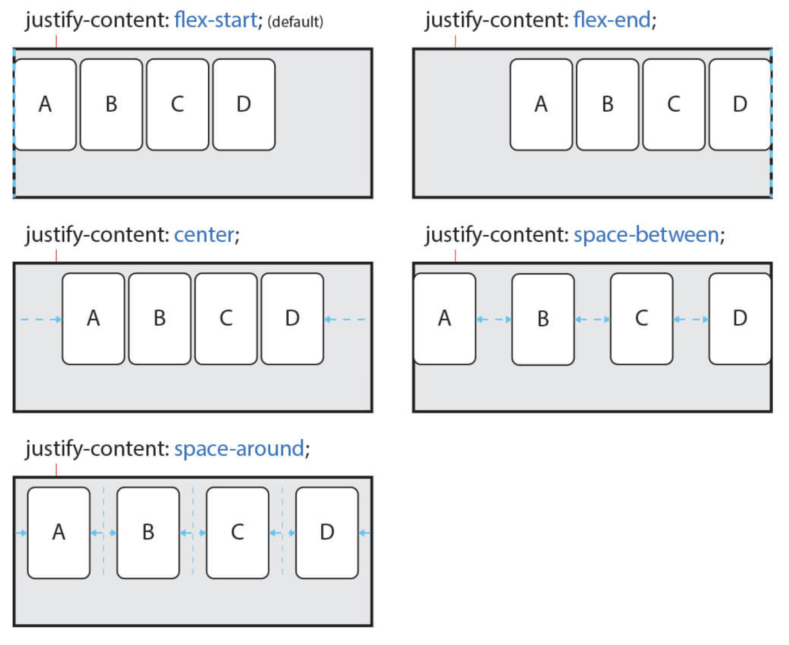
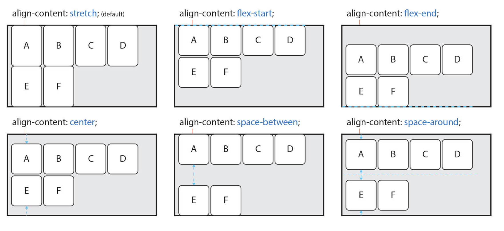
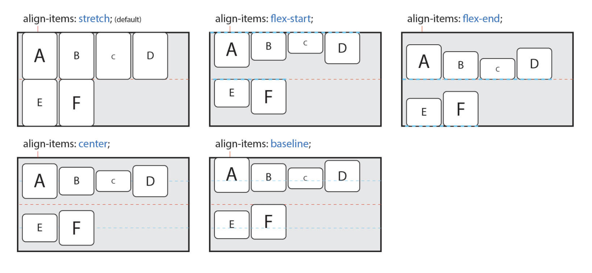

# Concept

Source: [HEROPY](https://heropy.blog/)

- **수직, 수평 정렬을 하는 CSS.** 우선 Flex는 2개의 개념으로 나뉜다.
  - 첫 번째는 CSS로 `display: flex;` 라는 값으로 설정되는 **Container.**
  - 두 번째는 그 컨테이너 안에 있는 **Items**.
- Container는 Items를 감싸는 부모 요소이며, **각 Item을 정렬하기 위해선 Container가 필수.**
- 주의할 부분은 Container와 Items에 적용하는 속성이 구분되어 있다는 것.
  - Container에는 **`display`**, **`flex-flow`**, **`justify-content`** 등의 속성을 사용할 수 있고
  - Items에는 **`order`**, **`flex`**, **`align-self`** 등의 속성을 사용할 수 있다.


## 1. Container

### display

---

- `display` 속성으로 Flex Container를 설정할 수 있는데, **display:`flex`** 혹은, **display:`inline-flex`** 로 설정할 수 있다.
- 둘 다 컨테이너를 설정해주는데, 그 안에 아이템들이 받는 영향은 없지만, 아래 그림에서 보듯 컨테이너와 컨테이너를 배치함에 있어서 block/inline 방식 중 어떤 방식으로 작동하게 할 것이냐와 관련이 있다.
  

### flex-flow

---

- `flex-flow` 는 아래의 두 가지 요소로 구성이 된다.
  - 첫 번째 요소: 컨테이너 안 아이템들의 주 축(axis)를 설정하는 **flex-direction 값**
  - 두 번째 요소: 컨테이너 안 아이템들을 여러 줄(줄 바꿈)로 묶어서 설정할지 말지를 결정하는 **flex-wrap 값**
  - **flex-flow는 이 두 가지 값의 조합으로 한 번에 선언해줄 수 있는 역할**을 하는 것이라, **flex-direction, flex-wrap을 각각 CSS로 설정해서 사용하는 것도 쌉가능**하다.
  ```css
  flex-flow: (direction) (wrap);
  ```
  | 값             | 의미                                         | 기본값 |
  | -------------- | -------------------------------------------- | ------ |
  | row            | Itmes를 수평축(왼쪽에서 오른쪽으로)으로 표시 | row    |
  | row-reverse    | Items를 row의 반대 축으로 표시               |        |
  | column         | Items를 수직축(위에서 아래로)으로 표시       |        |
  | column-reverse | Items를 column의 반대 축으로 표시            |        |
- **flex-direction**
  - **주축(`main-axis`), 교차축(`cross-axis`)**
    - direction을 `row` 로 설정을 했다고 하면 `주 축(main-axis)` 는 행이 되고, `교차 축(cross-axis)` 는 열이 될 것이다.
    - 당연히 direction을 column으로 설정했다고 하면, 반대로 칭하게 된다.
    
  - **시작점(`flex-start`), 끝점(`flex-end`)**
    - direction을 `row` 로 설정하면, `flex-start` 는 왼쪽이고 `flex-end` 는 오른쪽이다. `row-reverse` 로 했다면 반대.
    - direction을 `column`으로 설정하면, `flex-start` 는 위 쪽이고 `flex-end` 는 아래쪽이다. `row-reverse` 로 했다면 반대.
    
    - 그러나 main-axis(주축)가 reverse를 하던가 말던가, cross-axis(교차축)의 시작점(start), 끝점(end) 방향은 바뀌지 않는다. 참고!
    
- **flex-wrap**
  - 여러 줄 묶음(줄 바꿈)을 설정한다.
  | 값           | 의미                                           | 기본값 |
  | ------------ | ---------------------------------------------- | ------ |
  | nowrap       | 모든 Itmes를 여러 줄로 묶지 않음(한 줄에 표시) | nowrap |
  | wrap         | Items를 여러 줄로 묶음                         |        |
  | wrap-reverse | Items를 wrap의 역 방향으로 여러 줄로 묶음      |        |
  

### justify-content

---

- **main-axis (주 축)의 정렬 방법**을 설정한다!

```css
justify-content: 정렬방법;
```

| 값            | 의미                                                                                    | 기본값     |
| ------------- | --------------------------------------------------------------------------------------- | ---------- |
| flex-start    | Items를 시작점(flex-start)으로 정렬                                                     | flex-start |
| flex-end      | Items를 끝점(flex-end)으로 정렬                                                         |            |
| center        | Items를 가운데 정렬                                                                     |            |
| space-between | 시작 Item은 시작점에, 마지막 Item은 끝점에 정렬되고 나머지 Items는 사이에 고르게 정렬됨 |            |
| space-around  | Items를 균등한 여백을 포함하여 정렬                                                     |            |



### align-content

---

- 얘는 **교차 축(cross-axis)의 정렬 방법**을 설정한다.
- 주의할 점은 **`flex-wrap` 이 설정이 되어 있어서 items가 여러줄(2줄 이상)이고** **여백이 있을 때만** 사용이 가능!
  > 아이템이 한 줄일 경우는 **`align-items` 속성**을 사용하자.
  | 값            | 의미                                                                                    | 기본값  |
  | ------------- | --------------------------------------------------------------------------------------- | ------- |
  | stretch       | Container의 교차 축을 채우기 위해 Items를 늘림                                          | stretch |
  | flex-start    | Items를 시작점(flex-start)으로 정렬                                                     |         |
  | flex-end      | Items를 끝점(flex-end)으로 정렬                                                         |         |
  | center        | Items를 가운데 정렬                                                                     |         |
  | space-between | 시작 Item은 시작점에, 마지막 Item은 끝점에 정렬되고 나머지 Items는 사이에 고르게 정렬됨 |         |
  | space-around  | Items를 균등한 여백을 포함하여 정렬                                                     |         |



### align-items

---

- 교차 축(cross-axis)에서 **아이템이 한 줄일 경우에 사용!**

| 값         | 의미                                           | 기본값  |
| ---------- | ---------------------------------------------- | ------- |
| stretch    | Container의 교차 축을 채우기 위해 Items를 늘림 | stretch |
| flex-start | Items를 각 줄의 시작점(flex-start)으로 정렬    |         |
| flex-end   | Items를 각 줄의 끝점(flex-end)으로 정렬        |         |
| center     | Items를 가운데 정렬                            |         |
| baseline   | Items를 문자 기준선에 정렬 문자열 기준!        |         |



### 중앙정렬하기!

---

- 자! 여기까지만 배웠어도 그동안 그냥 볶붙만하던! 아래의 중앙정렬 CSS 코드를 이해할 수 있게됐다!
- 아래 CSS예시의 포인트는 `.item` 인데, **item에 해당하는 요소라도! `display: flex` 를 먹여서 container화**를 하면
  → 컨테이너에서 사용하는 justify-content, align-items, align-content를 적용할 수 있어서, 아이템 안의 TEXT들을 정 중앙에 위치할 수 있게 하는 것이다!!

```css
.item {
	**display: flex;**
	/* 주축 정렬 */
	**justify-content; center;**
	/* 교차축 정렬(wrap 1줄 일 때.) */
	**align-items: center;**
	/* 교차축 정렬wrap 2줄 이상일 때.)*/
	align-content: center;
}
```

## 2.Item
