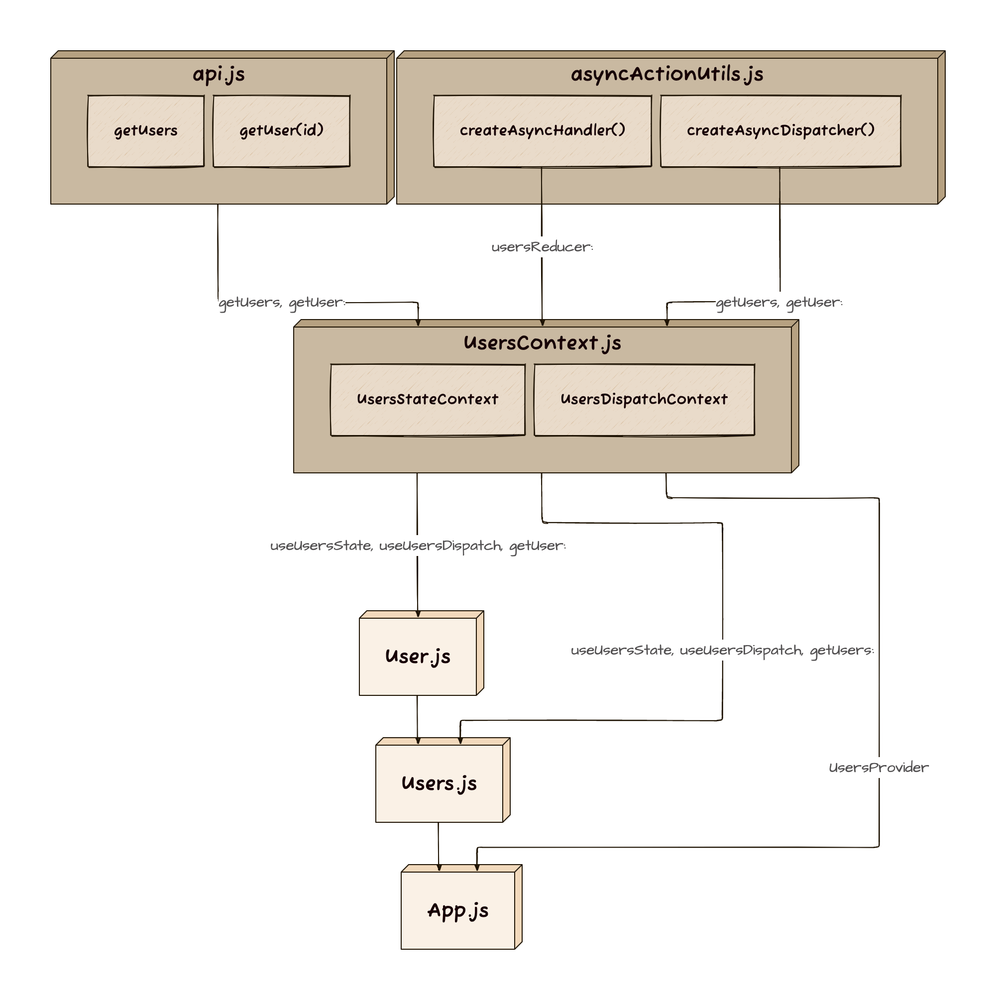

# API

### by [Velopert](https://react.vlpt.us/integrate-api/)

- React에서 API를 사용하는 기초 원리와 더불어, Context와 Reducer 활용법에도 조금 더 익숙해질 수 있게 해준 프로젝트.

  ```Shell
  $ npx create-react-app api
  $ cd api
  $ yarn add axios
  ```

- Replace the origin `src` directory with the `src` directory placed this path.

### Structure



### Result


