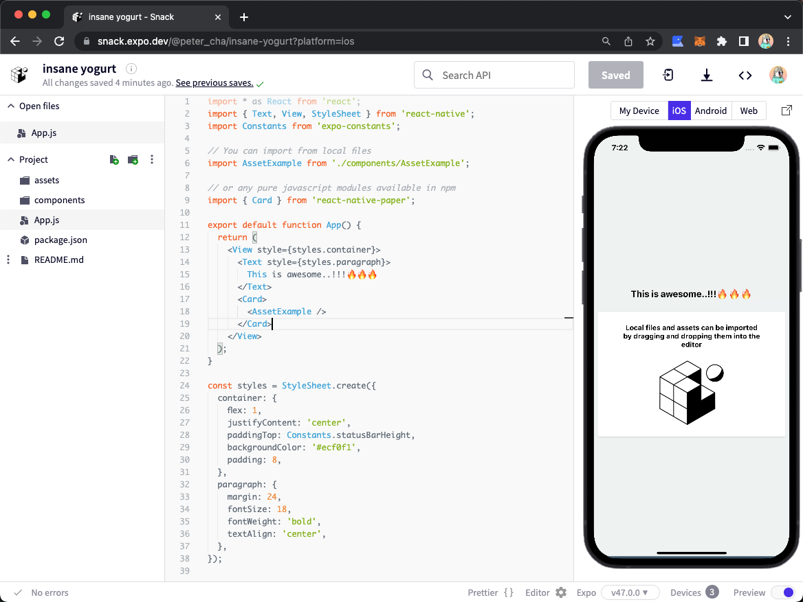

# Requirements

## 1. Expo

- [Expo](https://expo.dev/) 설치.
- 폰은 각 기종에 맞는 OS App Store에서 Expo 설치. 아이폰은 Expo Go라는 이름으로
  앱이 있음
- 피씨는 `$ npm install --global expo-cli`로 설치.
  - 맥 OS인 경우 `$ brew update` 후, `$ brew install watchman`
- 회원가입도 하고.

## 2. Create a new App.

- `npx create-expo-app app_name` 실행
  - 선택지가 나오는데, blank 선택하면 알아서 설치한다.
- `expo login`으로 PC 로그인 해주고, 폰도 설치한 Expo 앱에서 로그인 해주자. 이때
  , 같은 와이파이를 사용해서 같은 망 안에 둘 다 연결돼있어야 한다.
- 그리고 `npm start`.

## 3. App.js 수정

- 위의 실행으로 생성된 app_name에 해당하는 폴더 안, `App.js` 안의 아래
  `<Text>`안의 내용을 원래 있던 내용이 아닌 아래처럼 바꿔보자.

  ```javascript
  export default function App() {
    return (
      <View style={styles.container}>
        <Text>Hello! I made a RN App!</Text>
        <StatusBar style="auto" />
      </View>
    )
  }
  ```

- 그리고 저장을(Command + S)를 하는 순간, 폰에서도 아래처럼 결과를 확인할 수 있
  다.

    

# Snack

- [Snack](https://snack.expo.dev/)을 사용하면 더 놀랍다. 그냥 웹상에서 React
  Native 코딩을 할 수 있고, 안드로이드, iOS, Web, 그리고 사용자 폰 Expo 앱에서
  결과를 확인할 수 있는 QR Code까지 제공한다.


