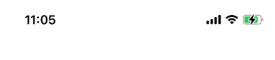

# The Rules of Native

## 1. View, Text, StyleSheet.create(), StatusBar

1. React Native는 웹이 아니다! 그래서 <div>와 같은 요소는 없다! 대신
   **`<View>`**라는 컨테이너를 만들고 요소를 넣을 뿐이다!

2. 모든 Text는 <Text> 안에 적혀있어야 한다!

3. StyleSheet.create(), StatusBar

   - 아래는 StyleSheet.create()를 사용하는 예시 App.js

     ```javascript
     import { StatusBar } from "expo-status-bar"
     import { StyleSheet, Text, View } from "react-native"

     export default function App() {
       return (
         <View style={styles.container}>
           <Text style={styles.text}>Hello! I made a RN App!</Text>
           <StatusBar style="auto" />
         </View>
       )
     }

     const styles = StyleSheet.create({
       container: {
         flex: 1,
         backgroundColor: "#fff",
         alignItems: "center",
         justifyContent: "center",
       },
       text: {
         fontSize: 28,
         color: "red",
       },
     })
     ```

   * `styles` 상수를 만드는 StyleSheet.create()안에 객체를 예시와 같이 쓰면 css
     에 해당하는 auto-complete 기능을 제공한다! (직접 해보셈)
   * `<StatusBar>`는 모바일 상단에 있는 wifi, battery, time, 신호감도표시같은 정
     보들을 담고있는 Bar를 뜻한다. 
