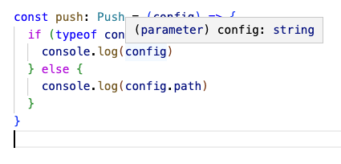

# Functions

- 실습을 하다가, type이 any뜨시는 분들은 (이미 존
  재하는 tsconfig.json을 지우고)
  `npm install -g typescript` 입력후 `tsc --init`
  입력해보시고 다시 시도해보세요. -
  [ryan](https://nomadcoders.co/users/ryan)

### call signature

---

- 아래와 같이 add 라는 화살표 함수가 있다고 했을때
  , 마우스를 올리면 올라와서 보여주는 **함수의
  arguments(=parameters)와 return type을 설명하는
  부분.** 저 부분이 **call signature**다.

  

- 나만의 **함수의 call signature를 선언하는 방
  법**은 아래와 같다. `type`을 사용한다.

  ```tsx
  type Add = (a: number, b: number) => number

  const add: Add = (a, b) => a + b
  ```

  이렇게 사용하면, 아래에서 보는 것처럼 a가 number
  타입이라는 것을 명시해주지 않아도 미리 알 수 있
  다.
  

### Overloading

---

- **Overloading은** **함수가 여러 개의 Call
  signatures를 가지고 있을 때 발생**한다. **즉, 받
  을 수 있는 파라미터 타입이나 리턴 값의 타입이 다
  양할 때!**

  - 한 가지 예시로, call signiture는 아래와 같이여
    러가지(b는 숫자일 수도, 문자열일 수도)로 선언
    을 할 수 있다.

    ```tsx
    type Add = {
      (a: number, b: number): number
      (a: number, b: string): number
    }

    const add: Add = (a, b) => {
      if (typeof b === 'string') return a
      return a + b
    }
    ```

  - 혹은 아래와 같은 예제에서 Push type을 사용하는
    경우도 Overloading을 사용하는 것이라고 볼 수있
    다. 받을 변수는 path라는 string일 수도 있고,
    state라는 object일 수도 있다는 것.

    ```tsx
    type Config = {
      path: string
      state: object
    }

    type Push = {
      (path: string): void
      (config: Config): void
    }

    const push: Push = (config) => {
      if (typeof config === 'string') {
        console.log(config)
      } else {
        console.log(config.path)
      }
    }
    ```

  - push 함수의 파라미터 config에 마우스 오버를 하
    면 string | Config로 나오지만,
    

  - if문으로 typeof를 설정해주면 string으로만 인식
    을 한다.
    

- Overloading을 활용하는 자주보이는 또 다른 예시는
  변수의 갯수를 다르게 가져갈 때이다. 아래처럼
  type Add를 선언해주고 변수를 2개, 혹은 3개를 받
  을 수 있게 설정한다고 했을 때 중요한 점은 실제
  함수를 선언 할때,
  `**const add:Add = (a, b, c?:number) => ...**`
  **라고 c는 optional하다는 점을 명시해줘야 한다는
  것이다!**

  ```tsx
  type Add = {
    (a: number, b: number): number
    (a: number, b: number, c: number): number
  }

  const add: Add = (a, b, c?: number) => {
    if (c) return a + b + c
    return a + b
  }

  add(1, 2)
  add(1, 2, 3)
  ```

### Polymorphism(다형성)

---

- Poly는 단어 뜻 그대로 많다는 뜻이고 morpho-는 형
  태, 구조, structure, form을 말한다. 그래서 많을
  ‘다’에 형상 ‘형’을 써서, 다형성이라고 한국어로는
  부르는겨. 그런의미에서 사실 Overloading도 다형성
  을 구현한 것이나 마찬가지.
- call signature를 작성할 때 앞에 **generic**(
  `<(anything)>` )을 붙이면, ‘어떤 타입이든’ 의미
  할 수 있는 = 받을 수 있는 polymorphism을 쉽게 구
  현할 수 있다.
- 아래와 같이 <myType>이라는 `generic`을 선언하고,
  그 안에 정해준 이름=Placeholder(아무거나써도 된
  다.- 근데 깔끔해보일라고 그냥 T - Temp를 뜻하는
  듯 - 나 M과 같은 대문자 알파벳 하나만 쓰는 것 같
  다.)를 사용해서 array를 받는 call signature를 선
  언해준다고 하면, 갯수가 어떻든, 형태가 어떻든 다
  가능해진다! → 내가 받을 return값이나 들어가야할
  데이터(= parameter)가 명확할 수 없는 상황에서 많
  이 쓸 것 같다.

```tsx
type SuperPrint = {
  <myType>(arr: myType[]): void
}

const superPrint: SuperPrint = (arr) => {
  arr.forEach((i) => console.log(i))
}

superPrint([1, 2, 3, 4])
superPrint([true, true, false, true])
superPrint(['hello', 1, true])
```

- 아래와 같이 generic을 2개를 써서 설정해줄 수도있
  다.

```tsx
type SuperPrint = {
  <T, M>(a: T[], b: M): void
}

const superPrint: SuperPrint = (arr) => {
  arr.forEach((i) => console.log(i))
}

superPrint([1, 2, 3, 4], true)
superPrint([true, true, false, true], 3)
superPrint(['hello', 1, true], 'hello')
```

### Generic Use Case

---

1. **함수 인자(parameter) 설정**

```tsx
function superPrint<T>(a: T[]) {
  return a[0]
}
```

1. **단순 Type 설정**

```tsx
type A = Array<number>
let a: A = [1, 2, 3, 4]
```

```tsx
function superPrint(arr: number[]){
	...
}

이렇게 쓰는 거랑,

function superPrint(arr: Array<number>){
	...
}

이렇게 쓰는거랑 같다.
```

1. **type들끼리 상속, 혹은 일종의 재사용 가능.**

- 아래와 같이 Player type이 있는데 generic을 사용
  해서 extraInfo의 type을 미정으로 두었다고 했을때
  , **실제로 Player type을 사용하는 상수를 만들게
  된다면 Player<>상에서 generic 부분의 type(=<> 안
  부분)을 제대로 명시해줘야한다.**
  - 아래 코드는 Player<E>의 `E`가 extraInfo: `E`
    로 사용되는 이 포멧을 그대-로 사용해서 Player
    type을 명시할 경우 `E` 자리에,
    `{favFood: 'kimchi'}` 라는 객체로 치환해서 사
    용하는 예시.

```tsx
type Player<E> = {
  name: string
  extraInfo: E
}

const nico: Player<{ favFood: string }> = {
  name: 'nico',
  extraInfo: {
    favFood: 'kimchi',
  },
}
```

- 이 코드는 한 번더 리팩토링이 가능한데, 아래처럼
  Player<>안의 정보를 또 다른 type으로 alias로 만
  들고 넣어줄 수도 있다.

```tsx
type Player<E> = {
  name: string
  extraInfo: E
}
type NicoProfile = {
  favFood: string
}
type Nico = Player<NicoProfile>

const nico: Nico = {
  name: 'nico',
  extraInfo: {
    favFood: 'kimchi',
  },
}
```

- 그래서 아래와 같이 자동완성이 되는 것을 확인이가
  능하다.

  
