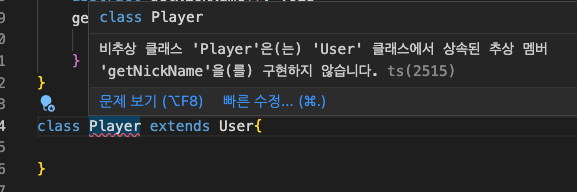
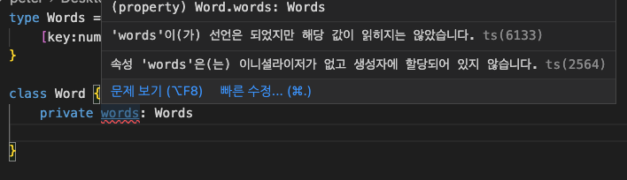
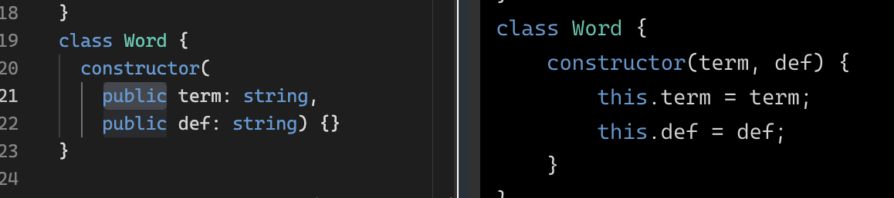
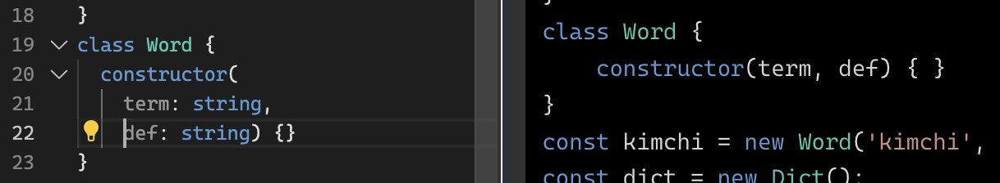

# Classes

> **Keywords**: `constructor(){}` , `abstract` ,
> `protected` , `extends` , `{ [key<T>]: T }`

- OOP가 Typescript에서 어떻게 구현되는지를 설명하
  기 때문에 OOP 기본 개념에 대해서는 다루지 않는다
  .

### constructor() {}

---

- Typescript에서 constructor는 아래와 같이 선언하
  는데, 귀찮게 다른 언어들처럼
  `this.firstName = firstName`과 같은 과정이 없어
  서 좋다.
  - 형태는
    `constructor( parameter ){ properties }` 와 같
    다.
  ```tsx
  class User {
      **constructor(**
          private firstName:string,
          private lastName:string,
          private nickname:string
      **) {}**
  }
  ```

### abstract class

---

- **추상 클래스는 스스로는 객체를 생성하지 못하지
  만, 하위 클래스가 상속을 받을 수 있는 클래스!**
  클래스 이름 앞에 `abstract` 만 붙여주면 된다.
- 아래의 getFullName 함수는 User 추상클래스를 상속
  받는 모든 클래스를 통한 객체는 사용할 수 있다.
  ```tsx
  **abtract class User {**
      constructor(
          private firstName:string,
          private lastName:string,
          private nickname:string
      ) {}
  	****	getFullName() {
          return `${this.firstName} ${this.lastName}`
      }
  }
  ```

### abstract method

---

- method는 클래스 안에 선언되는 함수를 뜻하는데,
  이 method를 구체적으로 구현하지 않고, 아래와 같
  이 `**abstract` + call signature만 선언하면, 이
  게 바로 추상 메소드\*\*가 되겠다.
- **이 추상 메소드는 상속받는 클래스에서 꼭 구현되
  어야만 한다.**
  ```tsx
  abstract class User {
      constructor(
          protected firstName:string,
          protected lastName:string,
          protected nickname:string
      ) {}
      // just call signature
      **abstract getNickName(): void**
      getFullName() {
          return `${this.firstName} ${this.lastName}`
      }
  }
  ```
- 구현을 안하면 TypeScript가 불평을 한다.
    


### protected, extends

---

- 기본적으로 디폴트는 public이다. 그러나 상속 받은
  클래스에서만 접근할 수 있게 하는 변수/메소드라면
  `protected`로, 아예 접근을 못하게 하려면
  `private`으로 설정할 수 있다.
- 상속은 자바와 같이 `extends` 를 사용한다.
  ```tsx
  abstract class User {
      constructor(
          protected firstName:string,
          protected lastName:string,
          protected nickname:string
      ) {}
      // just call signature
      abstract getNickName(): void
      getFullName() {
          return `${this.firstName} ${this.lastName}`
      }
  }

  class Player extends User{
      **getNickName(): void {
          console.log(this.firstName)
      }**
  }
  ```

### property의 이름은 모르겠지만 type만 알고 있을 때.

---

- 그런 경우 아래와 같이 type을 선언할 수 있다. 그
  럼 key(아무거나 써도됨)는 이름이 뭐가될지 모르겠
  지만, string이라는 말로 퉁치고 넘어갈 수 있는
  type을 만들어 준거다.
  ```tsx
  type Words = {
    [key: string]: string
  }
  ```

### Type call signature 활용해서 클래스 선언하기

---

- 아래와 같이 위에서 선언한 Words 타입을 사용해서
  변수를 선언하면 constructor를 사용하지 않았다고
  웅앵거리는 걸 볼 수 있는데,
    

- 그렇다고 아래와 같이 constructor 안에 사용해줘도
  안되는 것이,
  ```tsx
  class Dict {
    constructor(private words: Words) {}
  }
  ```
  이렇게 해버리면, TypeScript를 컴파일 한 결과로
  JavaScript는 아래와 같이 해석해서 words를 생성자
  가 매개변수로 받아야하는 것으로 해석해 버린다.
  ```tsx
  class Dict {
    constructor(words) {
      this.words = words
    }
  }
  ```
- 그래서 최종적으로, **type으로 정의한 값을 타입으
  로 설정해주려면** 아래와 같이
  > 1. 선언한 type의 call signature 다음에
  > 2. constructor(){
          this.선언한property이름 = {}
         }
  >
  과 같은 형태로 써야한다.
  ```tsx
  type Words = {
  	[key:number]: string
  }

  class Dict {
      **private words: Words
      constructor(){
          this.words = {}
      }**
  }
  ```

### Class 최종 실습

---

- 아래와 같이 코드를 배운 내용을 정리해서 적어보자
  . Dict 클래스에는 사전에 단어를 추가하는 add함수
  와, 해당 term의 def를 반환하는 def함수를 추가하
  자.

```tsx
type Words = {
  [key: number]: string
}

class Dict {
  private words: Words
  constructor() {
    this.words = {}
  }
  add(word: Word) {
    if (this.words[word.term] === undefined) {
      this.words[word.term] = word.def
    }
  }
  def(term: string) {
    return this.words[term]
  }
}
**class Word {
  constructor(
    public term: string,
    public def: string) {}
}**

const kimchi = new Word('kimchi', '한국의 음식')
const dict = new Dict()

dict.add(kimchi)
dict.def('kimchi')
```

- 해당코드를 TypeScript playground에 접속해서 좌측
  에 붙여넣어보고, 오른쪽에 컴파일 결과를 브라우저
  콘솔에서 실행시켜보면 “한국의 음식”이라고 결과가
  나오면 정상작동!

**Class as a Type**

- `add(word: Word)` 는 너무 자연스러워서 넘어가게
  되는데, 가만히 생각해보면 Type으로 Word라는 클래
  스를 선언해주고 있다! 우리는 Type으로 그동안
  concrete type(string, number, object, never, …)
  와 generic만 가능한 줄 알았는데, Class의 객체가
  변수의 타입이길 바란다면 이렇게 적을 수 있다는
  거다. 이 부분은 사실 `Interface` 라고 칭하는 부
  분이다.

**Constructor에서는 꼭 접근자를 명시해주자**

- 니꼬쌤이 언급하지 않았지만 실습을 하다가 알게 된
  점이 있는데, 아래 Word 클래스의 생성자 파라미터
  를 ‘public’이라고 명시하지 않으면 제대로 작동하
  지 않는다. public을 명시해주면, javaScript로 컴
  파일 했을 때, 제대로 아래와 같이 세팅하지만,
    
    ```tsx
    class Word {
      constructor(
        public term: string, 
        public def: string) {}
    }
    ```
    
    - 아래와 같이 public이 Default 값이라고 아예 안써버리면 세팅을 `this.term` `this.def`로 세팅을 아예 하지 않아서 정상 작동하지 않으니 꼭 명시해줄 것!
    
    


### generic이 class를 만나서 구현되는 멋진 polymorphism

---

- 아래 코드를 천천히 음미해보면, LocalStorage라는
  클래스는 generic인 <T>를 활용해서 string storage
  를 만들 수도 있고, boolean storage를 만들 수 있
  는. 즉, polymorphism을 멋지게 구현하는 코드다.
- Object를 생성할 때, 스토리지의 type을 어떤 것으
  로 할지 정할 수 있다는 점이 매력적인 다형성이라
  고 할 수 있겠다.
  ```tsx
  interface SStorage<T> {
    [key: string]: T
  }

  class LocalStorage<T> {
    private storage: SStorage<T> = {}
    set(key: string, value: T) {
      this.storage[key] = value
    }
    remove(key: string) {
      delete this.storage[key]
    }
    get(key: string): T {
      return this.storage[key]
    }
    clear() {
      this.storage = {}
    }
  }

  const stringStorage = new LocalStorage<string>()
  stringStorage.set('kimchi', 'good food')
  stringStorage.get('kimchi')

  const stringStorage2 =
    new LocalStorage<boolean>()
  stringStorage2.set('kimchi', true)
  stringStorage2.get('kimchi')
  ```
