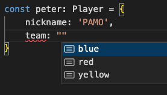

# Interface

Keywords: `interface` , `implements`

### Type 활용법

---

- Interfaces에 대해 알아보기 전에 Type의 활용법을
  잘 알면 인터페이스를 이해하기 좋다고 하니, 좀 더
  파보자.
- Type은 Concrete Type(우리가 아는 string, number,
  object 이런거), Generic을 설정해주는 것 말고도
  아래같이 **특정 값만 선택하게 하는 것도 가능**하
  다.
  ```tsx
  type Team = 'red' | 'blue' | 'yellow'
  type Health = 1 | 5 | 10

  type Player = {
    nickname: string
    team: Team
    health: Health
  }
  ```
- 보임? 이렇게 자동완성 제공하고, 다른 값 쓰면 에
  러를 일으킨다. 👍👍👍
    


### Interfaces

---

- 자 그럼 이제 오브젝트의 모양을 설명하는 다른 방
  법인 인터페이스에 대해 알아보자. **Interface는
  오로지 object(`{}`)/Class의 모양을 타입스크립트
  에게 설명하기 위해 사용된다. 자바스크립트에는
  interface가 없다.**
  ```tsx
  type Player = {
    nickname: string
    team: Team
    health: Health
  }
  ```
  랑,
  ```tsx
  interface Player {
    nickname: string
    team: Team
    health: Health
  }
  ```
  랑 똑같다. type이 쓰임새가 더 많다.
- 하나 더 기억해야 할 점은, interface는 **자바스크
  립트에는 존재하지 않는 개념이다. 그래서
  interface는 JS로 컴파일 될 때 안보인다. 사라진다
  . → 코드가 가벼워진다(=파일 사이즈가 줄어든다
  !).**

### Interfaces 사용하기

---

- 아래와 같이 **interface는 `extends` 를 통해 상속
  이 가능하며, interface는 type의 대상으로 사용이
  가능**하다.
  ```tsx
  interface User {
    name: string
  }

  interface Player extends User {}

  const peter: Player = {
    name: 'PETER',
  }
  ```
- 아래처럼 **type을 사용해서 똑같은 기능을 하게 만
  들 수도 있다.** **type의 상속**이랄까
  ```tsx
  type User = {
    name: string
  }

  type Player = User & {}

  const peter: Player = {
    name: 'PETER',
  }
  ```
  - Nico 쌤은 interface가 더 나은거 같다고 하는데
    나도 그렇다. 좀 더 직관적이랄까. type을 써서
    상속과 같은 기능을 만들면 코드는 더 짧지만 암
    호처럼 돼버린 것도 같다.

### 중첩 Interfaces

---

- 그럼 Interface는 할 수 있는데 type은 할 수 없는
  건 뭘까? 아래처럼 interface는 똑같은 이름의
  interface를 선언해주면 Typescript가 알아서 합쳐
  준다! type을 사용할 경우, 같은 이름이라고 에러를
  일으켜서 할 수 없다.
  ```tsx
  interface User {
    name: string
  }
  interface User {
    lastName: string
  }
  interface User {
    age: number
  }

  const peter: User = {
    // error 없이 잘 된다!
    name: 'PETER',
    lastName: 'CHA',
    age: 34,
  }
  ```

### Interfaces with Class

---

- 클래스에서는 아래와 같이 interface를 사용하면 된
  다.
- 클래스는 단수 혹은 복수의 인터페이스를
  `implements`를 통해 상속할 수 있다.
  - **인터페이스에서 선언한 변수는 construtor에서
    초기화**를 해줘야하고
  - **인터페이스에서 선언한 함수는 기본적으로
    abstract이라 상속 받은 뒤 구현**해줘야만 한다!
- **인터페이스는 public 외의 접근제한자를 사용할
  수 없다는 단점**(?)이 있다.

```tsx
interface User {
  firstName: string
  lastName: string
  sayHi(name: string): string
  fullName(): string
}

interface Human {
  health: number
}

class Player implements User, Human {
  constructor(
    public health: number,
    public firstName: string,
    public lastName: string,
  ) {}
  sayHi(name: string): string {
    return `Hi, ${name}`
  }
  fullName(): string {
    return `${this.firstName} ${this.lastName}`
  }
}
```

- 재밌는 것은 implements로 type을 구현할 수도 있다
  는 거다. 그래서 아래같이 사용도 가능.
  ```tsx
  interface User {
    firstName: string
    lastName: string
    sayHi(name: string): string
    fullName(): string
  }

  type Human {
    health: number
  }

  class Player implements User, Human {
    constructor(
      public health: number,
      public firstName: string,
      public lastName: string,
    ) {}
    sayHi(name: string): string {
      return `Hi, ${name}`
    }
    fullName(): string {
      return `${this.firstName} ${this.lastName}`
    }
  }
  ```

### Type으로 사용하는 Interface

---

- 위에서 사용한 User interface가 그대로 있다고 했
  을 때, 아래와 같이 함수의 파라미터의 타입을 지정
  해줄 수도, return Type으로 설정해줄 수도 있다.
  - 여기서 알아둬야할 포인트는 **return Type을
    `new User` 와 같이 클래스로 객체를 만들듯이 만
    들 수는 없다는 것이고, User Interface를 만족하
    는 형태의 객체를 반환하면 된다는 것**이다.

```tsx
function makeUser(user: User): User {
  return {
    firstName: 'PETER',
    lastName: 'CHA',
    sayHi: (name) => 'blah blah',
    fullName: () => 'PETERCHA',
  }
}

makeUser({
  firstName: 'PETER',
  lastName: 'CHA',
  sayHi: (name) => 'blah blah',
  fullName: () => 'PETERCHA',
})
```
