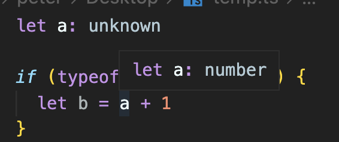
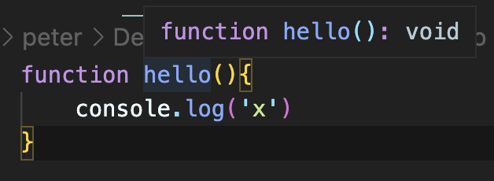
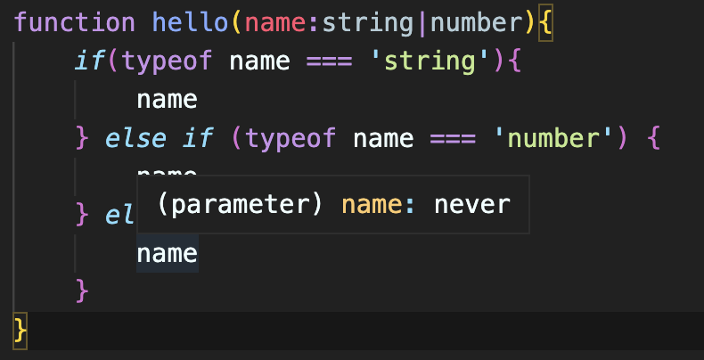
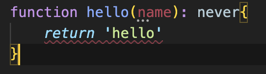
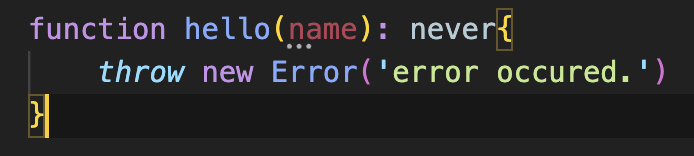

### Implicit Types vs Explicit Types

---

- 아래와 같이 명시적(Explicit)으로, 혹은 그냥 자바스크립트처럼 함축적(Implicit)으로 변수를 선언할 수 있다.

```tsx
let a = 'hello'
let b: boolean = false
let c: number[] = [1, 2, 3]
let d: {} = {
  type: 'CREATE',
}
const player: {
  name: string
  age: number
} = {
  name: 'peter',
  age: 34,
}
```

### Optional Types

---

- `**?`를 사용하면 Optional하게 변수를 가져도 되고 안가져도 되게 설정할 수 있다\*\*. 아래는 age를 optional하게 가지지 않아도 에러를 일으키지 않게 하는 코드.

```tsx
const player: {
  name: string
  age?: number
} = {
  name: 'peter',
}
```

### Alias

---

- 아래와 같이 `type` 이라는 키워드로 미리 type을 정해놓고 재사용할 수 있다. 👍👍👍

```tsx
type Player = {
  name: string
  age?: number
}

const nico: Player = {
  name: 'nico',
}

const lynn: Player = {
  name: 'lynn',
  age: 12,
}
```

- 아래 예시의 경우, 시각적으로 Player라는 키워드를 씀으로써 또한, 코드의 직관적인 이해가 빨라지는 효과도 누릴 수 있으니, 변수 명도 Player라고 굳이 쓰지 않고 빼줬다.
- 그리고 딱히 이렇게 할 필요는 없지만, 이런 것도 가능

```tsx
type Age: number
type Player = {
  name: string
  age?: Age
}
```

### Argument, Return types of function

---

- 함수에는 어떻게 TS를 적용할 수 있을까? 아래처럼 하면 된다! name이라는 string 변수를 받아서 Player type을 Return하는 것을 명시한 코드

```tsx
type Player = {
  name: string
  age?: number
}

function playerMaker(name: string): Player {
  return {
    name,
  }
}

const peter = playerMaker('peter')
peter.age = 34
```

- 화살표함수도 아래처럼 작성하면 된다.

```tsx
const playerMaker = (name: string): Player => ({ name })

const choonsik = playerMaker('choonsik')
choonsik.age = 33
```

### readonly

---

- `readonly` 를 사용하면 말 그대로 ‘읽기전용’으로 수정이 불가능하게 만들 수 있다!!! (개쩔탱)

```tsx
const names: readonly string[] = ['1', '2']
names.push(1) // error

type Player = {
  readonly name: string
  age?: number
}

const playerMaker = (name: string): Player => ({ name })
const nico = playerMaker('nico')
nico.name = 'peter' // error
```

### Tuple

---

- `Tuple` 을 사용하면 array를 생성할 수 있게해주는데,
  1. **특정 길이(개수)를 가져야하며**
  2. **특정 위치(순서)로 특정한 타입이 위치해야만 한다**
     **는 것을 강제**할 수 있게 해준다!
- 아래 예시에서 `[string, number, boolean]` 에 해당하는 array가 Tuple이다.

```tsx
const player: [string, number, boolean] = ['peter', 34, true]
player[0] = 1 // error
```

### any

---

- Typescript에게 바보 같은 짓을 하고 싶다고 허락을 받고 싶으면 그 때 any를 쓰면 된다. `any` 는 Typescript를 벗어나고 싶을 때 사용한다. nico형은 사용하는 것을 비추한다.

```tsx
const a: any[] = [1, 2, 3, 4]
const b: any = true

a + b // it works!
```

### unknown

---

- 어떤 타입인지 모르는 변수는 Typescript에게 어떻게 말해줘야 할까? 예를들어 API를 사용해서 데이터를 받게 되는데 return 타입을 모를 경우 어떻게 해야할까. 이 때 `unknown` 이다.
- 활용법은 아래처럼 if문으로 type이 원하는 경우에 해당하는 경우에만 작동하도록 할 수 있겠다.

```tsx
let a: unknown

if (typeof a === 'number') {
  let b = a + 1
}

if (typeof a === 'string') {
  let b = a.toUpperCase()
}
```

- 아래 사진에서 보듯이 if문 안에서의 a는 해당 scope에서는 number로 인지하고 있다는 것을 알 수 있다.
  

### void

---

- `void`는 아무것도 return하지 않는 함수를 대상으로 사용한다. 예를들어 아래같은 경우! 이게 다임.
  

### never

---

- 이건 그렇게 많이 사용하진 않지만 뭔지 아는 것은 중요하다. `never`는 함수가 절대 return하지 않을 때 발생한다.
- 아래에서 hello 함수는 name이라는 파라미터를 받는데, string이거나 number일 수 있다고 했을 때, string if scope안에서는 string이고 number 안에서는 number로 인식이 되겠지만, 그 외에 세 번째의 경우 있을 수 없는 경우라고 never로 인식이 된다.
  
- 이렇게 never에 해당하는 경우, return을 할 수 없게 Typescript는 보호하는데, 쓸 수 있게 허용하는 경우는 never와 어울리는 throw error 다.
  - **에러남**
    
  - **에러 안남**
    
