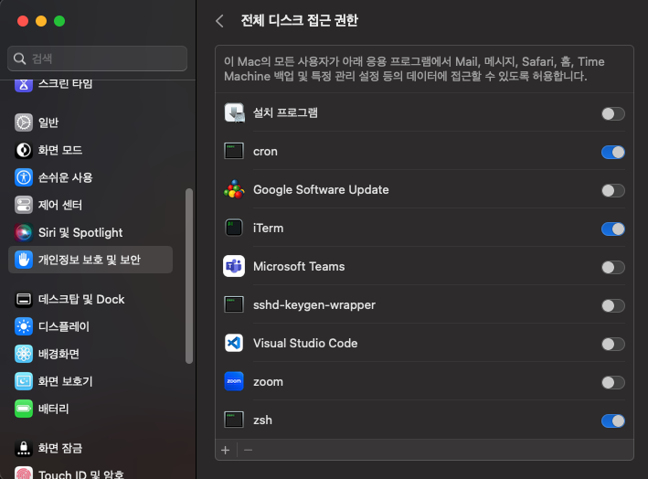

# crontab

Source:
[technfin](https://technfin.tistory.com/entry/%EB%A6%AC%EB%88%85%EC%8A%A4-%ED%81%AC%EB%A1%A0%ED%83%AD-%EC%82%AC%EC%9A%A9%EB%B2%95-Linux-crontab),
[losskatsu](https://losskatsu.github.io/os-kernel/crontab/#3-%EC%9E%91%EC%97%85-%ED%95%A0%EB%8B%B9-%EB%B0%A9%EB%B2%95),
[Eric Adams](https://stackoverflow.com/questions/58844669/trying-to-run-a-python-script-with-cron-getting-errno-1-operation-not-permitt)

### Install(Linux 기준)

---

```bash
# 설치
$ sudo apt install cron
# 설치 확인
$ sudo service cron status
# 크론탭 시작
$ sudo service cron start
```

Mac 설정

- Mac으로 실습을 하는 경우, 나처럼 zsh을 쓴다면 아래와 같이 cron, zsh을 전체 디
  스크 접근 권한 설정해야 됨.
  - 아래 + 아이콘을 클릭해서, Command + Shift + G를 누르면 뜨는 창에서
    - `cron` 은, `/usr/sbin/` 을 타이핑해서 찾을 수 있고
    - `zs"h` 은 `/bin` 이라고 검색하면 zsh을 찾을 수 있어서 추가.
    

### Commands

---

- **작업 할당**: `$ crontab -e` 입력 후, 나오는 편집창에 아래 Format 형태 작업
  작성. 한 줄이 작업 하나.
- **작업 확인**: `$ crontab -l`
- **작업 취소**:
  `$ crontab -r`

### Grammer

---

```
   *          *          *         *          *
분(0-59)  시간(0-23)  일(1-31)   월(1-12)   요일(0-7)
```

- 아래처럼 모두 별표면 ‘매분 명령어 실행’ 이라는 뜻. 마지막 요일은 0, 7이 일요일
  을 뜻함.

```bash
* * * * * **(source) [file_path]**
```

- **source에 해당하는 명령어**는 python이라면 which python을 통해 나오는 python
  path가 되어야 하고, sh 스크립트를 실행시킬 경우, sh를 적으면 된다.

**수행 주기 추가**

- 콤마(,)로 구분하면 실행 주기를 추가. 아래 경우는 매일 오전 5시 그리고 5시 30분
  에 스크립트를 수행.

```bash
0,30 5 * * * /test.sh
```

**수행 구간 지정**

- 마이너스 기호(-)를 사용하면 수행 주기의 구간을 지정. 아래 경우는 월요일부터 금
  요일까지 오전 5시에 스크립트를 수행

```bash
0 5 * * 1-5 /test.sh
```

**수행 간격 지정**

- 슬래시(/) 기호를 사용하면 수행 간격을 지정. 아래 경우는 매 10분마다 스크립트를
  실행

```bash
*/10 * * * /test.sh
```
