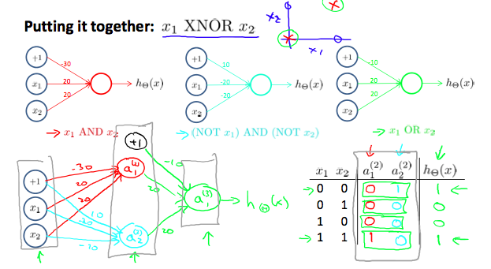

# Applications

## Examples and Intuitions I

* A simple example of applying neural networks is by predicting $x_1$ AND $x_2$, which is the logical 'and' operator and is only true if both $x_1$ and $x_2$ are 1.

* The graph of our functions will look like:

	$\begin{bmatrix}x_0 \\ x_1 \\ x_2\end{bmatrix} \rightarrow\begin{bmatrix}g(z^{(2)})\end{bmatrix} \rightarrow h_\Theta(x)$
    

* Remember that $x_0$ is our bias variable and is always 1. 
* Let's set our first theta matrix as:

	$\Theta^{(1)}= [-30\text{ }\text{ } 20 \text{ }\text{ }20]$
    
    
* This will cause the output of our hypothesis to only be positive if both $x_1$ and $x_2$ are 1. In other words:

	$h_\Theta(x) = g(-30 + 20x_1 + 20x_2)$
    $x_1 = 0 \ \ and \ \ x_2 = 0 \ \ then \ \ g(-30) \approx 0$
    $x_1 = 0 \ \ and \ \ x_2 = 1 \ \ then \ \ g(-10) \approx 0$ 
    $x_1 = 1 \ \ and \ \ x_2 = 0 \ \ then \ \ g(-10) \approx 0$ 
    $x_1 = 1 \ \ and \ \ x_2 = 1 \ \ then \ \ g(10) \approx 1$
    
    
* So we have constructed one of the fundamental operations in computers by using a small neural network rather than using an actual AND gate. Neural networks can also be used to simulate all the other logical gates. The following is an example of the logical operator 'OR', meaning either $x_1$ is true or $x_2$ is true, or both:

	
    
* Where g(z) is the following:

	

## Examples and Intuitions II

* The$\Theta^{(1)} matrices for AND, NOR, and OR are: 

	$AND:$
    $Theta^{(1)} =\begin{bmatrix}-30 & 20 & 20\end{bmatrix}$ 
    
    $NOR:$
    $\Theta^{(1)} = \begin{bmatrix}10 & -20 & -20\end{bmatrix}$ 
    
    $OR:$
    $\Theta^{(1)} = \begin{bmatrix}-10 & 20 & 20\end{bmatrix}$
    

* We can combine these to get the XNOR logical operator (which gives 1 if $x_1$ and $x_2$ are both 0 or both 1).

	$\begin{bmatrix}x_0 \\ x_1 \\ x_2\end{bmatrix} \rightarrow\begin{bmatrix}a_1^{(2)} \\ a_2^{(2)} \end{bmatrix}\rightarrow\begin{bmatrix}a^{(3)}\end{bmatrix} \rightarrow h_\Theta(x)$ 
    
    
* For the transition between the first and second layer, we'll use a $\Theta^{(1)}$ matrix that combines the values for AND and NOR:
	
    $\Theta^{(1)} = \begin{bmatrix}-30 & 20 & 20 \\10 & -20 &-20\end{bmatrix}$
    
    
* For the transition between the second and third layer, we'll use a $\Theta^{(2)}$ matrix that uses the value for OR:

	$\Theta^{(2)} = \begin{bmatrix}-10 & 20 & 20\end{bmatrix}$

* Let's write out the values for all our nodes:

	$a^{(2)} = g(\Theta^{(1)} \cdot x)$
    $a^{(3)} = g(\Theta^{(2)} \cdot a^{(2)})$
    $h_\Theta(x) = a^{(3)}$
    
    
* And there we have the XNOR operator using a hidden layer with two nodes! The following summarizes the above algorithm: 

	
    
    
    
## Multiclass Classification

* To classify data into multiple classes, we let our hypothesis function return a vector of values. Say we wanted to classify our data into one of four categories. We will use the following example to see how this classification is done. This algorithm takes as input an image and classifies it accordingly: 

	
    
* We can define our set of resulting classes as y:

	
    
* Each $y^{(i)}$ represents a different image corresponding to either a car, pedestrian, truck, or motorcycle. The inner layers, each provide us with some new information which leads to our final hypothesis function. The setup looks like:

	
    
* Our resulting hypothesis for one set of inputs may look like:

	$h_\theta(x) = [0010]$
    
* In which case our resulting class is the third one down, or $h_\Theta(x)_3$ which represents the motorcycle. 