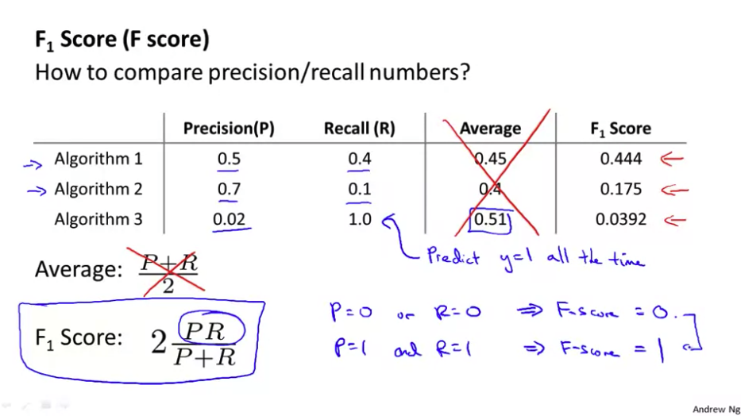
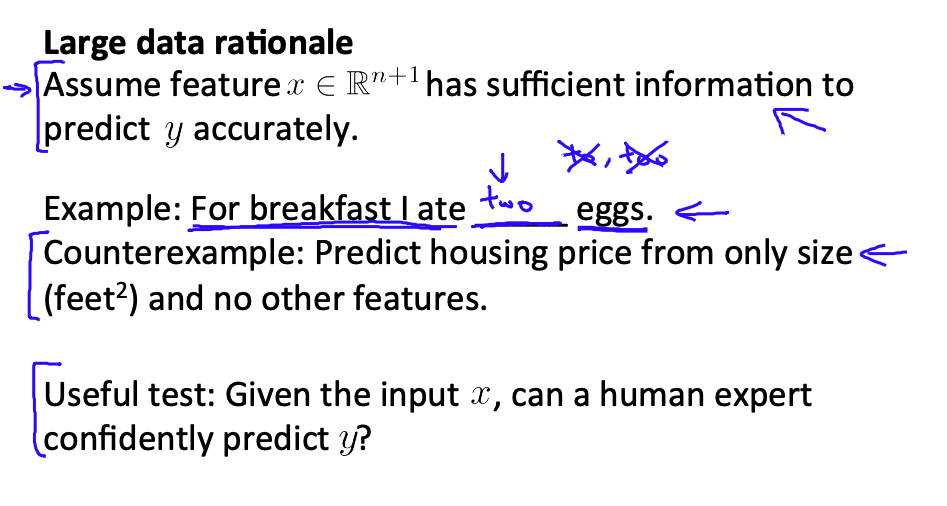
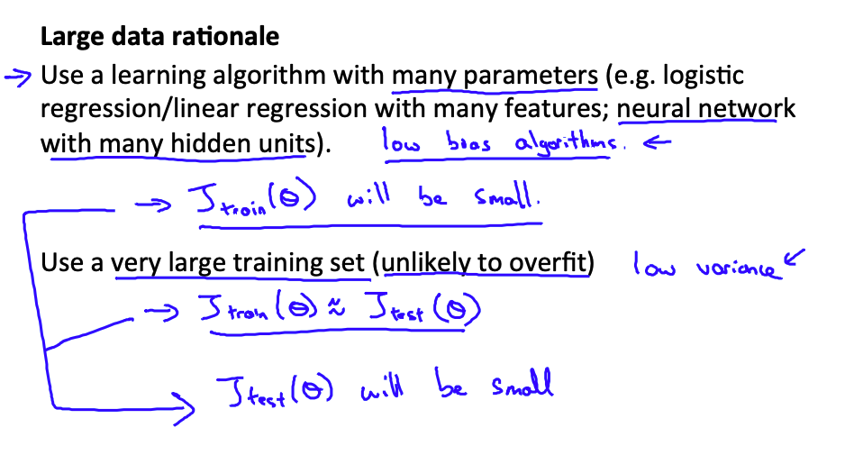

## Error Metrics for Skewed Classes

###  Precision/ Recall
* By using precision and recall, we find, what happens is that even if we have very skewed classes, it's not possible for an algorithm to "cheat" and predict y equals 1 all the time, or predict y equals 0 all the time, and get high precision and recall. 
* And in particular, if a classifier is getting high precision and high recall, then we are actually confident that the algorithm has to be doing well, even if we have very skewed classes.

* **Precision** 
	(Of all patients where we predicted y= 1, what fraction actually has cancer?)
    
    * $\dfrac{\text{True Positive}}{\#\text{predicted positive}} = \dfrac{\text{True Positive}}{\text{True pos + False pos}}$

* **Recall**
	(Of all patients that actually have cancer, what fraction did we correctly detect as having cancer?)
    
    * $\dfrac{\text{True Positive}}{\#\text{actual positive}} = \dfrac{\text{True Positive}}{\text{True pos + False neg}}$

### Trading Off Precision and Recall

* In a logistic regression, by varying the threshold, you can control a trade off between precision and recall. 
* **F Score**, which takes precision and recall, and again, gives you a single real number evaluation metric so that you can decide proper threshold between precision and recall. 

#### $F_1$ Score.

* $F_1 \text{ Score = }  2\dfrac{PR}{P+R}$

	
    
    
## Using Large Data Sets

* 

* 
