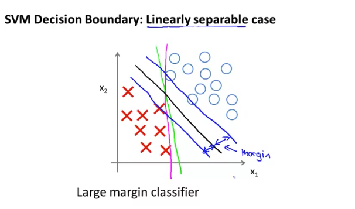
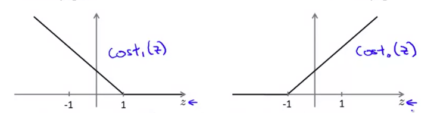
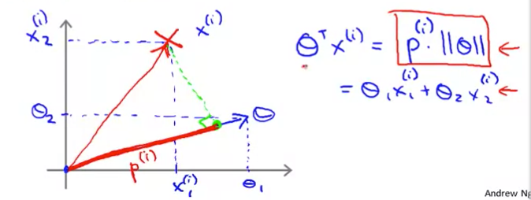
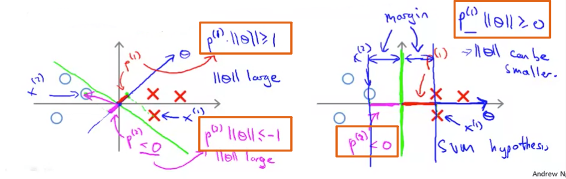

# Large Margin Classification

## Purpose

* What we want to do with SVM is making a good boundary so that **the margin between border and the most nearest positive or negative examples from border(Support vectors) becomes as large as possible.**

	
    
## Optimization Objective (Cost Function)

### Support vector machine

* The `cost function of Logistic regression` is:
	
	$\min\limits_{\theta} \frac{1}{m}\Big[ \displaystyle\sum^{m}_{i=1}y^{(i)}(-\text{log}(h_\theta (x^{(i)})) + (1-y^{(i)})((-\text{log}(1-h_\theta(x^{(i)})))\Big] + \frac{\lambda}{2m}\sum^n_{i=1}\theta^2_j$
    
* Similarly, the **`cost function of SVM`** is like below:

    $\min\limits_{\theta} C \displaystyle\sum^{m}_{i=1}\Big[y^{(i)}\text{cost}_1(\theta^Tx^{(i)}) + (1-y^{(i)})\text{cost}_0(\theta^Tx^{(i)})\Big] + \frac{1}{2}\sum^n_{i=1}\theta^2_j$
    * $\text{cost}_1(\theta^Tx^{(i)})$ and $\text{cost}_0(\theta^Tx^{(i)})$ mean in case y is 1 or 0 each. 
	* $\text{cost}_1(\theta^Tx^{(i)})$ and $\text{cost}_0(\theta^Tx^{(i)})$ replace $-\text{log}h_\theta(x^{(i)})$ and $-\text{log}(1-h_\theta(x^{(i)}))$ of logistic each. 
	* Both cost function in case 0 or 1, look like following,
		
    * If $y =1,$ we want $\theta^Tx \geq 1$ (not just $\geq0$)
    * If $y =0,$ we want $\theta^Tx \leq -1$ (not just $\lt0$)
    * The values 1 and -1 are decided 100% arbitrarily. There is no logical reason. We just want the length of margin to become bigger or smaller than these values at least, so that we can minimize the cost function.

     
* The main difference between logistic regression and SVM is **where the balancing part, $\lambda$ or $C$ is located**. Both are basically trying to balance out the portion of cost and regularization term.

	* **Logistic Regression form**: $A + \lambda B$
	* **SVM form**: $CA + B$. In here, [$C=\frac{1}{\lambda}$] doing the same role as $\lambda$ does in logistic regression.  

* Basically, the **`hypothesis`** of SVM:

	$h_\theta(x) = \begin{cases} 
      1 & \text{if }\theta^Tx\geq 0 \\ 
      0                 & \text{otherwise}
	\end{cases}$    
    
### SVM Decision Boundary

* The constraints of SVM like following,
	$\theta^T x^{(i)} \geq 1$ &nbsp;&nbsp;&nbsp;&nbsp;&nbsp;&nbsp;&nbsp;&nbsp;&nbsp; $\text{ when } y^{(i)} =1$
	$\theta^T x^{(i)} \leq -1$&nbsp;&nbsp;&nbsp;&nbsp;&nbsp;&nbsp;&nbsp; $\text{ when } y^{(i)} = 0$
	
    are **to make the $C\sum_{i-=1}^m(...)$ part in the cost function equal to 0** for sure, so that we can focus on **to minimize $\theta$ part($\frac{1}{2}\sum^n_{i=1}\theta^2_j$)"** whatever $C$ is. As mentioned before, the minimum border widths 1 and -1 are also decided for this purpose.

* As a result, the cost function becomes like following.
	
    $\min\limits_{\theta} C\times 0 + \dfrac{1}{2}\displaystyle\sum^n_{i=1}\theta^2_j \Longrightarrow \min\limits_{\theta} \dfrac{1}{2}\displaystyle\sum^n_{i=1}\theta^2_j$
	s.t. $\theta^T x^{(i)} \geq 1$ &nbsp;&nbsp;&nbsp;&nbsp;&nbsp;&nbsp;&nbsp;&nbsp;&nbsp; $\text{ when } y^{(i)} =1$
	&nbsp;&nbsp;&nbsp;&nbsp;&nbsp;&nbsp;$\theta^T x^{(i)} \leq -1$&nbsp;&nbsp;&nbsp;&nbsp;&nbsp;&nbsp;&nbsp; $\text{ when } y^{(i)} = 0$
 

## Mathematics Behind Large Margin Classification

* Now, Let's understand the meaning of $\theta^Tx^{(i)}$ in the constraints,  
	$\theta^T x^{(i)} \geq 1$ &nbsp;&nbsp;&nbsp;&nbsp;&nbsp;&nbsp;&nbsp;&nbsp;&nbsp; $\text{ when } y^{(i)} =1$
	$\theta^T x^{(i)} \leq -1$&nbsp;&nbsp;&nbsp;&nbsp;&nbsp;&nbsp;&nbsp; $\text{ when } y^{(i)} = 0$ more precisely. 
* Actually, $\theta^Tx^{(i)}$ means the **dot product(or inner product) of two vectors**.
	the form of $\theta^Tx^{(i)}$ is the form of inner product, $u^Tv$. Therefore, $\theta^Tx^{(i)}$ means the projection of $x^{(i)}$ onto $\theta$ like following picture.
    
    
    
* Hence, we want to know $p^{(i)}\cdot||\theta||$, because it is the length of margin between the classification border and support vector. 

* Note that $\theta^Tx^{(i)} = p^{(i)}\cdot ||\theta||$. It means we can replace $\theta^Tx^{(i)}$ in the constraints with $p^{(i)}\cdot ||\theta||$ like following.

	$p^{(i)}\cdot ||\theta|| \geq 1$ &nbsp;&nbsp;&nbsp;&nbsp;&nbsp;&nbsp;&nbsp;&nbsp;&nbsp; $\text{ when } y^{(i)} =1$
	$p^{(i)}\cdot ||\theta|| \leq -1$&nbsp;&nbsp;&nbsp;&nbsp;&nbsp;&nbsp;&nbsp; $\text{ when } y^{(i)} = 0$

### Again, SVM Decision Boundary

* Before we talk about the meaning of $p^{(i)}\cdot ||\theta||$ further, we have to rethink the cost function, $\min\limits_{\theta} \dfrac{1}{2}\displaystyle\sum^n_{i=1}\theta^2_j$. Actually, **SVM's cost function means minimizing the l2-lorm of $\theta$, $||\theta||$** by the following equation. 
	
    $$\min\limits_{\theta}\dfrac{1}{2}\displaystyle\sum^n_{i=1}\theta^2_j = \dfrac{1}{2}(\theta^2_1 + \theta^2_2) = \dfrac{1}{2}(\sqrt{\theta_1^2 + \theta_2^2)}^2 \Longrightarrow \min\limits_{\theta}\dfrac{1}{2}||\theta||^2$$
    
* So, back to the main point, with perspective of $p^{(i)}\cdot ||\theta||$, to minimize our cost function, we have maximize $p^{(i)}$, so that minimize $||\theta||$. 
* Then, to maximize $p^{(i)}$, we have to know what decides the length of $p^{(i)}$.

#### Minimize cost function $\Rightarrow$ Large margin classifier.

* Here is a good example why minimizing $||\theta||$ stands for large margin classifier. It is a good example to explan what decides the length of $p^{(i)}$ at the same time.

* For the same positive and negative examples, There are two SVM classifiers, left one and right one(green lines). Left border is not a good classifier, but right one is ideal. 

#### Bad border, good border

* In case of bad border(left one), if we draw the orthogonal $\vec\theta$(blue line), and do projection of support vector(the nearest positive or negative example) onto $\vec\theta$, then you can see the length of $p^{(i)}$ is pretty short.
	* With the negative support vector, the angle of $\vec\theta$ with support vector is over 90 degree, so $p^{(i)}$ value is negative.  
	
* Then, to satisfy the constraints, 

  $p^{(i)}\cdot ||\theta|| \geq 1$ &nbsp;&nbsp;&nbsp;&nbsp;&nbsp;&nbsp;&nbsp;&nbsp;&nbsp; $\text{ when } y^{(i)} =1$
      $p^{(i)}\cdot ||\theta|| \leq -1$&nbsp;&nbsp;&nbsp;&nbsp;&nbsp;&nbsp;&nbsp; $\text{ when } y^{(i)} = 0$,
  
  if $p^{(i)}$ is small, then relatively $||\theta||$ should be large.

* By constrast, if $p^{(i)}$ is large, in case of right border, then relatively $||\theta||$ should be small. Hence, a good SVM classifier has large margin.