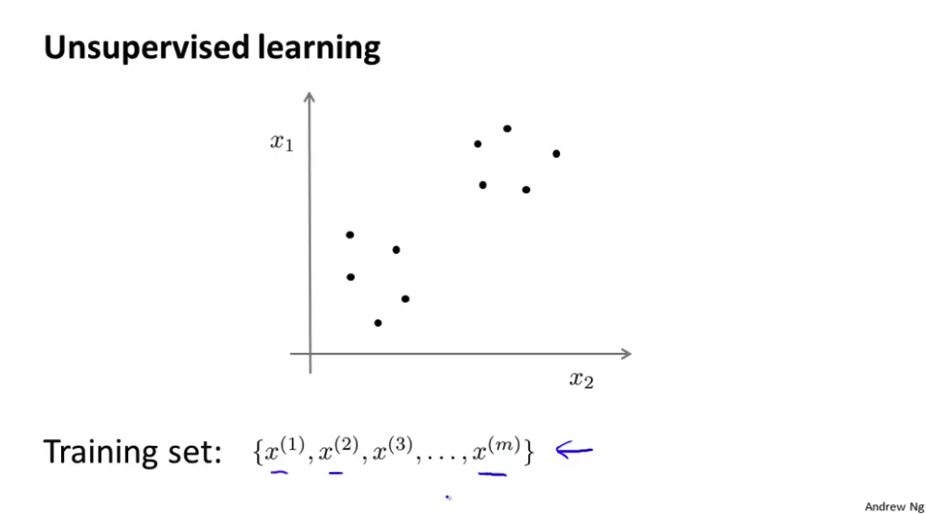
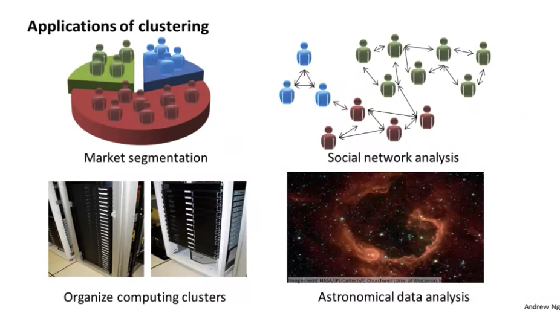
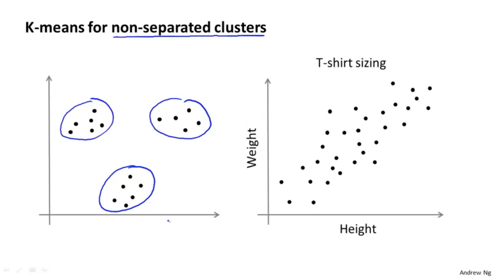
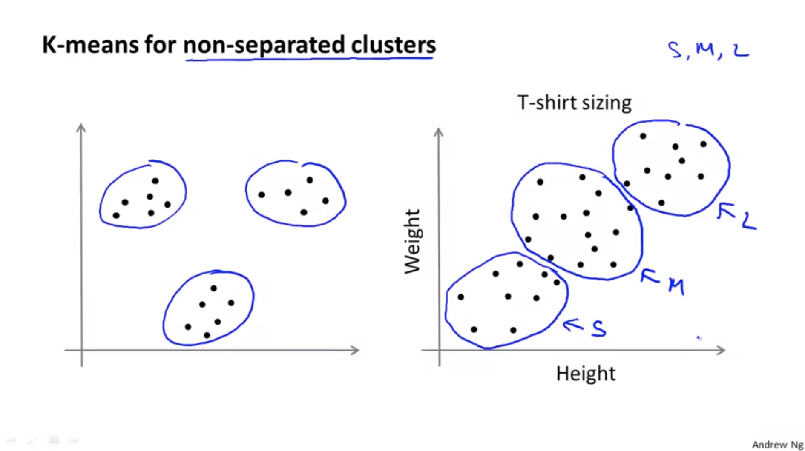

# Unsupervised Learning

## Introduction

* In unsupervised learning, what we do is we give some **sort of unlabeled training set** to an algorithm and we just ask the algorithm find some **structure in the data** for us. 

* One of typical example of unsupervised learning is clustering algorithm.
	

* In the **clustering problem** we are given an unlabeled dataset and we would like to have an algorithm **automatically group the data into coherent subsets or into coherent clusters** for us.

#### Applications of clustering

## K-Means Algorithm

* The K Means algorithm is by far the most popular, by far the most widely used clustering algorithm.

#### Input:

* $K$ (number of cluster)
* Training set $\{x^{(1)},x^{(2)},...,x^{(m)}\}$
	* $x^{(i)} \in \ \mathbb{R}^n$ (drop $x_0=1$ convention)

#### Algorithm

1. Randomly initialize $K$ cluster centroids $\mu_1, \mu_2,...,\mu_K \in \mathbb{R}^n$
2. Repeat $\{$
&nbsp;&nbsp;&nbsp;&nbsp;&nbsp; for $i=1$ to $m$
	  &nbsp;&nbsp;&nbsp;&nbsp;&nbsp;&nbsp;&nbsp;&nbsp;&nbsp;&nbsp;&nbsp;&nbsp;&nbsp;(Cluster assignment step)
		&nbsp;&nbsp;&nbsp;&nbsp;&nbsp;&nbsp;&nbsp;&nbsp;&nbsp;&nbsp;&nbsp;&nbsp;&nbsp; $c^{(i)} :=$ index (from 1 to $K$) of cluster centroid closest to $x^{(i)}$
&nbsp;&nbsp;&nbsp;&nbsp;&nbsp; for $k=1$ to $K$
&nbsp;&nbsp;&nbsp;&nbsp;&nbsp;&nbsp;&nbsp;&nbsp;&nbsp;&nbsp;&nbsp;&nbsp;&nbsp;(Move centroid step)
&nbsp;&nbsp;&nbsp;&nbsp;&nbsp;&nbsp;&nbsp;&nbsp;&nbsp;&nbsp;&nbsp;&nbsp;&nbsp; $\mu_k :=$ average (mean) of points assigned to cluster $k$
 $\}$

 
* But **what if there is a cluster centroid no points with zero points assigned to it.**
	* In that case the more common thing to do is to **just eliminate that cluster centroid.** And if you do that, you end up with K minus one clusters instead of k clusters. 
	* Sometimes <u>if you really need k clusters</u>, then the other thing you can do if you have a cluster centroid with no points assigned to it is you can **just randomly reinitialize** that cluster centroid.

### K-Means Application

* K-means is applied to datasets that look like following where there may not be several very well separated clusters(T-shirt sizing on the right). 

	
	

