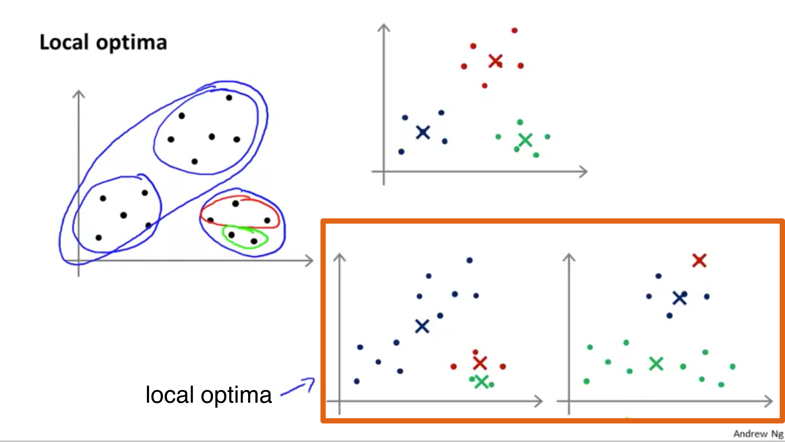
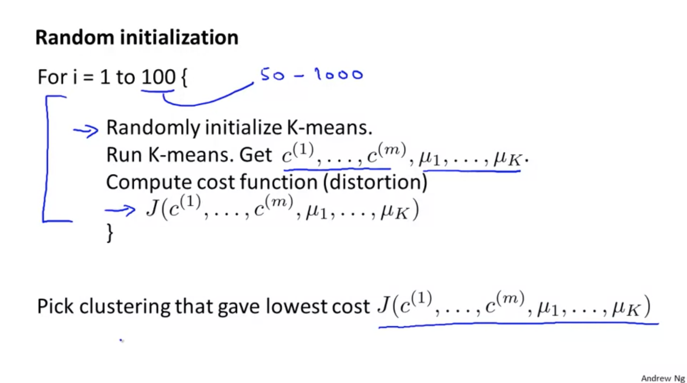
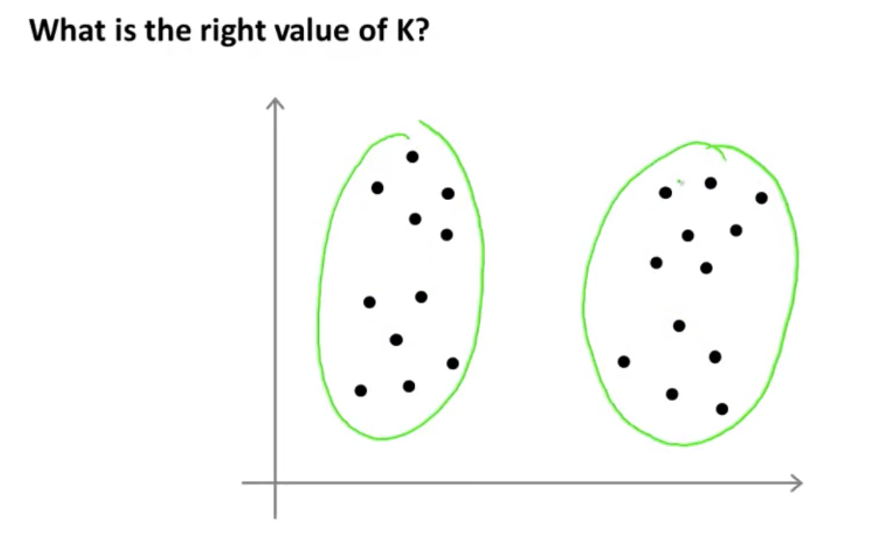
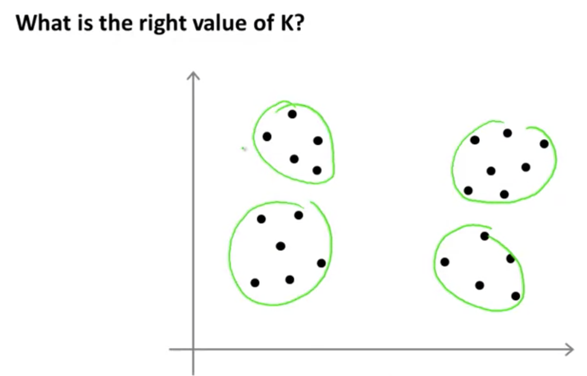
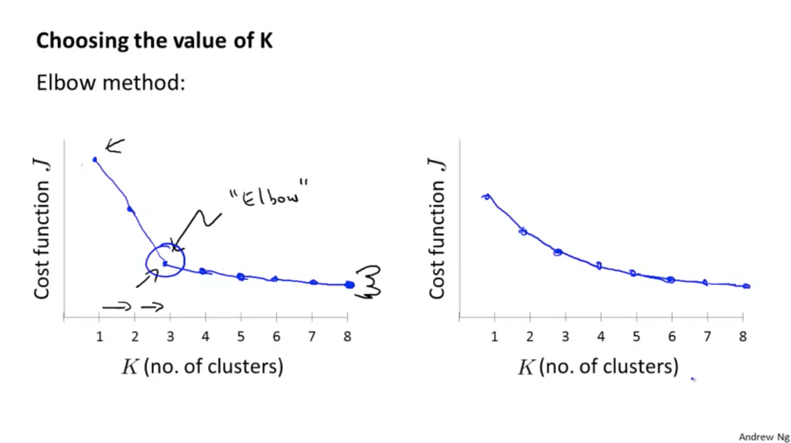
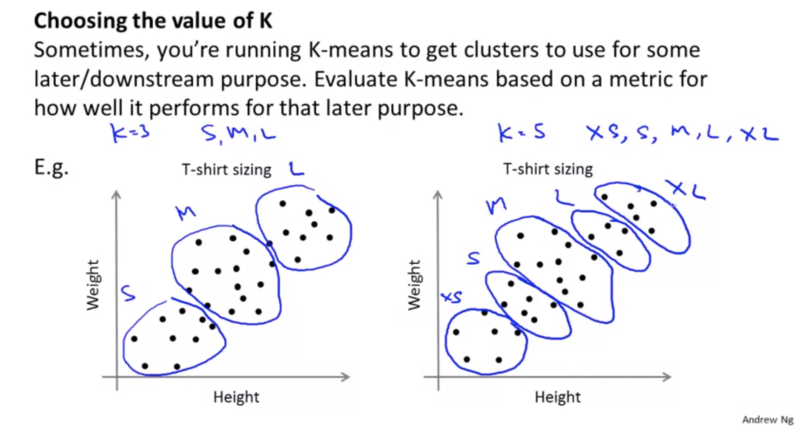

# Optimization Objective

## K-means optimization objective

* $c^{(i)}$ = index of cluster (1,2,...,$K$) to which example $x^{(i)}$ is currently assigned.
* $\mu_k =$ cluster centroid $k \ (\mu_k \in \mathbb{R}^n)$
* $\mu_{c^{(i)}} =$ cluster centroid of cluster to which example $x^{(i)}$ has been assigned.

#### Optimization objective
$$J(c^{(1)},...,c^{(m)}, \mu_1,...,\mu_K) = \dfrac{1}{2}\displaystyle\sum^m_{i=1}||x^{(i)} - \mu_{c^{(1)}}||^2$$

 $$\min\limits_{c^{(1)},...,c^{(m)},\mu_1, ..., \mu_K}J(c^{(1)},...,c^{(m)}, \mu_1,...,\mu_K)$$

* This function is called the **Distortion** cost function. 

* In the K-Means algorithm as,
  **Algorithm**

  1. Randomly initialize $K$ cluster centroids $\mu_1, \mu_2,...,\mu_K \in \mathbb{R}^n$
  2. Repeat $\{$
  &nbsp;&nbsp;&nbsp;&nbsp;&nbsp; for $i=1$ to $m$
        &nbsp;&nbsp;&nbsp;&nbsp;&nbsp;&nbsp;&nbsp;&nbsp;&nbsp;&nbsp;&nbsp;&nbsp;&nbsp;**(Cluster assignment step)**
          &nbsp;&nbsp;&nbsp;&nbsp;&nbsp;&nbsp;&nbsp;&nbsp;&nbsp;&nbsp;&nbsp;&nbsp;&nbsp; $c^{(i)} :=$ index (from 1 to $K$) of cluster centroid closest to $x^{(i)}$
  &nbsp;&nbsp;&nbsp;&nbsp;&nbsp; for $k=1$ to $K$
  &nbsp;&nbsp;&nbsp;&nbsp;&nbsp;&nbsp;&nbsp;&nbsp;&nbsp;&nbsp;&nbsp;&nbsp;&nbsp;**(Move centroid step)** 
  &nbsp;&nbsp;&nbsp;&nbsp;&nbsp;&nbsp;&nbsp;&nbsp;&nbsp;&nbsp;&nbsp;&nbsp;&nbsp; $\mu_k :=$ average (mean) of points assigned to cluster $k$
   $\}$

	 
    
	* The cluster assignment step is the part $\min\limits_{c^{(1)},...,c^{(m)}}J(c^{(1)},...,c^{(m)})$. (holding $\mu_1,...,\mu_K$ fixed)
	* The left moving centroid step is exactly the part of $\min\limits_{\mu_1,...,\mu_K}J(\mu_1,...,\mu_K)$.

 

## Random Initialization 

* Should have $K \lt m$
* Randomly pick $K$ training examples.
* Set $\mu_1,...,\mu_K$ equal to these $K$ examples.

#### Local optima

* But if you had a particularly unlucky, random initialization, K-means can also get stuck at different local optima as we can see below.

	

* So, if you're worried about K-means getting stuck in local optima, if you want to increase the odds of K-means finding the best possible clustering as **trying multiple, random initializations, and pick the best lowest one** because local optima means high cost value.

	

#### Shortcoming
* This barbaric method doesn't work well when $K$ is bigger than 10. It especially works well when $K$ is in the arange between $2 \leq K \leq 7$.

 

## Choosing the Number of Clusters

* How to choose the number of clusters, or how to choose the value of the parameter? By the perspective, the number of cluster for the same dataset could be 2 or 4. 

	

### Elbow Method

* If we iterate the K-Means with vary $K$ values and compute cost function, then we get a plot as below.

	

* The left plot in the picture above, we see the drastic reduction of cost at $K=3$. 
* So, we can decide 3 is proper for the number of cluster. This is the Elbow method. Elbow method is named after the shape like a left plot above.(Look at the cute hand drawn by Andrew Ng!!)

#### Shortcoming
* **However**, if you actually do this **in a practice**, if your plot looks like the one on the left and that's great. It gives you a clear answer, but just as often, you end up with a plot that looks like the one on the right and **is not clear where the ready location of the elbow is**.
*  It makes it harder to choose a number of clusters using this method. So maybe the quick summary of the Elbow Method is that is worth the shot but **I wouldn't necessarily have a very high expectation of it working** for any particular problem. - by professor.

## What is your purpose of SVM?

* The better way to think about how to choose the number of clusters is to ask, **for what purpose are you running K-means?**

* Think about this from the perspective of the T-shirt business and ask: 
	> "If I have five segments, then how well will my T-shirts fit my customers and so, how many T-shirts can I sell? How happy will my customers be?"

* What really makes sense, from the perspective of the T-shirt business, in terms of whether, I want to have Goer T-shirt sizes so that my T-shirts fit my customers better. Or do I want to have fewer T-shirt sizes so that I make fewer sizes of T-shirts. And I can sell them to the customers more cheaply. 

* And so, the t-shirt selling business, that might give you a way to decide, between three clusters versus five clusters.