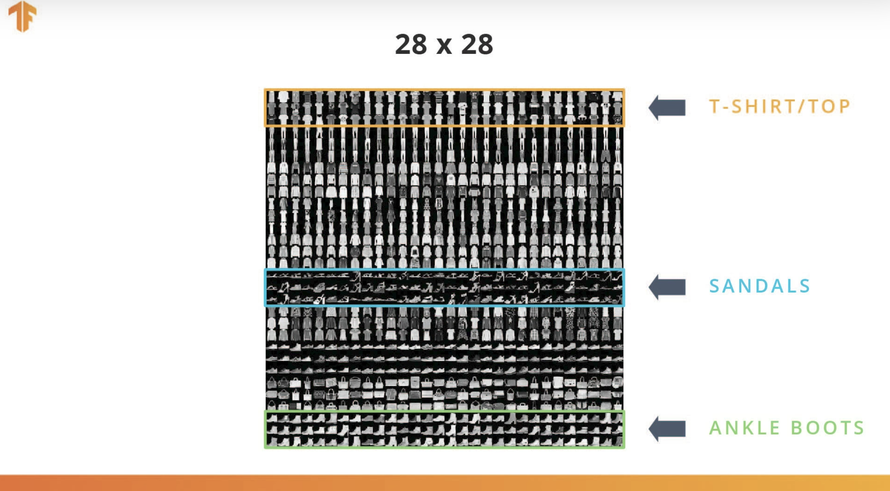
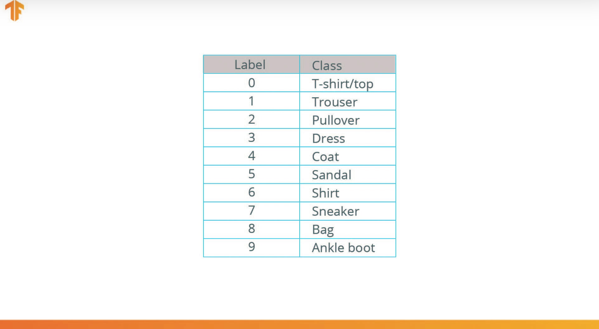
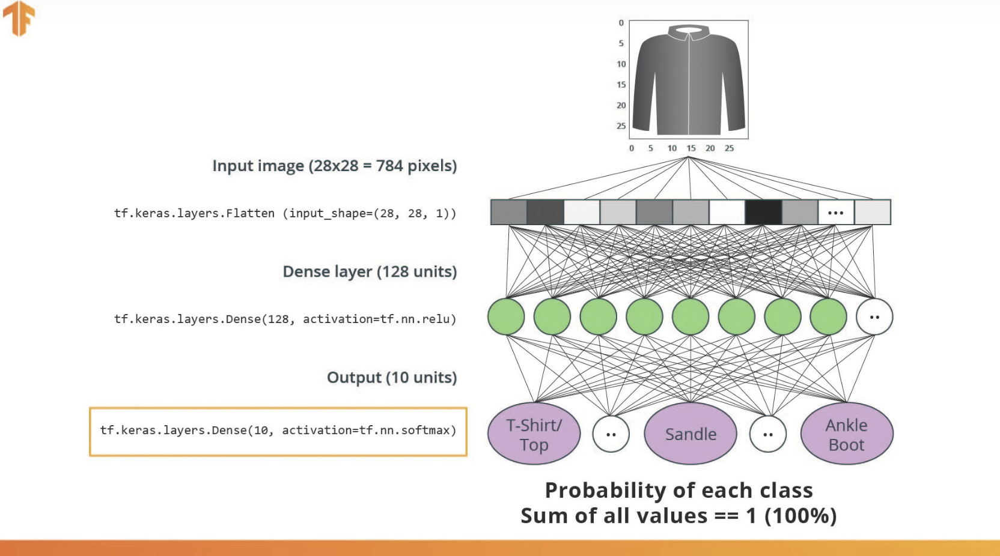
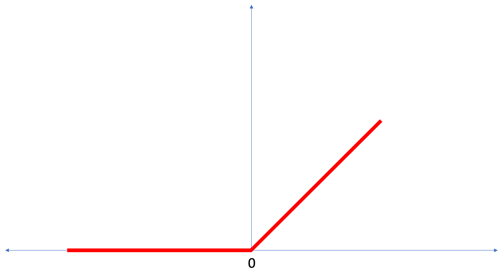

# Fashion MNIST Dataset

### Fashion MNIST
* 10 clothes classes cosists of 60,000 Training data and 10,000 Test Data.

	

	
    
### Neural Network

* What we gonna do is predicting the classes of input data with following simple neural network.
	

### The Rectified Linear Unit (ReLU)
* In this lesson we talked about ReLU and how it gives our Dense layer more power. ReLU stands for Rectified Linear Unit and it is a mathematical function that looks like this:

	
    
    
* As we can see, the ReLU function gives an output of 0 if the input is negative or zero, and if input is positive, then the output will be equal to the input.

* ReLU gives the network the ability to solve nonlinear problems.

* Converting Celsius to Fahrenheit is a linear problem because `f = 1.8*c + 32` is the same form as the equation for a line, `y = m*x + b`. But most problems we want to solve are nonlinear. In these cases, adding ReLU to our Dense layers can help solve the problem.

* ReLU is a type of activation function. There several of these functions (ReLU, Sigmoid, tanh, ELU), but ReLU is used most commonly and serves as a good default. To build and use models that include ReLU, you don’t have to understand its internals. 
* Let’s review some of the new terms that were introduced in this lesson:

  * **Flattening**: The process of converting a 2d image into 1d vector
  * **ReLU**: An activation function that allows a model to solve nonlinear problems
  * **Softmax**: A function that provides probabilities for each possible output class
  * **Classification**: A machine learning model used for distinguishing among two or more output categories.

### Training and Testing

* TensorFlow Datasets provides a collection of datasets ready to use with TensorFlow.

* Datasets are typically split into different subsets to be used at various stages of training and evaluation of the neural network. In this section we talked about:

	* Training Set: The data used for training the neural network.
	* Test set: The data used for testing the final performance of our neural network.

* The test dataset was used to try the network on data it has never seen before. This enables us to see how the model generalizes beyond what it has seen during training, and that it has not simply memorized the training examples.

* In the same way, it is common to use what is called a Validation dataset. This dataset is not used for training. Instead, it it used to test the model during training. This is done after some set number of training steps, and gives us an indication of how the training is progressing. For example, if the loss is being reduced during training, but accuracy deteriorates on the validation set, that is an indication that the model is memorizing the test set.

* The validation set is used again when training is complete to measure the final accuracy of the model.

### Summary
* In this lesson we trained a neural network to classify images of articles of clothing. To do this we used the Fashion MNIST dataset, which contains 70,000 greyscale images of articles of clothing. 
* We used 60,000 of them to train our network and 10,000 of them to test its performance. In order to feed these images into our neural network we had to flatten the 28 × 28 images into 1d vectors with 784 elements. 
* Our network consisted of a fully connected layer with 128 units (neurons) and an output layer with 10 units, corresponding to the 10 output labels. 
* These 10 outputs represent probabilities for each class. The softmax activation function calculated the probability distribution.

* We also learned about the differences between regression and classification problems.

	* **Regression**: A model that outputs a single value. For example, an estimate of a house’s value.
	* **Classification**: A model that outputs a probability distribution across several categories. For example, in Fashion MNIST, the output was 10 probabilities, one for each of the different types of clothing. Remember, we use Softmax as the activation function in our last Dense layer to create this probability distribution.

	
    