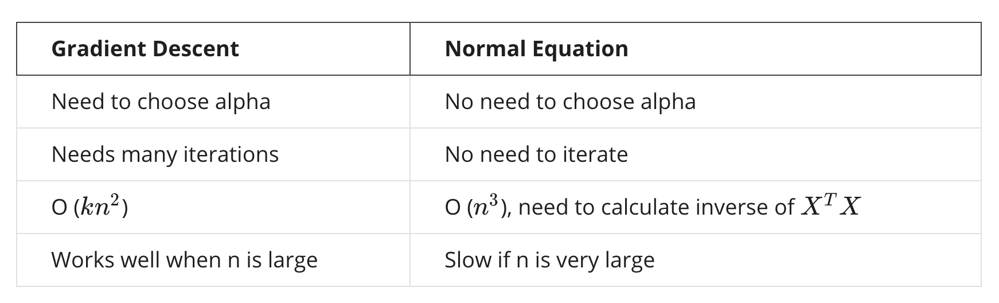

# Computing Parameters Analytically

## Normal Equation

* Gradient descent gives one way of minimizing J. Let’s discuss a second way of doing so, this time performing the minimization explicitly and without resorting to an iterative algorithm. In the "Normal Equation" method, we will minimize J by explicitly taking its derivatives with respect to the $\theta_j$ ’s, and setting them to zero. This allows us to find the optimum theta without iteration. The normal equation formula is given below:
	
    $\theta = (X^TX)^{-1}X^Ty$
    
 
 	
 
 
* There is **no need** to do feature scaling with the normal equation.

* The following is a comparison of gradient descent and the normal equation:

	 
     

* With the normal equation, computing the inversion has complexity $\mathcal{O}(n^3)$. So if we have a very large number of features, the normal equation will be slow. In practice, when n exceeds 10,000 it might be a good time to go from a normal solution to an iterative process.