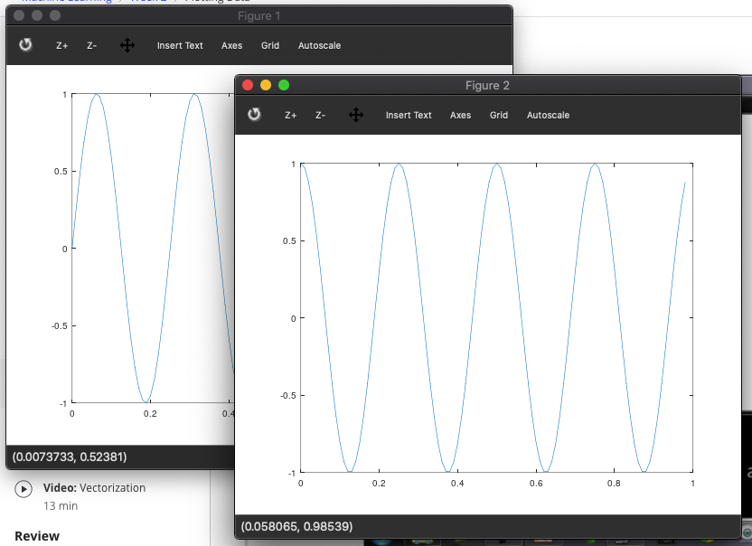

## Basic operations

* #### Logical Operation 
  ~~~matlab
  % equal '=='
  1 == 2   % false
  ans = 0
  % not equal '~='
  1 ~= 2   % true
  ans = 1
  % AND
  1 && 0 
  ans = 0 
  % OR
  1 || 0 
  ans = 1 
  xor(1, 0)  %XOR
  ans = 1 
  ~~~
  
* #### Cryptical function (to simple prompt)
  ~~~matlab
  octave:34> PS1('>> ');   % prompt sign changed to '>> ' 
  >> a = 3 
  a = 3
  >> a = 3;  % semicolon supressing output
  >> disp(pi)   % show result without 'ans ='
   3.1416
  ~~~
  
* #### miscellaneous
  ~~~matlab
  >> b = 'hi';  % string
  >> b
  b = hi
  >> pi    % pi
  ans =  3.1416
  >> disp(sprintf('2 decimals: %0.2f', pi))  % print string with float up to 2 decimal point.
  2 decimals: 3.14
  ~~~
* #### format
  ~~~matlab
  >> format long
  >> pi
  ans =  3.141592653589793
  >> format short
  >> pi
  ans =  3.1416
  >> v = 1:0.1:2 % start from 1 to 2 increasing by 0.1
  v =

      1.0000    1.1000    1.2000    1.3000    1.4000    1.5000    1.6000    1.7000    1.8000    1.9000    2.0000
  ~~~
 
### Matrix
* #### Matrix 1
  ~~~matlab
  >> A = [ 1 2; 3 4; 5 6]
  A =

     1   2
     3   4
     5   6
     
  >> A = [1 2;
  > 3 4;
  > 5 6]
  A =

     1   2
     3   4
     5   6
     
  v = [1 2 3]   % a row vector
  v =

   1   2   3

  >> v = [1; 2; 3]  % a column vector
  v =

     1
     2
     3
     
  >> ones(2, 3)   % ones 
  ans =

     1   1   1
     1   1   1
  
   >> C = 2*ones(2,3)
  C =

     2   2   2
     2   2   2
     
  >> w = rand(1,3)    %  random matrix with uniform distribution between 0 and 1.
  w =

     0.115363   0.057313   0.849492

  >> w = randn(1,3)   % random variables with Gaussian or normal distribution with (0, 1).
  w =

     1.43068   1.23386  -0.21462

  w = -6 + sqrt(10)*(randn(1, 10000));
  hist(w) % histogram of w with 50 bins. result is below.
  ~~~
  
  </img>

* Matrix 2
	~~~matlab
    >> eye(4)      % identity matrix
    ans =

    Diagonal Matrix

       1   0   0   0
       0   1   0   0
       0   0   1   0
       0   0   0   1
    
    help eye    % you can see explanation of the funcion after help keyword
    ~~~

 

## Moving Data Around 

* #### Size and Length

  ~~~matlab
  >> A = [ 1 2; 3 4; 5 6]
  A =

     1   2
     3   4
     5   6

  >> size(A)
  ans =

     3   2

  >> sz = size(A)
  sz =

     3   2

  >> sz
  sz =

     3   2

  >> size(sz)
  ans =

     1   2

  >> size(A, 1) % select the size of dimention
  ans =  3
  >> size(A, 2)
  ans =  2

  >> v = [1 2 3 4]
  v =

     1   2   3   4

  >> length(v)
  ans =  4
  >> length(A)
  ans =  3
  >> B = [1 2 3; 4 5 6]
  B =

     1   2   3
     4   5   6

  >> length(B) % length produces the larger dimention size.
  ans =  3
  ~~~

* #### Linux commands

  ~~~matlab
  >> pwd    % location     
  ans = /Users/chayesol
  >> cd Desktop    % change the directory
  >> pwd
  ans = /Users/chayesol/Desktop
  >> ls         % list files
  Blog						Study
  Data_Crew					git-other
  Guideline_of_ML_pipeline.pptx			git_exer
  Hobbies						just
  ~~~

* #### Variable check(who, whos) and remove.

  ~~~matlab
  >> who         % show current variables
  Variables in the current scope:

  A    B    ans  sz   v    w

  >> whos      % with more information
  Variables in the current scope:

     Attr Name        Size                     Bytes  Class
     ==== ====        ====                     =====  =====
          A           3x2                         48  double
          B           2x3                         48  double
          ans         1x23                        23  char
          sz          1x2                         16  double
          v           1x4                         32  double
          w           1x10000                  80000  double

  Total is 10041 elements using 80167 bytes

  >> clear A       % remove certain variable
  >> who
  Variables in the current scope:

  B    ans  sz   v    w

  >> clear v w
  >> who
  Variables in the current scope:

  B    ans  sz

  >> clear      % clear all variables
  >> who
  >> whos
  ~~~
  
* #### Load and save data

  ~~~matlab
  >> v = [1 2 3 4]
  v =

     1   2   3   4

  >> save hello.mat    % you can save it as .txt file. It works identically.
  >> clear v
  >> who
  >> load hello.mat
  >> v
  v =

     1   2   3   4

  >> who
  Variables in the current scope:

  v
  ~~~
  
* #### Selct elements
  ~~~matlab
  >> A = [1 2; 3 4; 5 6]
  A =

     1   2
     3   4
     5   6

  >> A(3, 2)
  ans =  6
  >> A(2, :)
  ans =

     3   4

  >> A(2, :)  % ":" means every elements along that row/column
  ans =

     3   4

  >> A([1 3], :)    % select first and third row and all columns
  ans =

     1   2
     5   6

  >> A(:, 2) = [10; 11; 12]
  A =

      1   10
      3   11
      5   12

  >> A = [A, [100; 101; 102]];   % put elements to the right
  >> A
  A =

       1    10   100
       3    11   101
       5    12   102

  >> A(:)    % put all elements of A into a single vector
  ans =

       1
       3
       5
      10
      11
      12
     100
     101
     102
  ~~~

* #### Concatenation

  ~~~matlab
  >> A = [1 2; 3 4; 5 6];
  >> B = [11 12; 13 14; 15 16]
  B =

     11   12
     13   14
     15   16

  >> C = [A B]
  C =

      1    2   11   12
      3    4   13   14
      5    6   15   16

  >> C = [A; B]
  C =

      1    2
      3    4
      5    6
     11   12
     13   14
     15   16

  >> size(C)
  ans =

     6   2

  >> [A B]
  ans =

      1    2   11   12
      3    4   13   14
      5    6   15   16

  >> [A, B]
  ans =

      1    2   11   12
      3    4   13   14
      5    6   15   16
  ~~~
  
 

## Computing on Data

* #### Element-wise operations
  ~~~matlab
  >> A
  A =

     1   2
     3   4
     5   6

  >> B
  B =

     11   12
     13   14
     15   16

  >> C = [1 1; 2 2]
  C =

     1   1
     2   2

  >> A*C
  ans =

      5    5
     11   11
     17   17

  >> A .* B
  ans =

     11   24
     39   56
     75   96

  >> A .* B     % '.' is element-wise function
  ans =

     11   24
     39   56
     75   96

  >> A
  A =

     1   2
     3   4
     5   6

  >> A .^ 2
  ans =

      1    4
      9   16
     25   36

  >> 1 ./ A
  ans =

     1.00000   0.50000
     0.33333   0.25000
     0.20000   0.16667

  >> v = [1; 2; 3]
  v =

     1
     2
     3

  >> v + ones(length(v),1)
  ans =

     2
     3
     4

  >> v + 1
  ans =

     2
     3
     4
  ~~~

* #### log, exp, abs

  ~~~matlab
  >> log(v)
  ans =

     0.00000
     0.69315
     1.09861

  >> exp(v)
  ans =

      2.7183
      7.3891
     20.0855

  >> v = [-1; -2; 3]
  v =

    -1
    -2
     3

  >> abs(v)
  ans =

     1
     2
     3
  ~~~
  
* #### Transpose

  ~~~matlab
  >> A
  A =

     1   2
     3   4
     5   6

  >> A'
  ans =

     1   3   5
     2   4   6

  >> A'    % Transpose
  ans =

     1   3   5
     2   4   6

  >> (A')'
  ans =

     1   2
     3   4
     5   6
  ~~~

* #### Logical function with matrix

  ~~~matlab
  >> a = [1 15 2 0.5]
  a =

      1.00000   15.00000    2.00000    0.50000

  >> val = max(a)
  val =  15
  >> [val, ind] = max(a)
  val =  15
  ind =  2
  >> max(A)     % max row
  ans =

     5   6

  >> a < 3
  ans =

    1  0  1  1

  >> a < 3    % element-wise comparison
  ans =

    1  0  1  1

  >> find(a < 3)
  ans =

     1   3   4

  >> A = magic(3)     % it produces every sum of direction equals to 10 matrix. 
  A =

     8   1   6
     3   5   7
     4   9   2

  >> [r, c] = find(A >= 7)    % results in rows and columns sets.
  r =

     1
     3
     2

  c =

     1
     2
     3    % it means A(1, 1)=8, A(3, 2)=7, A(2, 3)=9
  ~~~

* #### sum, prod, floor, ceil, and max

  ~~~matlab
  >> a
  a =

      1.00000   15.00000    2.00000    0.50000

  >> sum(a)
  ans =  18.500
  >> prod(a)
  ans =  15
  >> floor(a)
  ans =

      1   15    2    0

  >> ceil(a)
  ans =

      1   15    2    1

  >> rand(3)      % random square matrix
  ans =

     0.79868   0.73666   0.56469
     0.14535   0.76850   0.23191
     0.37785   0.20593   0.51562

  >> max(rand(3), rand(3))   % get a matrix consists of  maximum elements between two random 3x3 maxtrixes
  ans =

     0.57524   0.99979   0.54784
     0.43340   0.75738   0.83675
     0.91927   0.97823   0.97630

  >> A
  A =

     8   1   6
     3   5   7
     4   9   2

  >> max(A, [], 1)    % column-wise max results
  ans =

     8   9   7

  >> max(A, [], 2)    % per row max results
  ans =

     8
     7
     9

  >> max(A)
  ans =

     8   9   7

  >> max(max(A))
  ans =  9
  >> A(:)
  ans =

     8
     3
     4
     1
     5
     9
     6
     7
     2

  >> max(A(:))
  ans =  9
  ~~~

* ####  Inverse

  ~~~matlab
  >> A = magic(3)
  A =

     8   1   6
     3   5   7
     4   9   2

  >> pinv(A)
  ans =

     0.147222  -0.144444   0.063889
    -0.061111   0.022222   0.105556
    -0.019444   0.188889  -0.102778

  >> temp = pinv(A)
  temp =

     0.147222  -0.144444   0.063889
    -0.061111   0.022222   0.105556
    -0.019444   0.188889  -0.102778
  ~~~

* #### Do some several sums with magic function

  ~~~matlab
  >> A = magic(9)
  A =

     47   58   69   80    1   12   23   34   45
     57   68   79    9   11   22   33   44   46
     67   78    8   10   21   32   43   54   56
     77    7   18   20   31   42   53   55   66
      6   17   19   30   41   52   63   65   76
     16   27   29   40   51   62   64   75    5
     26   28   39   50   61   72   74    4   15
     36   38   49   60   71   73    3   14   25
     37   48   59   70   81    2   13   24   35

  >> sum(A, 1)
  ans =

     369   369   369   369   369   369   369   369   369

  >> sum(A, 2)
  ans =

     369
     369
     369
     369
     369
     369
     369
     369
     369

  >> eye(9)
  ans =

  Diagonal Matrix

     1   0   0   0   0   0   0   0   0
     0   1   0   0   0   0   0   0   0
     0   0   1   0   0   0   0   0   0
     0   0   0   1   0   0   0   0   0
     0   0   0   0   1   0   0   0   0
     0   0   0   0   0   1   0   0   0
     0   0   0   0   0   0   1   0   0
     0   0   0   0   0   0   0   1   0
     0   0   0   0   0   0   0   0   1

  >> A.* eye(9)
  ans =

     47    0    0    0    0    0    0    0    0
      0   68    0    0    0    0    0    0    0
      0    0    8    0    0    0    0    0    0
      0    0    0   20    0    0    0    0    0
      0    0    0    0   41    0    0    0    0
      0    0    0    0    0   62    0    0    0
      0    0    0    0    0    0   74    0    0
      0    0    0    0    0    0    0   14    0
      0    0    0    0    0    0    0    0   35

  >> sum(sum(A .*eye(9)))
  ans =  369
  >> sum(sum(A .*flipud(eye(9))))
  ans =  369
  ~~~
  
## Plotting Data

* #### Plot
  ~~~matlab
  >> t = [0: 0.01: 0.98];
  >> plot(t, y1);
  >> hold on; 		 % to duplicate two graphs
  >> plot(t, y2, 'r');
  >> xlabel('time')		% x label
  >> ylabel('value')		% y label
  >> title('my plot')		% title
  >> legend('sin','cos')	% legend
  >> cd Desktop; print -dpng 'myPlot.png' 	% save result as a file 
  >> close		% close figure
  ~~~

	* Result
	</img>
    

* #### Pop up two figures. 

  ~~~matlab
  >> figure(1); plot(t, y1);
  >> figure(2); plot(t, y2);
  ~~~
	* Result

	</img>
    
    
* #### Subplot

  ~~~matlab
  >> subplot(1,2,1); % Divides plot a 1x2 grid, access first element
  >> plot(t, y1);
  >> subplot(1,2,2);
  >> plot(t,y2);
  >> axis([0.5 1 -1 1])       % change the axis of plot
  ~~~
  
  * Result
  
  
  
* #### Colormap

~~~matlab
>> clf; 		% clear figure
>> imagesc(A)
>> imagesc(A), colorbar;
>> imagesc(magic(15)), colorbar, colormap gray;
~~~

* Results

## Control Statements: for, while, if statement
* #### for, while, if statesments

  ~~~matlab
  >> v = zeros(10, 1)
  v =

     0
     0
     0
     0
     0
     0
     0
     0
     0
     0

  >> for i=1:10,		% for 
  >     v(i) = 2^i;
  >  end;
  >> v
  v =

        2
        4
        8
       16
       32
       64
      128
      256
      512
     1024

  >> i = 1;		
  >> while i <= 5,	% while
  >     v(i) = 100;
  >     i = i+1;
  >  end;
  >> v
  v =

      100
      100
      100
      100
      100
       64
      128
      256
      512
     1024

  >> i=1;
  >> while true,		
  >     v(i) = 999;
  >     i = i+1;
  >     if i == 6,	% if
  >        break;
  >     end;
  >  end;
  >> v
  v =

      999
      999
      999
      999
      999
       64
      128
      256
      512
     1024

  >> v(1)=2;
  >> if v(1)==1,				% if else
  >     disp('The value is one');
  >  elseif v(1) == 2,
  >     disp('The value is two');
  >  else
  >     disp('The value is not one or two.');
  >  end;
  The value is two
  ~~~
  
* #### function as a module

	* if you have a `squareAndCubeThisNumber.m` file like following at your Desktop,  
  
      ~~~m
      % This is squareAndCubeThisNumber.m file contents.
      % input: x, outputs: y1, y2
      function [y1, y2] = squareAndCubeThisNumber(x)

      y1 = x^2;
      y2 = x^3;
      ~~~
      
      and you register the Desktop path to the octave environmnet with following command, 
      ~~~matlab
      >> addpath('/Users/chayesol/Desktop')
      ~~~
      theh, you can see the results like following,
      ~~~matlab
      >> [a, b] = squareAndCubeThisNumber(5)
      a =  25
      b =  125
      ~~~
     