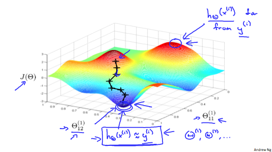

# Implementation Note: Unrolling Parameters

## Implementation Note: Unrolling Parameters

* With neural networks, we are working with sets of matrices:

	$\Theta^{(1)}, \Theta^{(2)}, \Theta^{(3)}, \cdots$
    $D^{(1)}, D^{(2)}, D^{(3)}, \cdots$
    

* In order to use optimizing functions such as "fminunc()", we will want to "unroll" all the elements and put them into one long vector:

	```matlab
    thetaVector = [ Theta1(:); Theta2(:); Theta3(:); ]
	deltaVector = [ D1(:); D2(:); D3(:) ]
    ```
    
* If the dimensions of Theta1 is 10x11, Theta2 is 10x11 and Theta3 is 1x11, then we can get back our original matrices from the "unrolled" versions as follows:

	```matlab
    Theta1 = reshape(thetaVector(1:110),10,11)
    Theta2 = reshape(thetaVector(111:220),10,11)
    Theta3 = reshape(thetaVector(221:231),1,11)
    ```
    
* To summarize:

	
    
    
 ## Gradient Checking
 
 * Gradient checking will assure that our backpropagation works as intended. We can approximate the derivative of our cost function with:

	$\dfrac{\partial}{\partial\Theta}J(\Theta) \approx \dfrac{J(\Theta + \epsilon) - J(\Theta - \epsilon)}{2\epsilon}$
    

* With multiple theta matrices, we can approximate the derivative **with respect to $\Theta_j$** as follows:

	$\dfrac{\partial}{\partial\Theta_j} J(\Theta) \approx \dfrac{J(\Theta_1, \cdots, \Theta_j + \epsilon, \cdots, \Theta_n) - J(\Theta_1, \cdots, \Theta_j-\epsilon,\cdots,\Theta_n)}{2\epsilon}$
    
    
* A small value for ${\epsilon}$ (epsilon) such as ${\epsilon = 10^{-4}}$, guarantees that the math works out properly. If the value for $\epsilon$is too small, we can end up with numerical problems.

* Hence, we are only adding or subtracting epsilon to the $\Theta_j$ matrix. In octave we can do it as follows:

	```matlab
    epsilon = 1e-4;
    for i = 1:n,
      thetaPlus = theta;
      thetaPlus(i) += epsilon;
      thetaMinus = theta;
      thetaMinus(i) -= epsilon;
      gradApprox(i) = (J(thetaPlus) - J(thetaMinus))/(2*epsilon)
    end;
    ```
    
* We previously saw how to calculate the deltaVector. So once we compute our gradApprox vector, we can check that gradApprox ≈ deltaVector. 

#### Important
* Once you have verified **once** that your backpropagation algorithm is correct, <u>you don't need to compute gradApprox again.</u> The code to compute gradApprox can be very slow.

<br>

## Random Initialization

* Initializing all theta weights to zero does not work with neural networks. When we backpropagate, all nodes will update to the same value repeatedly. Instead we can randomly initialize our weights for our $\Theta$ matrices using the following method:

	
    
    
* Hence, we initialize each $\Theta^{(l)}_{ij}$to a random value between $[-\epsilon,\epsilon]$. Using the above formula guarantees that we get the desired bound. The same procedure applies to all the $\Theta$'s. Below is some working code you could use to experiment.

	```matlab
    If the dimensions of Theta1 is 10x11, Theta2 is 10x11 and Theta3 is 1x11.

    Theta1 = rand(10,11) * (2 * INIT_EPSILON) - INIT_EPSILON;
    Theta2 = rand(10,11) * (2 * INIT_EPSILON) - INIT_EPSILON;
    Theta3 = rand(1,11) * (2 * INIT_EPSILON) - INIT_EPSILON;
    ```
    
* rand(x,y) is just a function in octave that will initialize a matrix of random real numbers between 0 and 1. 

	(Note: the epsilon used above is unrelated to the epsilon from Gradient Checking)
    

<br>

## Putting it Together

* First, pick a network architecture; choose the layout of your neural network, including how many hidden units in each layer and how many layers in total you want to have.

	* Number of input units = dimension of features $x^{(i)}$
 
	* Number of output units = number of classes

	* Number of hidden units per layer = usually more the better (must balance with cost of computation as it increases with more hidden units)
	* Defaults: 1 hidden layer. If you have more than 1 hidden layer, then it is recommended that you have the same number of units in every hidden layer.


### Training a Neural Network

1. Randomly initialize the weights
2. Implement forward propagation to get $h_\Theta(x^{(i)})$ for any $x^{(i)}$
 
3. Implement the cost function
4. Implement backpropagation to compute partial derivatives
5. Use gradient checking to confirm that your backpropagation works. Then disable gradient checking.
6. Use gradient descent or a built-in optimization function to minimize the cost function with the weights in theta.

* When we perform forward and back propagation, we loop on every training example:

	```matlab
    for i = 1:m,
        Perform forward propagation and backpropagation using example (x(i),y(i))
        (Get activations a(l) and delta terms d(l) for l = 2,...,L
    ```

* The following image gives us an intuition of what is happening as we are implementing our neural network: 

	
    
    
 * Ideally, you want $h_\Theta(x^{(i)}) \approx y^{(i)}$. This will minimize our cost function. However, keep in mind that $J(\Theta)$ is not convex and thus we can end up in a local minimum instead. 