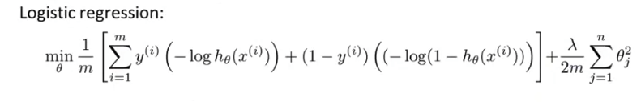
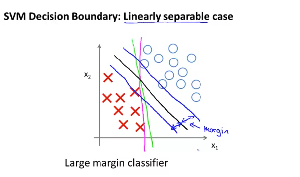
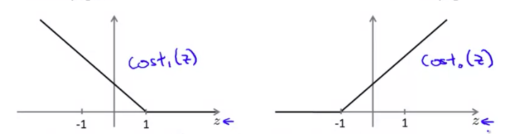

# Large Margin Classification

## Optimization Objective (Cost Function)

### Support vector machine

* The cost function of Logistic regression is:
	

* Similarly, the **`cost function of SVM`** is like below:

	
    
    * $\text{cost}_1(\theta^Tx^{(i)})$ and $\text{cost}_0(\theta^Tx^{(i)})$ mean in case y is 1 or 0 each. 
	* $\text{cost}_1(\theta^Tx^{(i)})$ and $\text{cost}_0(\theta^Tx^{(i)})$ replace $-\text{log}h_\theta(x^{(i)})$ and $-\text{log}(1-h_\theta(x^{(i)}))$ of logistic each. 
	* Both cost function in case 0 or 1, look like following,
		
    * If $y =1,$ we want $\theta^Tx \geq 1$ (not just $\geq0$)
    * If $y =0,$ we want $\theta^Tx \leq -1$ (not just $\lt0$)
    * The values 1 and -1 are decided 100% arbitrarily. There is no logical reason. We just want the length of margin to become bigger or smaller than these values at least, so that we can minimize the cost function.

     
* The main difference between logistic regression and SVM is **the position of the balance part**, $\lambda$ and $C$. Both are basically trying to balance out the portion of cost and regularization term.

* Basically, the **`hypothesis`** of SVM:

	$h_\theta(x) = \begin{cases} 
      1 & \text{if }\theta^Tx\geq 0 \\ 
      0                 & \text{otherwise}
	\end{cases}$    
    
### SVM Decision Boundary

* The constraints of SVM like following,
	 
	$\theta^T x^{(i)} \geq 1 \text{ Whenever } y^{(i)} =1$
	$\theta^T x^{(i)} \leq -1 \text{ Whenever } y^{(i)} = 0$

	are for the assurance to make the $C\displaystyle\sum_{i-=1}^m$ part of cost function equal to 0, so that we can focus on to minimize $\theta$ whatever $C$ would be.

 

## Mathematics Behind Large Margin Classification

