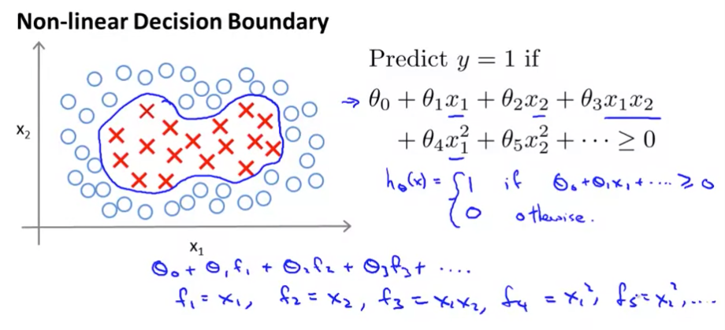
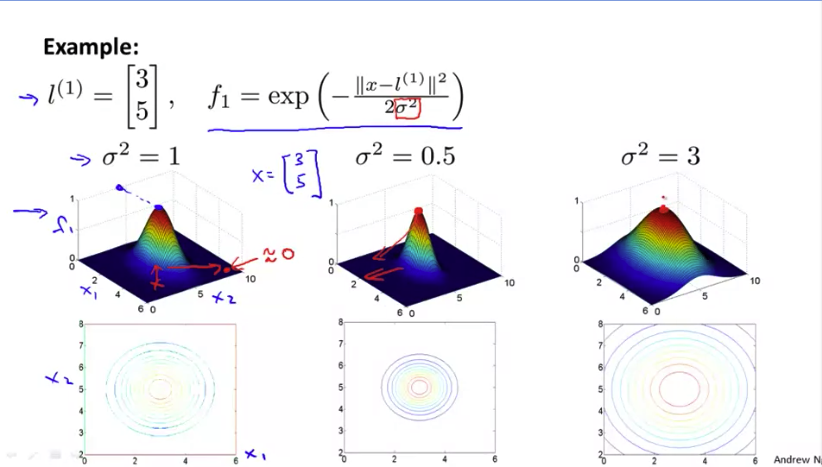
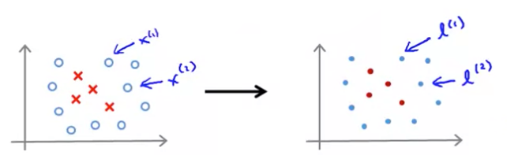
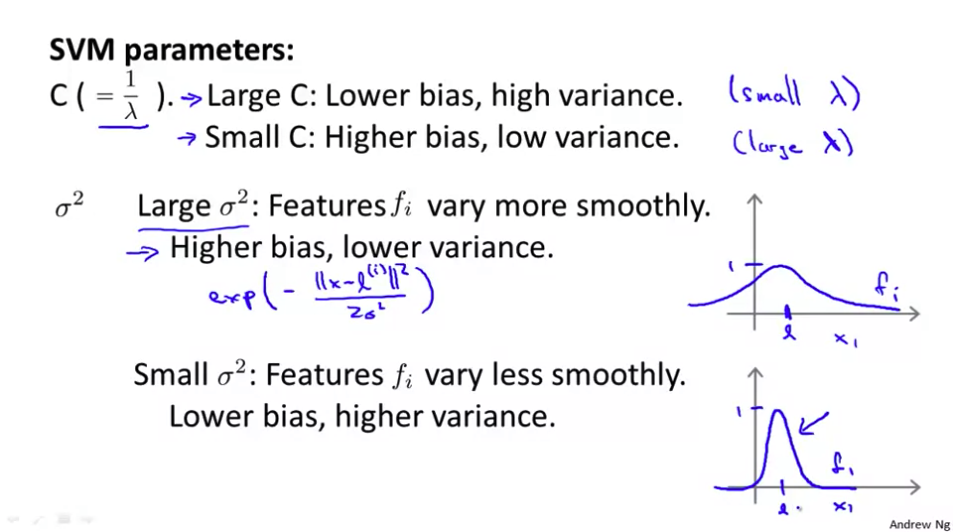
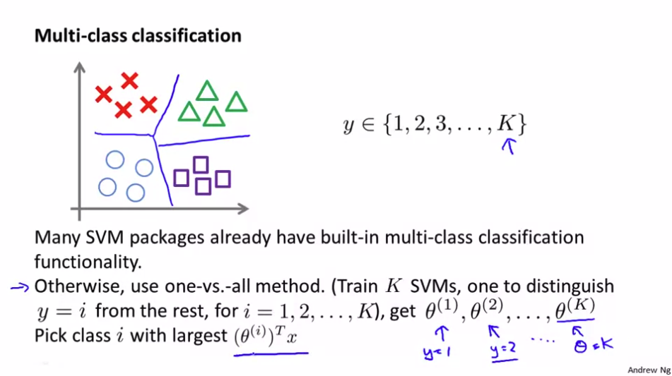
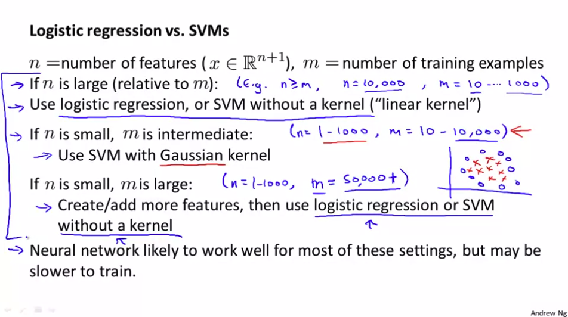

# Kernels

* If we have a non-linear decision boundary problem like below, 

	
    
    a **polynomial feature hypothesis** is a good solution, but it is **computationaly expensive.**
    
* Is there a different / better choice of the features?

## Gaussian Kernels

* Here is a one idea for how to define new features. **Decide landmarks which are the answers, and given $x$, compute new feature depending on proximity to landmarks.** This method is called Kernel.

* One of kernel methods, Gaussian kernels work like following.

### Kernels and Similarity

* $f_1 = similarity(x, l^{(1)} = \text{exp}\Big(-\dfrac{||x=l^{(1)}||^2}{2\sigma^2}\Big)$
	* $l$ is a landmark.

	$\text{If } x \approx l^{(1)}:$
    
    $$f_1 \approx \text{exp}\Big(\dfrac{0^2}{2\sigma^2}\Big) \approx 1$$
    
    $\text{If } x$ is far from $l^{(1)}:$
    
    $$f_1 \approx \text{exp}\Big(-\dfrac{\text{(large number)}^2}{2\sigma^2}\Big) \approx 0$$
    
    
* Visualization examples:

	
    
    * If $\sigma^2$ is large, then as you move away from landmarks, the value of the feature falls away much more slowly.

### Choosing the landmarks

* How do we choose the landmarks then? One way to do is choose landmarks based on training datasets.

	
    
    
#### SVM with Kernels

* $\text{Given } (x^{(1)}, y^{(1)}), (x^{(2)}, y^{(2)}), ..., (x^{(m)},y^{(m)}),$
$\text{choose } l^{(1)} = x^{(1)}, l^{(2)} = x^{(2)},...,l^{(m)} = x^{(m)}.$

* $\text{Given example } x:$

$$f_1 = \text{similarity}(x, l^{(1)})$$
$$f_2 = \text{similarity}(x, l^{(2)})$$
$$...  \text{ so, } f= \begin{bmatrix} f_0\\ f_1 \\f_2\\\cdots\\f_m \end{bmatrix}, f_0 =1$$

* Hypothesis: Given $x$, compute features $f \in\  \mathbb{R}^{m+1}$
	* Predict "$y=1$' if $\theta^Tf \geq 0$

* **Training**: 

	$\text{min}_\theta C \displaystyle\sum^{m}_{i=1}\Big[y^{(i)}\text{cost}_1(\theta^Tf^{(i)}) + (1-y^{(i)})\text{cost}_0(\theta^Tf^{(i)})\Big] + \frac{1}{2}\sum^n_{i=1}\theta^2_j$
    
    * Note that the $\theta^Tx^{(i)}$ in the original cost function is replaced with $\theta^Tf^{(i)}$.
    * The $n$ in $\dfrac{1}{2}\displaystyle\sum^n_{j=1}\theta^2_j$ is actually equals to $m$.

* Even though the number of training examples is big, SVM Kernels do mathmatical tricks so that SVM efficiently compute the value. 
	* The tricks do something like instead of computing $\theta^T\theta$, which is $||\theta||$, compute $\theta^TM\theta$. 
	* This kind of trick doesn't work well with other method like linear regression or logistic regression, it only fits well with SVM. If you use kernels with other methods, it takes more time only, there is no advantages.

* To minimize the cost yourself, you don't need to compute yourself. There are good off the shelf libraries easy to use and well designed. The things you need to know is how to choose the SVM parameters.\

### SVM parameters:

## Using An SVM

* Use SVM software package (e.g. liblinear, libsvm, ..) to solve for parameters $\theta$.
* Need to specify:
	* Choice of parameter C.
	* Choice of kernel (similarity function):

		**No kernel** ("linear kernel")
        * Predict "$y=1$" if $\theta^Tx \geq 0$ 
        * It is recommended when $n$ is large, $m$ is small
        
        **Gaussian kernel:**
        * $f_i =\text{exp}\Big(-\dfrac{||x-l^{(i)}||^2}{2\sigma^2}\Big)$, where $l^{(i)} = x^{(i)}.$
        * **Need to shoose $\sigma^2$**
        * It is recommended when $n$ is small, $m$ is large.

* **Note: Do** perform feature scaling **before** using the Gaussian kernel.

### Other choices of kernel

* Many off-the-shelf kernels available: 
	* Polynomial kernel, More esoteric: String kernel, chi-square kernel, histogram intersection kernel, ...

* However, very rarely these are used. 

## Multi-class classification

 

## Logistic regression vs. SVMs

