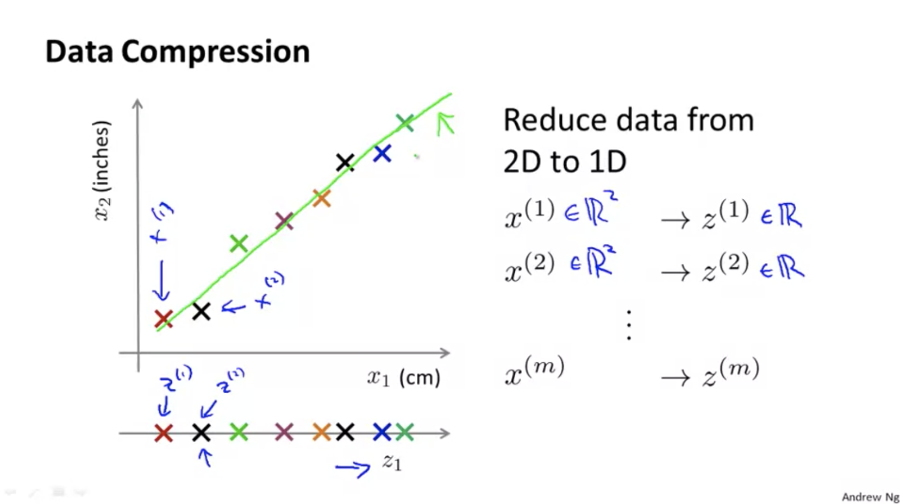
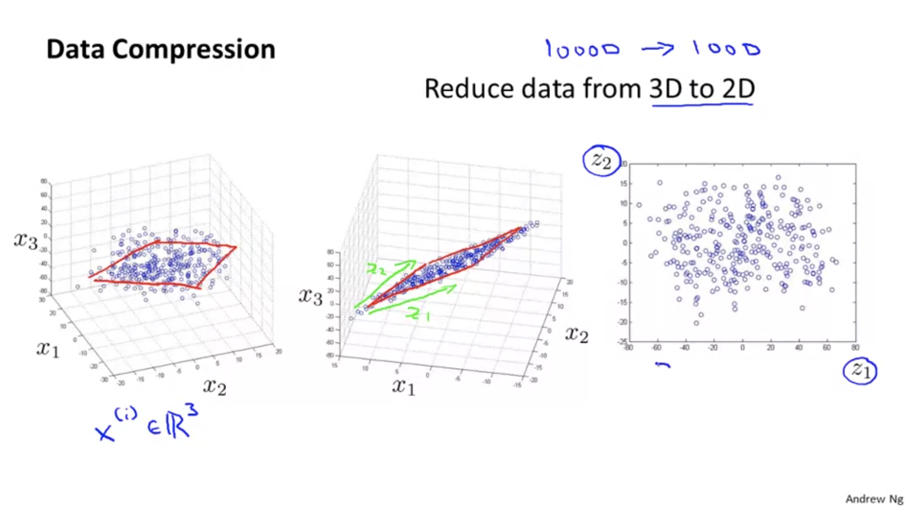
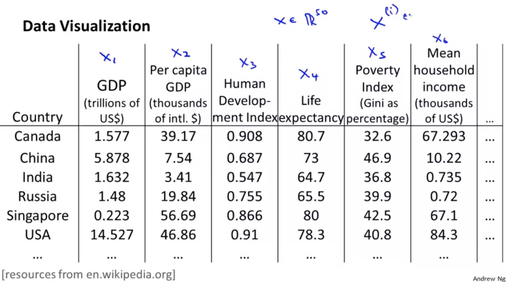
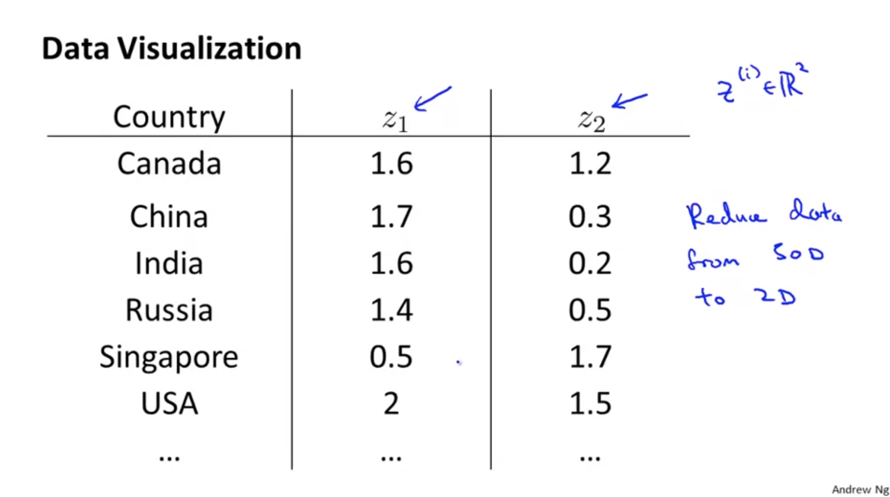
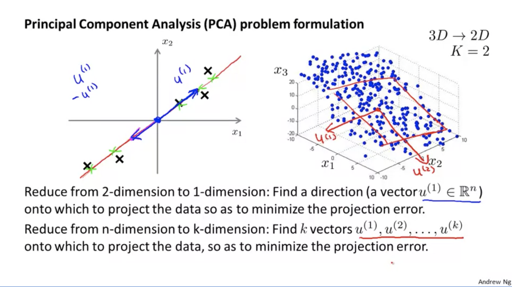
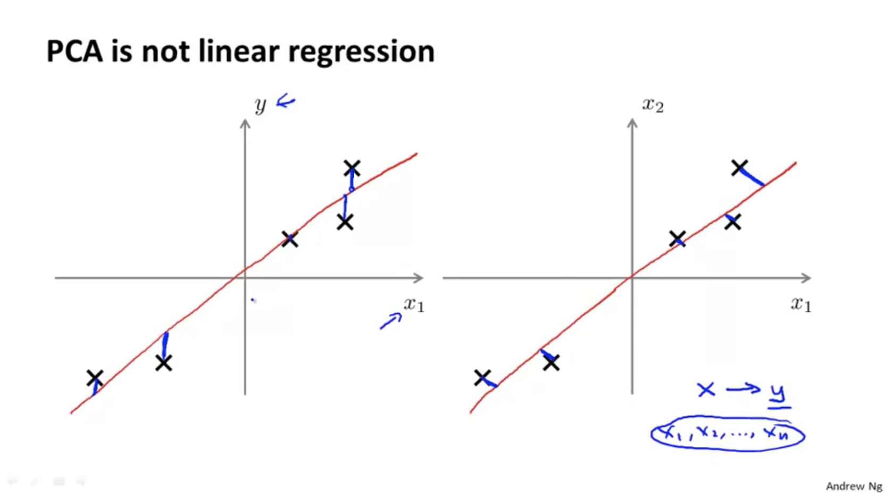
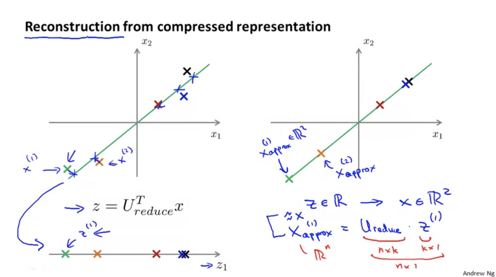

# Principal Component Analysis
## Motivation I: Data Compression
* Let's start talking about a second type of unsupervised learning problem called **dimensionality reduction.**
* There are a couple of different reasons why one might want to do dimensionality reduction. One is data compression, data compression **not only allows us to compress the data** and have it therefore use up less computer memory or disk space, but it will also allow us to **speed up our learning** algorithms.

* As you can see below, if some features can be expressed in a new format, we can reduce redundancy.

* If all 3D data are projected onto 2D surface, we can visualize the 3D data as 2D data like following. In this exammple, $x_1, x_2, x_3$ 3D cordinates are represented as $z_1 \text{ and } z_2$ as a 2D data. This is data compression.

## Motivation II: Visualization

* For a lot of machine learning applications, **it really helps us to develop effective learning algorithms, if we can understand our data better.**
* If there is some **way of visualizing the data** better, and so, **dimensionality reduction offers us, often, another useful tool to do so**.

* For example, if you reduce following 50 feature data of countries into 2 dimension, new features can be expressed as $z_1$ and $z2$.

	
    
    
    
* If you look at the output of the Dimensionality Reduction algorithms, It usually doesn't describe a particular meaning to these new features $z_1$ and $z_2$. **It's often up to us to figure out you know, roughly what these features means.**.. (Seriously..?)

## Principal Component Analysis Problem Formulation

* For the problem of dimensionality reduction, by far the most popular, by far the most commonly used algorithm is something called principle components analysis, or PCA.'
* What PCA does is **to find (a) direction(s)(vector(s)) that minimize the square distance** between each point and the location of where it gets projected.

	
    
### PCA is not linear regression

* It turns out PCA is not linear regression, and despite some cosmetic similarity, these are actually totally different algorithms.

* When you're doing linear regression, there is this distinguished variable y they we're trying to predict. All that linear regression as well as taking all the values of x and try to use that to predict y. 
* Whereas in PCA, there is no distinguish, or there is no special variable y that we're trying to predict. And instead, we have a list of features, $x_1$, $x_2$, and so on, up to $x_n$, and all of these features are treated equally, so **no one of them is special**.

## Principal Component Analysis Algorithm

#### Data Preprocessing
* Before applying PCA, there is a **data pre-processing step which you should always do**.
* **Mean Normalization**: replace each $x_j^{(i)}$ with $x_j$ - $\mu_j$)
* **Feature scailing**: $x_j^{(i)} = \dfrac{x_j^{(i)}- \mu_j}{s_j}$. In here, $s_j$ can be $\max - \min$ or standard deviation.

#### PCA Algorithm

* Reduce data from $n$-dimensions to $k$-dimensions

	1. Compute **"covariance matrix"**($\Sigma$):
    	$\Sigma = \dfrac{1}{m}\displaystyle\sum^n_{i=1}(x^{(i)})(x^{(i)})^T$ 
 ($x^{(i)}$ is ($n \times 1$), so **$\Sigma$ is a ($n \times n$) matrix.**)
        
   2. Compute "eigenvectors" of matric $\Sigma$:
    	$[\text{U}, \text{S}, \text{V}] = \text{svd}(\Sigma)$; or $\text{eig}(\Sigma)$
        
   3. From $\text{U}$($\text{U}$ is $n \times n$ matrix), take $k$ columns so that $U_{\text{reduce}}$ is a ($n \times k$) matrix.
   4. Define $z = \text{U}^Tx$. Get the $(k \times 1)$ matrix.

* One thing professor didn't do was give a mathematical proof that the U1 and U2 and so on and the Z and so on you get out of this procedure is really the choices that would minimize these squared projection error, because the mathematical proof of that is beyond the scope of this course.

### Reconstruction from Compressed Representation

* The formula in the slide:
	
    $x_{\text{approx}}^{(i)} = \text{U}_{\text{reduce}} * z^{(i)}$
    
    * $\text{U}_{\text{reduce}}$'s size is $(n \times k)$ 
    * $z^{(i)}$'s size is $(k \times 1)$
    * So, $x_{\text{approx}}^{(i)}$'s size is $(n\times 1)$. $\approx x^{(i)}$. $z \in  \mathbb{R} \Rightarrow x \in  \ \mathbb{R}^2$

### Choosing the Number of Principal Components($k)$