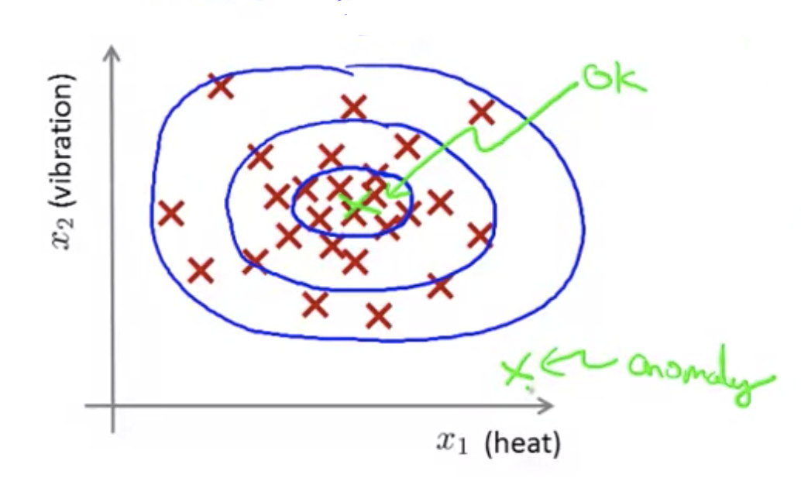
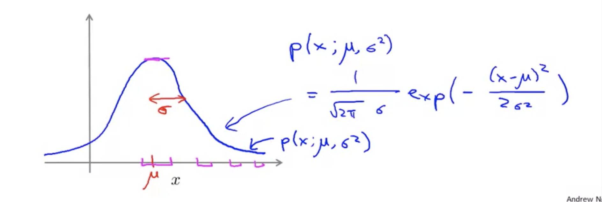
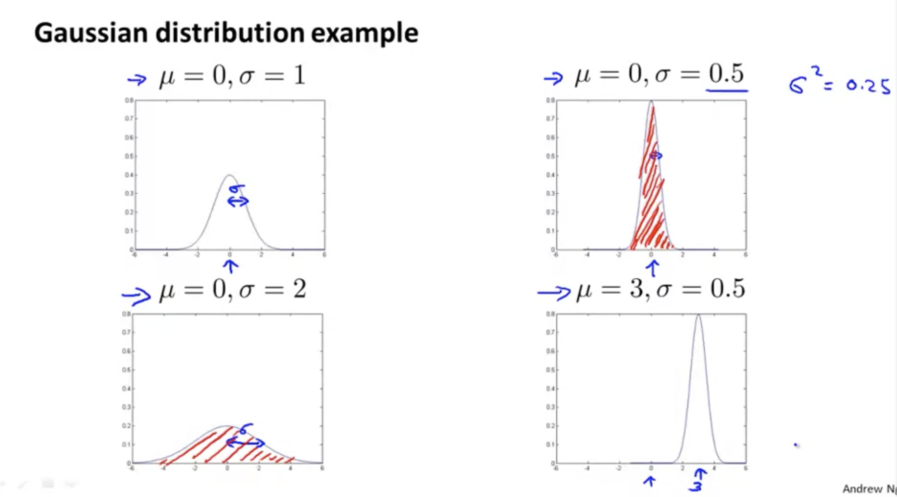
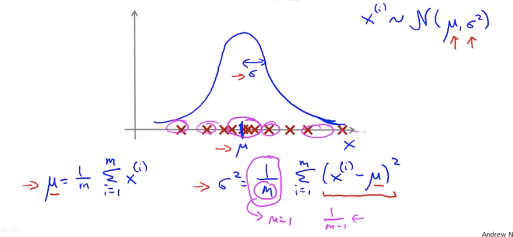
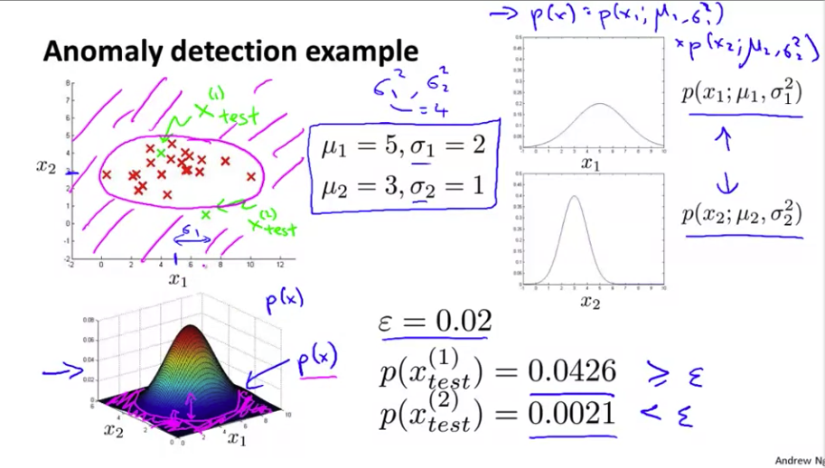

# Anomaly detection

## Problem Motivation

#### Anomaly detection examples

1. **Aircraft engine features**:
	
    * For dataset: $\{{x^{(1)},x^{(2)},...,x^{(m)}}\}$
          $x_1$ = heat generated
          $x_2$ = vibration intensity
          ...

    * New engine: $x_{test}$
    * Model: $P(x)$
    * #### Density estimation

    
    
    
2. **Fraud detection**:

	* $x^{(i)}$ = features of user $i$'s activities
    * Model $p(x)$ from data.
    * Identify unusual users by checking which have $p(x) < \epsilon$

3. **Monitoring computers in a data center**.
	* $x^{(i)}$ = features of machine $i$
 $x_1$ = memory use, $x_2$ = number of disk accesses/sec, 
$x_3$ = CPU load, $x_4$ = CPU load/network traffic.
...

## Gaussian(= Normal) Distribution 

* Say $x \in \mathbb{R}$. If $x$ is a distributed Gaussian with mean $\mu$, variance $\sigma^2$.

	$X \sim N(\mu, \sigma^2)$
    
	 
     

### Parameter estimation

* Dataset: $\{x^{(1)},x^{(2)},...,x^{(m)} \} \ x^{(i)} \in \mathbb{R}$

 
* If $m$ is resonable large(usually $m \geq 30$), just suspect the dataset is come from gaussian distribution, so that we can get the $\mu$ and $\sigma^2$ roughly.
* It is possible by the [central limit theorem](https://en.wikipedia.org/wiki/Central_limit_theorem).

* When you compute $\sigma^2$, in practice, there is no big difference between $\frac{1}{m}$ and $\frac{1}{m-1}$. $\frac{1}{m-1}$ is statistically and mathmatically for other case, but in practice, $\frac{1}{m}$ is usually used.

## Algorithm

#### Density Estimation

* Training set: $\{x^{(1)},x^{(2)},...,x^{(m)} \}$
	Each example is $x \in \mathbb{R}$
    
    $x_1 \sim N(\mu_1, \sigma_1^2)$
    $x_2 \sim N(\mu_2, \sigma_2^2)$
    ...
    $x_n \sim N(\mu_n, \sigma_n^2)$
    
    $p(x) = p(x_1;\mu_1, \sigma_1^2)p(x_1;\mu_2, \sigma_2^2) \cdots p(x_1;\mu_n, \sigma_n^2)$
    $\Rightarrow \ \displaystyle\prod^n_{j=1}p(x_j;\mu_j, \sigma_j^2)$
    
* This equation actually corresponds to an **independence assumption on the values of the features $x_1$ through $x_n$**. 
* But in practice it turns out that the algorithm of this fragment, it works just fine, whether or not these features are anywhere close to independent and even if independence assumption doesn't hold true this algorithm works just fine.

#### Anomaly detection algorithm

1. Choose features $x_i$ that you think might be indicative of anomalous examples.
2. Fit parameters $\mu_1, \cdots,\mu_n, \sigma^2_1, \cdots,\sigma^2_n$

	$\mu_j = \dfrac{1}{m}\displaystyle\sum^m_{i=1}x_j^{(i)}$
    $\sigma^2_j = \dfrac{1}{m}\displaystyle\sum^m_{i=1}(x_j^{(i)} - \mu_j)^2$
    
3. Given new example x, compute $p(x)$:
	
    $\displaystyle\prod^n_{j=1}p(x_j;\mu_j, \sigma_j^2) = \displaystyle\prod^n_{j=1}\dfrac{1}{\sqrt{2\pi}\sigma_j}\exp(-\dfrac{(x_j - \mu_j)^2}{2\sigma^2_j})$
    
    Anomaly if $p(x) \lt \epsilon$
    
#### Anomaly detection example

