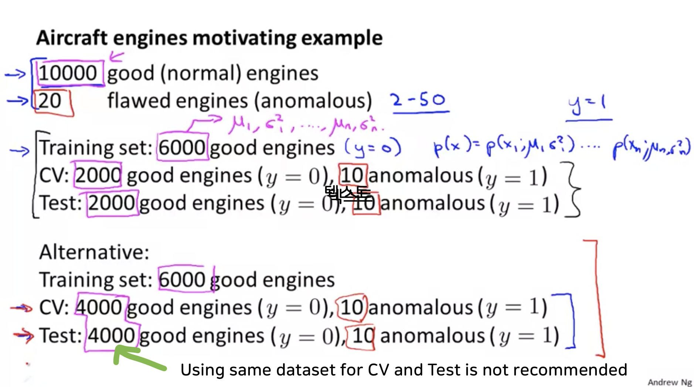
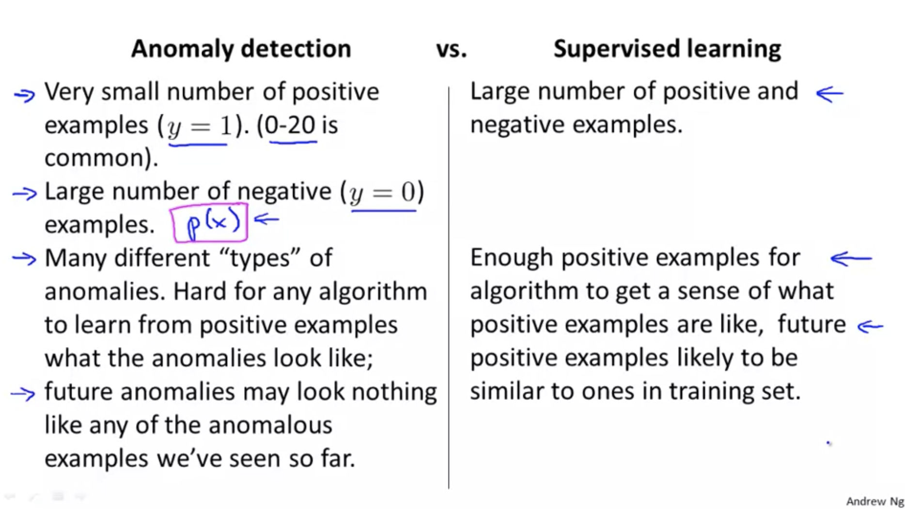
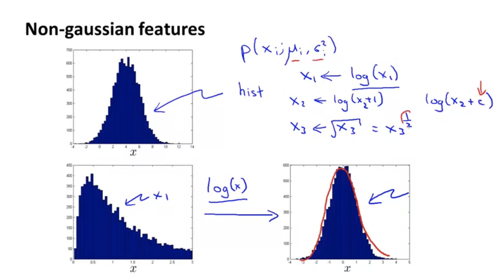
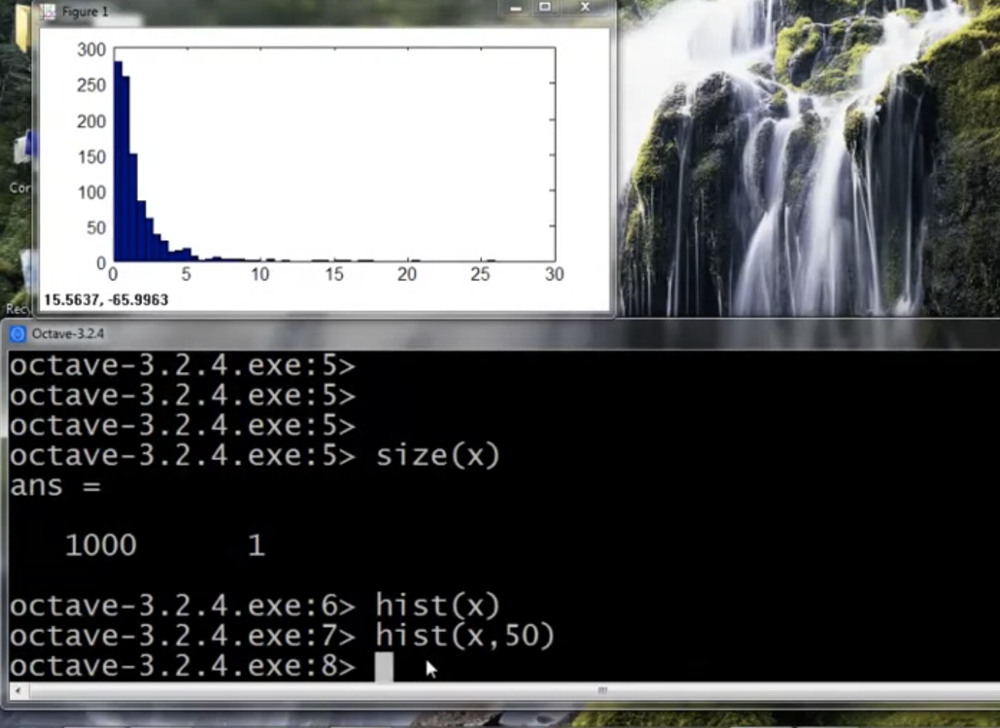
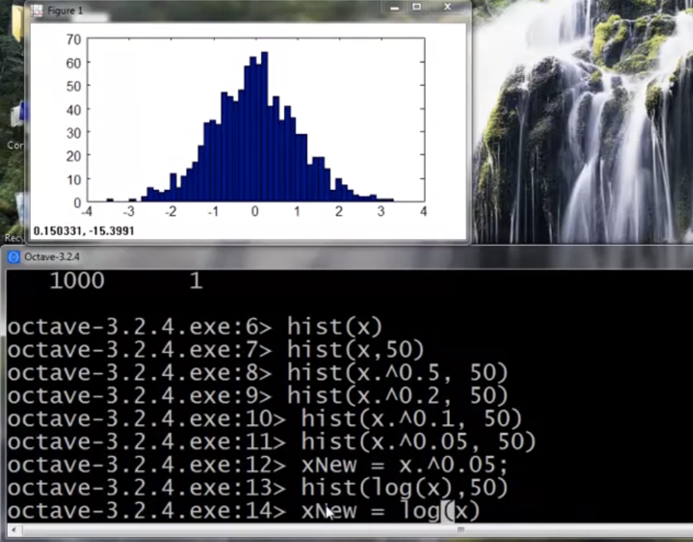
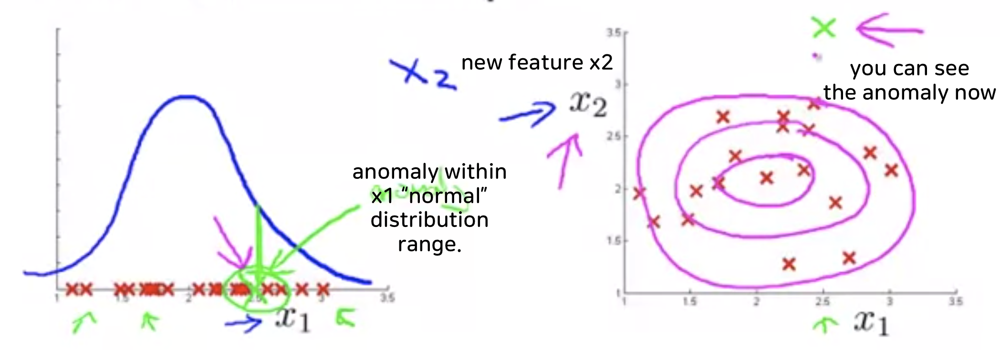

# Building an Anomaly Detection System

## Developing and Evaluating an Anomaly Detection System

#### The importance of real-number evaluation

* When developing a learning algorithm (choosing features, etc.), making decisions is much easier if we have a way of evaluating our learning algorithm.
* Assume we have some labeled data, of anomalous and non-anomalous examples. ($y=0$ if normal, $y=1$ if anomalous).

* Training set: $x^{(1)},x^{(2)},\cdots,x^{(m)}$ (assume normal examples/not anomalous)
* Croos validataion set: $(x^{(1)}_{cv}, y^{(1)}_{cv}), ..., (x^{(m)}_{cv}, y^{(m)}_{cv})$
* Test set: $(x^{(1)}_{test}, y^{(1)}_{test})..., (x^{(m)}_{test}, y^{(m)}_{test})$

#### Aircraft engines motivating example

#### Algorithm evaluation

* Fit model $p(x)$ on training set $x^{(1)},x^{(2)},\cdots,x^{(m)}$ 
* On a cross validation/test example $x$, predict

	$$y = \begin{cases}
    1 & \text{if } p(x) \lt \epsilon \text{ (anomaly)} \\
    0 & \text{if } p(x) \geq \epsilon \text{ (normal)}  
  \end{cases}$$
  
* Possible evaluation metrics:
	- True positive, false positive, false negative, true negative
	- Precision/Recall
	- $\text{F}_1$-score

* Can also use cross validation set to choose parameter $\epsilon$

 

## Anomaly Detection vs. Supervised Learning

 

## Choosing What Features to Use

### 1. Make dataset insto Gaussian form.
* In case dataset is **non-gaussian form** like below, you can take $\text{log}(x)$ or $x^{\frac{1}{2}}$ or $x^{\frac{1}{4}}$ and more in shape of $x^{\text{fraction number}}$.

 	

* Making non-gaussian data

    

* Into gaussian form

	
    
    
### 2. Error analysis for anomaly detection

#### 2.1. Choosing features for anomaly detection
* If you find an anomaly within $x_1$ normal distribution range, then you may need a new feature to consider it with a different perspective.
* In the picture below, make new feature, $x_2$, and plot the dataset again, then you can see why the anomaly data is abnormal.

	
    

#### 2.2. Example

* For example, you are monitoring computers in a data center and wanting to detect the computer which works strangely.
* You have following features,
	$x_1$ = memery use of computer
    $x_2$ = number of disk accesses/sec
    $x_3$ = CPU load
    $x_4$ = network traffic 
    
    then, you can create following features
    
    $x_5 = \dfrac{\text{CPU load}}{\text{network traffic}}$, $x_6 = \dfrac{(\text{CPU load})^2}{\text{network traffic}}$
    
    to detect the anomaly. because if a computer has high CPU load even though it has low network traffic, it can be a distinctive sign of anomaly and visa versa.