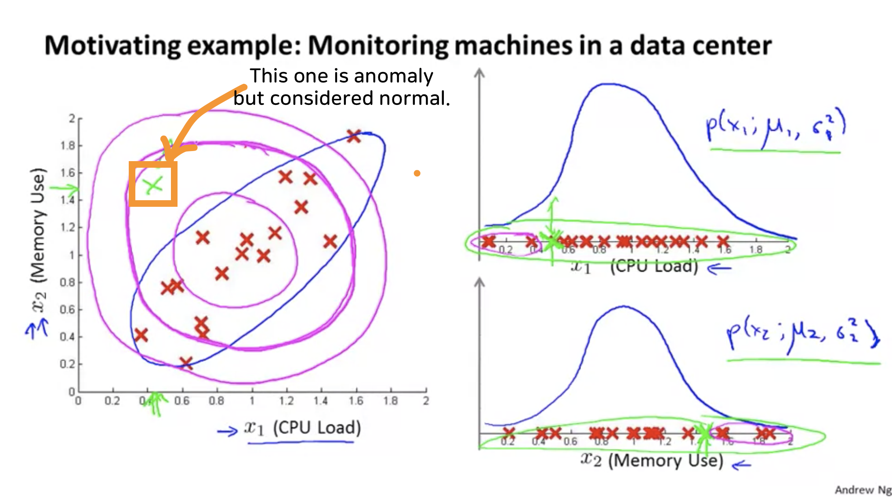

# Multivariate Gaussian Distribution

* This is one possible extension to the anomaly detection algorithm. Multivariate Gaussian Distribution can solve following problem.

	
    
   
* The green cross $x$ in the orange retengle is actually anomaly, but is considered as normal because, with perspective $x_1$ or $x_2$, it is within normal range as you can see on the right.