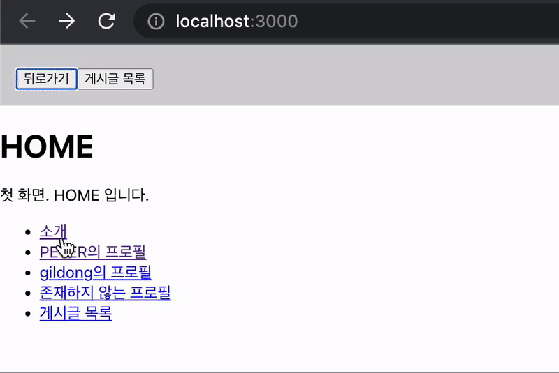

# API

#### by [Velopert](https://react.vlpt.us/integrate-api/)

- React에서 API를 사용하는 기초 원리와 더불어, Context와 Reducer 활용법에도 조금 더 익숙해질 수 있게 해준 프로젝트.

  ```Shell
  $ npx create-react-app api
  $ cd api
  $ yarn add react-router-dom
  ```

- Replace the origin `src` directory with the `src` directory placed this path.

### What I learned

**Components**

- `Route`
- `Link`
- `NavLink` for CSS when URL path matched
- `Navigate` to redirect

**Hooks**

- `useParams` for URL Parameter
- `useSearchParams` for Queryrstring
- `useNavigate` to move to another page

**Tricks**

- `Nested Route` & `Outlet` Component for Layout
- <Route path="\*" element={<NotFound />} /> for 404 NotFound Page

### Result


