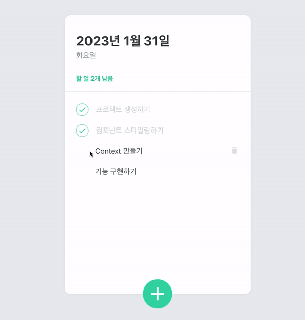

# Todo List 
### by [Velopert](https://react.vlpt.us/mashup-todolist/)

* React의 기본개념 스터디를 마치고, 배운 내용을 체화하기에 좋았던 실습 프로젝트.

### Install
* Run the following scripts.

   ```Shell
   $ npx create-react-app todo
   $ cd todo
   $ yarn start // for creat a lockfile

   (stop the app)
   $ yarn add react-icons styled-components
   ```
* Replace the origin `src` directory with the `src` directory placed this path. 


### Result 

