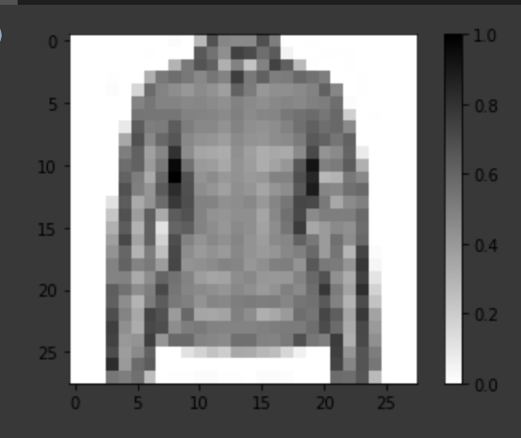

# Lesson 4. Introduction to CNNs

### 4.1. Deep Learning Terms
Here are some of terms that were introduced in this lesson:

- **CNNs:** Convolutional neural network. That is, a network which has at least one convolutional layer. A typical CNN also includes other types of layers, such as pooling layers and dense layers.
- **Convolution:** The process of applying a kernel (filter) to an image
- **Kernel / filter:** A matrix which is smaller than the input, used to transform the input into chunks
- **Padding:** Adding pixels of some value, usually 0, around the input image
- **Pooling** The process of reducing the size of an image through downsampling.There are several types of pooling layers. For example, average pooling converts many values into a single value by taking the average. However, maxpooling is the most common.
- **Maxpooling**: A pooling process in which many values are converted into a single value by taking the maximum value from among them.
- **Stride:** the number of pixels to slide the kernel (filter) across the image.
- **Downsampling:** The act of reducing the size of an image

### 4.2. Fashion MNIST with CNNs

#### 1. tensorflow_datasets
- Use **`tensorflow_datasets`**  to model test.
- **`tfds.load(dataset_name, as_supervised=bool, with_info=bool)`**

  ```python
  import tensorflow as tf
  import tensorflow_datasets as tfds
  tfds.disable_progress_bar() # because it is ugly.

  ...

  dataset, metadata = tfds.load('fashion_mnist',
 	                            as_supervised=True, 
                                with_info=True)

  train_dataset, test_dataset = dataset['train'], dataset['test']

  num_train_examples = metadata.splits['train'].num_examples
  num_test_examples = metadata.splits['test'].num_examples
  # Number of training examples: 60000
  print("Number of training examples: {}".format(num_train_examples))
  # Number of test examples:     10000
  print("Number of test examples:     {}".format(num_test_examples))
  ```

- **Peeking a datum**

  ```python
  # Take a single image, and remove the color dimension by reshaping
  for image, label in test_dataset.take(1):
    break
  image = image.numpy().reshape((28,28))

  # Plot the image - voila a piece of fashion clothing
  plt.figure()
  plt.imshow(image, cmap=plt.cm.binary)
  plt.colorbar()
  plt.grid(False)
  plt.show()
  ```
	

#### **2. Simple Classification Model**
  - `tf.keras.Sequential([])`

    ```python
    # tf.keras.Sequential([])
    model = tf.keras.Sequential([
        tf.keras.layers.Conv2D(32, (3,3), padding='same',
                               activation=tf.nn.relu,
                               input_shape=(28, 28, 1)),
        tf.keras.layers.MaxPooling2D((2, 2), strides=2),
        tf.keras.layers.Conv2D(64, (3,3), padding='same',
                               activation=tf.nn.relu,
                               input_shape=(28, 28, 1)),
        tf.keras.layers.MaxPooling2D((2, 2), strides=2),
        tf.keras.layers.Flatten(),
        tf.keras.layers.Dense(128, activation=tf.nn.relu),
        tf.keras.layers.Dense(10, activation=tf.nn.softmax)
    ])
    ```

#### **3. Compile the model**
  - `model.compile(optimizer, loss, metrics=[])`

    ```python
    model.compile(optimizer='adam',
    	      loss=tf.keras.losses.SparseCategoricalCrossentropy(),
    	      metrics=['accuracy'])
    ```

#### **4. Train the model**
  - `model.fit(data, epoch, steps_per_epoch)`

    ```python
    batch_size = 32
    # set the datasets
    train_dataset = train_dataset.cache().repeat().shuffle(num_train_examples).batch(batch_size)
    test_dataset = test_dataset.cache().batch(batch_size)

    model.fit(train_dataset, epoch=10, 
    	  steps_per_epoch=math.ceil(num_train_examples/batch_size))
    ```

#### **5. Evaluate accuracy**
- `model.evaluate(data, stpes)`

  ```python
  test_loss, test_accuracy = model.evaluate(
           test_dataset, steps=math.ceil(num_test_examples/batch_size))
  print('Accuracy on test dataset:', test_accuracy)
  ```

#### **6. Make predictions**
  - `model.predict(test_data)`

    ```python
    for test_images, test_labels in test_dataset.take(1):
        test_images = test_images.numpy()
        test_labels = test_labels.numpy()
        predictions = model.predict(test_images)
    ```
### 4.3. Honey tips
- **Using map() to normalize**

  ```python
  def normalize(images, labels):
    images = tf.cast(images, tf.float32)
    images /= 255
    return images, labels

  # The map function applies the normalize function to each element in the train
  # and test datasets
  train_dataset =  train_dataset.map(normalize)
  test_dataset  =  test_dataset.map(normalize)
  ```

- **Dataset** **Caching to make trining faster**

  ```python
  # The first time you use the dataset, the images will be loaded from disk
  # Caching will keep them in memory, making training faster
  train_dataset =  train_dataset.cache()
  test_dataset  =  test_dataset.cache()
  ```