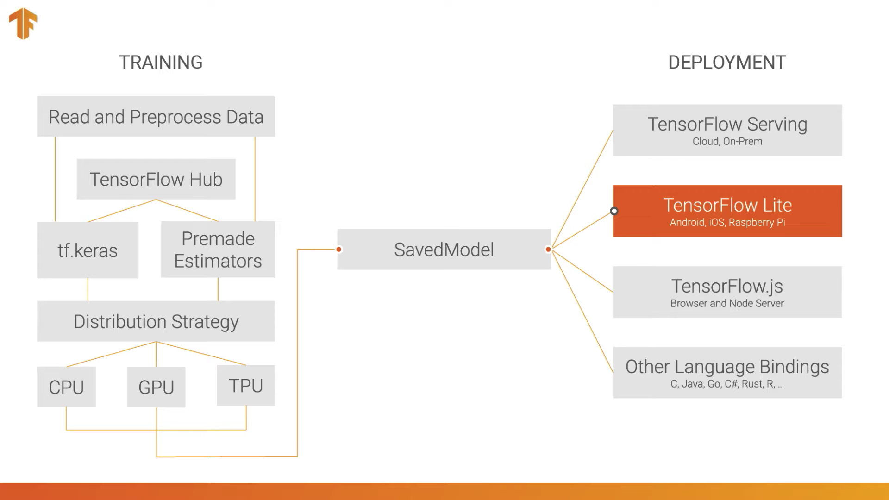

# Lesson 7. Saving and Loading Models
### 7.1. Save as Keras `.h5` model

- Now that we've trained the model, we can save it as an HDF5 file, which is the format used by Keras. Our HDF5 file will have the extension '.h5', and it's name will correpond to the current time stamp.
- `model.save(path)`

    ```python
    # A tip for an unique name
    t = time.time()
    export_path_keras = "./{}.h5".format(time.strftime(
        '%Y-%m-%d_%H-%M', time.localtime(t)
    ))
    print(export_path_keras) # ./2020-08-29_14_41.h5
    model.save(export_path_keras)
    ```

### **7.2. Load the Keras `.h5` model**  ☄️
- `tf.keras.models.load_model( path, custom_objects: dict)`

    ```python
    reloaded = tf.keras.models.load_model(
      export_path_keras, 
      # `custom_objects` tells keras how to load a `hub.KerasLayer`
      custom_objects={'KerasLayer': hub.KerasLayer})

    reloaded.summary()
    ```

### **7.3. Export as SavedModel**
- **SavedModel** is a standalone serialization format for Tensorflow objects, supported by TensorFlow serving as well as TensorFlow implementations other than Python.
- A SavedModel contains a complete TensorFlow program, including weights, computation and even the optimizers configuration.
- It does not require the original model building code to run, which makes it useful for sharing or deploying (with TFLite, TensorFlow.js, TensorFlow Serving, or TFHub).



- `tf.saved_model.save(model, path)`

    It creates a folder where you will find an `assets` folder, a `variables` folder, and the `saved_model.pb` file

    ```python
    t = time.time()
    export_path_sm = "./{}".format(time.strftime(
        '%Y-%m-%d_%H-%M', time.localtime(t)
    ))
    print(export_path_sm)

    **tf.saved_model.save(**model, export_path_sm**)**
    ```

- `tf.saved_model.load(path)`

    ```python
    reloaded_sm = **tf.saved_model.load**(export_path_sm)
    ```

### **7.4. Loading the SavedModel as a Keras Model**
- The object returned by **`tf.saved_model.load` is not a Keras object** (i.e. doesn't have `.fit`, `.predict`, `.summary`, etc. methods). Therefore, you can't simply take your `reloaded_sm` model and keep training it by running `.fit`.
- To be able to get back a full keras model from the Tensorflow SavedModel format we must use the `tf.keras.models.load_model` function. This function will work the same as before, except now we pass the path to the folder containing our SavedModel.

    ```python
    reload_sm_keras = **tf.keras.models.load_model**(
      export_path_sm,
      **custom_objects={'KerasLayer': hub.KerasLayer}**)

    reload_sm_keras.summary()
    ```

### **7.5. Download your model** 🖥️
- First, zip your file

    ```python
    !zip -r model.zip {export_path_sm}
    ```

- Download it using `google.colab.files`.

    ```python
    from google.colab import files

    **files.download**('./model.zip')
    ```