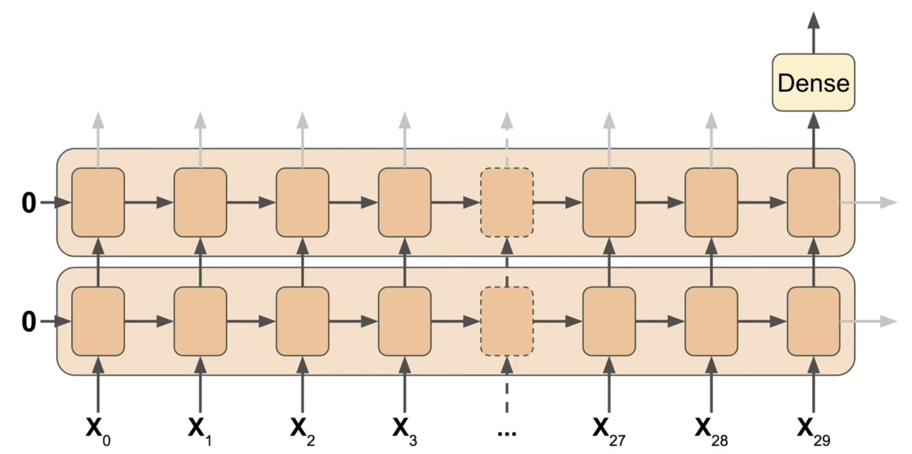
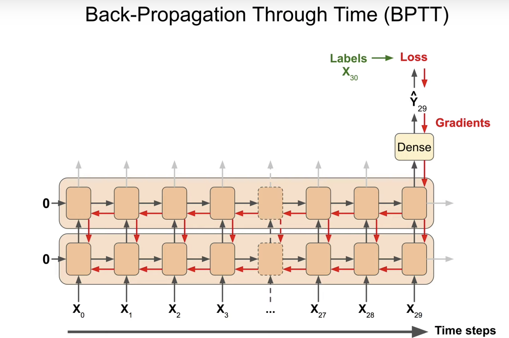
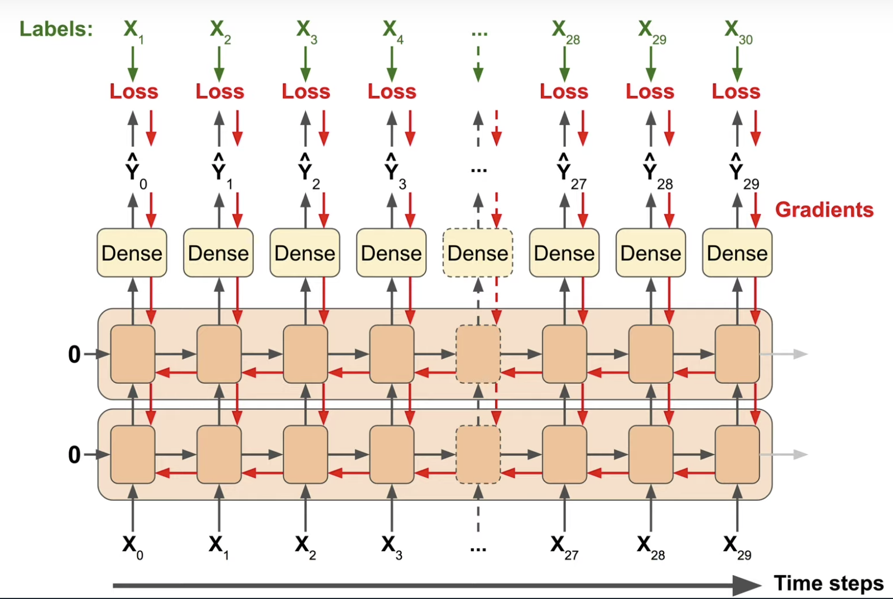

# Lesson 8. Time Series Forecasting

- **`Time Series`** are everywhere. It's an ordered sequence of values usually equally spaced over time.
    - `Univariate`  - if there is a single value at each time-step, this kind of time series are called univariate time series.
    - `Multivariate` - Some time series have multiple values at each time-step. in this case, this time series are called multivariate time series.
## **8.1. Common Patterns** 
  - `Trend` - Upward or downward. Gradually drift up or down.
  - `Seasonality` - When patterns repeat at predictable intervals and particular peaks and troughs.
  - `White Noise` -  Sometimes series are just completely unpredictable. For example, a time series is generated by picking a random number at each step. The best you can do with this is to identify the probability distribution and find its parameters.
  - `Trend + Seasonality`  or `Trend + Seasonality + White Noise` are also possible.

    > "When you're doing time series forecasting or analysis, it's often good to untangle all of these components from your time series and possibly study them separately. You can isolate the trend, the seasonal pattern, and the noise." - AurĂŠlien GĂŠron

  
## **8.2. Forecasting**  

### Naive Forecasting

  - To take the last value and assume that the next value will be the same.

      ```python
      naive_forecast = series[split_time - 1:-1]
      ```

### Fixed Partitioning

  - To measure the performance of our forecasting model, Split the time series into a training period, a validation period, and a test period. This is called fixed partitioning.
  - With time series data, you train your model on the training period, and you evaluate it on the validation period.
  - After you find right hyper parameter and performance, you can train your best model one last time on the whole training + validation period and evaluate it on the test period to get an idea of how well your model would perform in production.
  - It will not always be a very reliable estimate, because the time series may behave differently in the future but hopefully, it will be a reasonable estimate.
  - Then **you should train your model one last time on the full time series including the test set, before you deploy your model to production.**
  - This is different from the usual machine learning best practices where we never train on the test set **but it's necessary for time series because the most recent period is usually the one that contains the most useful information to predict the future.**

  ### Roll-Forward Partitioning

  - Fixed partitioning is simple and intuitive, but there's another way.
  - We start with a short training period and we gradually increase it, by one day at a time or one week at a time.
  - At each iteration, we train the model on the training period and we use it to forecast the following day or the following week in the validation period. This is called **roll forward partitioning.**
  - The **drawback is that it will require much more training time**, but the **benefit is that it will more closely mimic the production conditions** since you will generally want to retrain your model regularity as you get new data in production.

  ### Moving Average

  - This is just the **Mean of the past N values.** This nicely eliminates a lot of the noise but it does not anticipate trend or seasonality. So it ends up performing worse than naive forecasting.
  - **One way to fix this is to remove the trend and seasonality from the time series.** A simple technique is to use **differencing**.
  - Instead of studying the time series itself, we study the difference between the value at time $t$ and the value one year earlier at time $t$ - 365. Then we can get differenced time series which has no trend and no seasonality.
  - We can then **use a moving average to forecast time series**. **Then we need to add back the value at time t minus 365.** But, the noise which the origin data had can affect the predicted value also at this time. **So we need to also remove the past noise using a moving average again**! Then it can give you proper answer.

    ```python
    def moving_average_forecast(series, window_size):
      """Forecasts the mean of the last few values.
         If window_size=1, then this is equivalent to naive forecast
         This implementation is *much* faster than the previous one"""
      mov = np.cumsum(series)
      mov[window_size:] = mov[window_size:] - mov[:-window_size]
      return mov[window_size - 1:-1] / window_size

    diff_series = (series[365:] - series[:-365])
    diff_time = time[365:]
    # moving average of the data
    diff_moving_avg = moving_average_forecast(diff_series, 50)[split_time - 365 - 50:]
    # moving average + diff data
    diff_moving_avg_plus_past = series[split_time - 365:-365] + diff_moving_avg
    # moving average + diff data noise removed
    diff_moving_avg_plus_smooth_past = moving_average_forecast(series[split_time - 370:-359], 11) + diff_moving_avg
    ```

  - Simple approaches may work just fine.
##  **8.3. Metrics** 

* If large errors are potentially dangerous and they cost you much more than smaller errors, then you may prefer the MSE. But if your gain or your loss is just proportional to the size of the error, then the MAE may be better. 

  ### MSE, RMSE

  - The most common metric to evaluate the forecasting performance of the model is the **mean squared error or MSE.**
  - Sometimes we compute the square root of the MSE which is RMSE. **RMSE has the advantage of having roughly the same scale as the values in the time series. So it's easier to interpret.**

  ### MAE

  - Mean of the Absolute values of the Errors. It does not penalize large errors as much as the MSE.

  ### MAPE

  - It is an abbreviation of Mean Absolute Percentage Error.
  - This is the mean ratio between the absolute error and the absolute value. This gives an idea of the size of the errors compared to the values.

  ```python
  errors = forecasts - actual

  mse = np.square(errors).mean()

  mae = np.abs(errors).mean()

  mape = np.abs(errors / x_valid).mean()
  ```

## **8.4. Time Windows**
  - In order to forecast the value using machine learning, we must prepare a data set of all possible **time windows** of that size. For example, 30 days or something.
  - Here is a method making this easy using TensorFlow's tf.data API.

    ```python
    def window_dataset(series, window_size, batch_size=32):
        # 1.turn series into the dataset 
        ds = tf.data.Dataset.from_tensor_slices(series)
        # 2.split the series into shifted window size data 
        ds = ds.window(window_size + 1,
                       shift = 1, drop_remainder=True)
        # 3.turn into a flat sequence, not a dataset each
        ds = ds.flat_map(lambda w: w.batch(window_size +1))
        # 4.split each data into features and label.
        ds = ds.map(lambda w: (w[:-1], w[-1]))
        # 5.for iid
        ds = ds.shuffle(len(series))
        # 6.use prefetch() for performance.
        return ds.batch(batch_size).prefetch(1)
    ```
    
    
## 8.5. Recurrent Layer 

### Seq2Vec
* Here is the RNN example code that consists of 2 RNN layers and a dense layer.

* Seq2Vec's input is a sequence and output is vector. 

	```python
    # input size = (100, None, 1)
    model = keras.models.Sequential([
    	keras.layers.SimpleRNN(100, return_sequences=True,
        			       input_shape=[None, 1]),
            keras.layers.SimpleRNN(100),
            keras.layers.Dense(1)
    ])
    ```
    This means,
    
    
    
 * If you set `return_sequences=True`, then it produce the output at each time step.
 * Default activation function is `tanh`. The reason not using Relu activation is RNNs have a tendency to have unstable gradients, <u>so if you use non-saturating activation function like Relu, then it can grow arbitrarily large. So by using the hyperbolic tangent, it is a bit more stable since it will saturate.</u> 

* But, it might still get vanishing gradients, so training maybe super slow. The RNN is like a very deep net.The more time steps there are, the deeper it is.

	


### Seq2Seq
* To speed things up, one approach is to train the RNN to make a prediction at each and every time step.

	
    
* note that this is just a trick to speed up training, we don't really care about the outputs except for the very last time step.

	```python
    # seq2seq
    model = keras.models.Sequential([
        keras.layers.SimpleRNN(100, return_sequences=True,
                               input_shape=[None, 1]),
        keras.layers.SimpleRNN(100, return_sequences=True),
        keras.layers.Dense(1),
        keras.layers.Lambda(lambda x: x * 200)
  ])
    ```
    Training example:
    ```python
    optimizer = keras.optimizers.SGD(lr=1.5e-6, momentum=0.9)
  model.compile(loss=keras.losses.Huber(),
                  optimizer=optimizer,
                  metrics=["mae"])
  early_stopping = keras.callbacks.EarlyStopping(patience=50)
  model_checkpoint = keras.callbacks.ModelCheckpoint(
      "my_checkpoint", save_best_only=True)
  model.fit(train_set, epochs=500,
              validation_data=valid_set,
              callbacks=[early_stopping, model_checkpoint])
    ```
    
### Datasets for seq2vec and seq2seq

* Note the differences

	```python
    def seq2seq_window_dataset(series, window_size, batch_size=32,
                             shuffle_buffer=1000):
        series = tf.expand_dims(series, axis=-1)
        ds = tf.data.Dataset.from_tensor_slices(series)
        ds = ds.window(window_size + 1, shift=1, drop_remainder=True)
        ds = ds.flat_map(lambda w: w.batch(window_size + 1))
        ds = ds.shuffle(shuffle_buffer)
        ds = ds.map(lambda w: (w[:-1], w[1:]))
        return ds.batch(batch_size).prefetch(1)

  # seq2vec dataset
  def window_dataset(series, window_size, batch_size=32,
                     shuffle_buffer=1000):
        dataset = tf.data.Dataset.from_tensor_slices(series)
        dataset = dataset.window(window_size + 1, shift=1, drop_remainder=True)
        dataset = dataset.flat_map(lambda window: window.batch(window_size + 1))
        dataset = dataset.shuffle(shuffle_buffer)
        dataset = dataset.map(lambda window: (window[:-1], window[-1]))
        dataset = dataset.batch(batch_size).prefetch(1)
        return dataset
    ```
    
    
