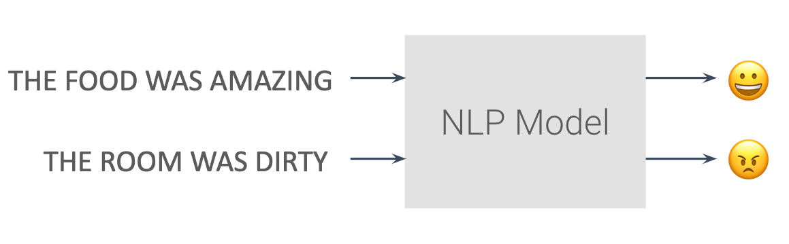

# Lesson 9: NLP: Tokenization and Embeddings.

## 1. Introduction to Natural Language Processing

* Natural Language Processing, or NLP for short, focuses on analyzing text and speech data. 
* This can range from simple recognition (what words are in the given text/speech), to sentiment analysis (was a review positive or negative), and all the way to areas like text generation (creating novel song lyrics from scratch).

* We’ll focus only on text in these lessons and not speech, but many of the same principles apply.

* NLP got its start mostly on machine translation, where users often had to create strict, manual rules to go from one language to another. 
* It has since morphed to be more machine learning-based, reliant on much larger datasets than the early methods were.

	

## 2. Tokenizing Text

* Neural networks utilize numbers as their inputs, so we need to convert our input text into numbers. **Tokenization is the process of assigning numbers to our inputs**, but there is more than one way to do this - should each letter have its own numerical token, each word, phrase, etc.

* Tokenizing based on letters with our current neural networks doesn’t always work so well - anagrams, for instance, may be made up of the same letters but have vastly different meanings. **So, in our case, we’ll start by tokenizing each individual word.**

### Tokenizer
* With TensorFlow, this is done easily through use of a Tokenizer, found within `tf.keras.preprocessing.text`. If you wanted only the <u>**first 10 most common words**</u>, you could initialize it like so:

  ```python
  tokenizer = Tokenizer(num_words=10)
  ```
  
### Fit on Texts
* Then, to fit the tokenizer to your inputs (in the below case a list of strings called `sentences`), you use `.fit_on_texts()`:

  ```python
  tokenizer.fit_on_texts(sentences)
  ```
  
### Text to Sequences
* From there, you can use the tokenizer to convert sentences into tokenized sequences:

  ```python
  tokenizer.texts_to_sequences(sentences)
  ```
  
### Out of Vocabulary Words
* However, new sentences may have new words that the tokenizer was not fit on. By default, the tokenizer will just ignore these words and not include them in the tokenized sequences. 
* However, you can also add an “out of vocabulary”, or **OOV, token to represent these words.** This has to be specified when originally creating the `Tokenizer` object.

  ```python
  tokenizer = Tokenizer(num_words=20, oov_token=’OOV’)
  ```
  
  
### Viewing the Word Index
* Lastly, if you want to see how the `tokenizer` has mapped numbers to words, use the `tokenizer.word_index` property to see this mapping.


* Example Code
	```python
    sentences = [
      'My favorite food is ice cream',
      'do you like ice cream too?',
      'My dog likes ice cream!',
      "your favorite flavor of icecream is chocolate",
      "chocolate isn't good for dogs",
      "your dog, your cat, and your parrot prefer broccoli"
  ]
    tokenizer = Tokenizer(num_words = 100, oov_token="<OOV>")
  tokenizer.fit_on_texts(sentences)
	word_index = tokenizer.word_index
	print(word_index) # {'<OOV>': 1, 'your': 2, 'ice': 3, 'cream': 4, 'my': 5, 'favorite': 6, 'is': 7, 'dog': 8, 'chocolate': 9, 'food': 10, 'do': 11, 'you': 12, 'like': 13, 'too': 14, 'likes': 15, 'flavor': 16, 'of': 17, 'icecream': 18, "isn't": 19, 'good': 20, 'for': 21, 'dogs': 22, 'cat': 23, 'and': 24, 'parrot': 25, 'prefer': 26, 'broccoli': 27}
    
    # Create sequences for the sentences
    sequences = tokenizer.texts_to_sequences(sentences)
  print (sequences) # [[5, 6, 10, 7, 3, 4], [11, 12, 13, 3, 4, 14], [5, 8, 15, 3, 4], [2, 6, 16, 17, 18, 7, 9], [9, 19, 20, 21, 22], [2, 8, 2, 23, 24, 2, 25, 26, 27]]
    ```
    
## 3. Text to Sequences
* Even after converting sentences to numerical values, there’s still an issue of providing equal length inputs to our neural networks - not every sentence will be the same length!

* There’s two main ways you can process the input sentences to achieve this - **padding the shorter sentences with zeroes, and truncating some of the longer sequences to be shorter.** In fact, you’ll likely use some combination of these.

* With TensorFlow, the `pad_sequences` function from `tf.keras.preprocessing.sequence` can be used for both of these tasks. Given a list of sequences, you can specify a `maxlen` (where any sequences longer than that will be cut shorter), as well as whether to pad and truncate from either the beginning or ending, depending on `pre` or `post` settings for the `padding` and `truncating` arguments. 
* By default, padding and truncation will happen from the beginning of the sequence, so set these to `post` if you want it to occur at the end of the sequence.

* If you wanted to pad and truncate from the beginning, you could use the following:

	```python
    from tensorflow.keras.preprocessing.sequence import pad_sequences
    
    # Specify a max length for the padded sequences
	padded = pad_sequences(sequences, maxlen=15)
	print(padded)
    # output
    [[ 0  0  0  0  0  0  0  0  0  5  6 10  7  3  4]
   [ 0  0  0  0  0  0  0  0  0 11 12 13  3  4 14]
   [ 0  0  0  0  0  0  0  0  0  0  5  8 15  3  4]
   [ 0  0  0  0  0  0  0  0  2  6 16 17 18  7  9]
   [ 0  0  0  0  0  0  0  0  0  0  9 19 20 21 22]
   [ 0  0  0  0  0  0  2  8  2 23 24  2 25 26 27]]
    
    # Put the padding at the end of the sequences
  padded = pad_sequences(sequences, maxlen=15, padding="post")
  print(padded)
  
  [[ 5  6 10  7  3  4  0  0  0  0  0  0  0  0  0]
   [11 12 13  3  4 14  0  0  0  0  0  0  0  0  0]
   [ 5  8 15  3  4  0  0  0  0  0  0  0  0  0  0]
   [ 2  6 16 17 18  7  9  0  0  0  0  0  0  0  0]
   [ 9 19 20 21 22  0  0  0  0  0  0  0  0  0  0]
   [ 2  8  2 23 24  2 25 26 27  0  0  0  0  0  0]]
   
   # Limit the length of the sequences, you will see some sequences get truncated
  padded = pad_sequences(sequences, maxlen=3)
  print(padded)
  
  [[ 7  3  4]
   [ 3  4 14]
   [15  3  4]
   [18  7  9]
   [20 21 22]
   [25 26 27]]
    ```
    
## 4. 