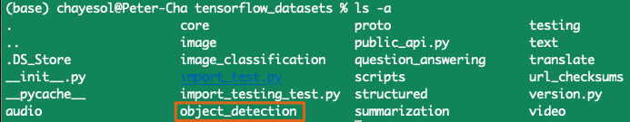
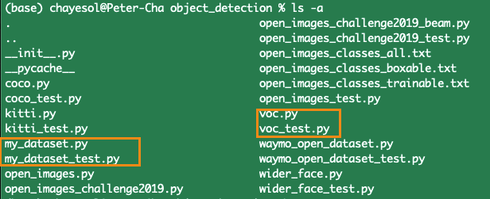

# Custom Tensorflow dataset
**[Source](https://github.com/tensorflow/datasets/blob/v3.2.1/docs/add_dataset.md)**


* Simple guideline to convert local custom data into tensorflow datasets only for personal use. This tutorial is written at following environments:
  
  * macOS Big Sur
  * tfds version: `v3.2.1`.


### 1. Writing `my_dataset.py`

* #### First, install tensorflow-datasets

	```shell
    pip install tensorflow-datasets==3.2.1
    ```


* #### Second, move to where tfds installed and run the following code. In my case, the path is  `/Users/user_name/opt/anaconda3/lib/python3.7/site-packages`.

    ```shell
    cd /opt/anaconda3/lib/python3.7/site-packages
    python tensorflow_datasets/scripts/create_new_dataset.py \
      --dataset my_dataset \
      --type object_detection  # text, audio, translate,... see the flags options below.
    ```
    
	* **flags:**
      > tensorflow_datasets/scripts/create_new_dataset.py:
      > &nbsp;&nbsp;&nbsp;&nbsp;&nbsp;&nbsp;--dataset: Dataset name
      > &nbsp;&nbsp;&nbsp;&nbsp;&nbsp;&nbsp;--type: 						 
      >	&nbsp;&nbsp;&nbsp;&nbsp;&nbsp;&nbsp;&nbsp;&nbsp;&nbsp;<audio, image, image_classification, object_detection, 
      >	&nbsp;&nbsp;&nbsp;&nbsp;&nbsp;&nbsp;&nbsp;&nbsp;&nbsp;&nbsp;question_answering, structured, summarization, text, translate, video>

	
* #### Third, modify the config files just like other same kind datasets written.

	* You can refer to other dataset format in the same type directory. For example, in my case, my dataset is for object_detection with pascal VOC format. Hence, move to object_detection directory..
	
    	

	* Then, you can see `my_dataset.py` and `my_dataset_test.py`. Next,  let's simply copy the contents of voc files and replace with `my_dataset.py`. 
	* Next, modify it to fit well with my_dataset. More specific corrections will be treated at part 3. Modify `my_dataset.py`.
		
        


### 2. Prepare your dataset. 

* #### First, prepare your data as for your purpose. 
	Below is VOC format example.

	```
    MY_DATASET
    ├── Annotations
    ├── ImageSets
    │   └── Main
    └── JPEGImages
    
    and, ImageSets/Main is like below,
    
    MY_DATASET/ImageSets/Main
    ├── train.txt
    ├── trainval.txt
    └── val.txt
    ```
 
 * #### Second, `tar` dataset and upload <u>somewhere you can download via URL</u>, like google cloud storage, AWS S3 or somewhere. `.zip` or `.gz` are also supported.

	* If you have some troubles with auto downlaod via URL, then you can access with `dl_manager.manual_dir` for your Dataset directory. In this case, you should replace `dl_manager.download_and_extract()` with `dl_manager.manual_dir()` at following part 3.

### 3. Modify `my_dataset.py`.

* When you type following code,

  ```
  python tensorflow_datasets/scripts/create_new_dataset.py \
    --dataset my_dataset \
    --type image  # text, audio, translate,...
  ```


* Then search for `TODO(my_dataset)` in the generated files to do the
modifications. 

#### `DatasetBuilder`

* Each dataset is defined as a subclass of `tfds.core.DatasetBuilder` implementing
    the following methods:

    >   `_info`: builds the `tfds.core.DatasetInfo` object describing the dataset
    >   `_download_and_prepare`: to download and serialize the source data to disk
    >   `_as_dataset`: to produce a `tf.data.Dataset` from the serialized data

* Most datasets are defined as subclass `tfds.core.GeneratorBasedBuilder`, which
    is a subclass of `tfds.core.DatasetBuilder` that simplifies defining a dataset.
    It works well for datasets that can be generated on a single machine. Its
    subclasses implement:

    >  `_info`: builds the `tfds.core.DatasetInfo` object describing the dataset
    >   `_split_generators`: downloads the source data and defines the dataset splits  
    >    `_generate_examples`: yields `(key, example)` tuples in the dataset from the
        source data

#### Downloading and extracting source data

* For example, one can both download and extract URLs with download_and_extract:

	```python
    def _split_generators(self, dl_manager):
    # Equivalent to dl_manager.extract(dl_manager.download(urls))
    dl_paths = dl_manager.download_and_extract({
        'foo': 'https://example.com/foo.zip',
        'bar': 'https://example.com/bar.zip',
    })
    dl_paths['foo'], dl_paths['bar']
  	```

* For source data that cannot be automatically downloaded (for example, it may require a login), the user will manually download the source data and place it in manual_dir, which you can access with dl_manager.manual_dir (defaults to ~/tensorflow_datasets/manual/).

* This part is really bothering, so you can simply refer to other similar dataset style as I mentioned already. just copy and paste the contents of another dataset codes, and do some modification for your dataset.

### 4. Results

* If everything is done successfully, you can find your dataset name as following result with command, `tfds.list_builders()`:

	

	
